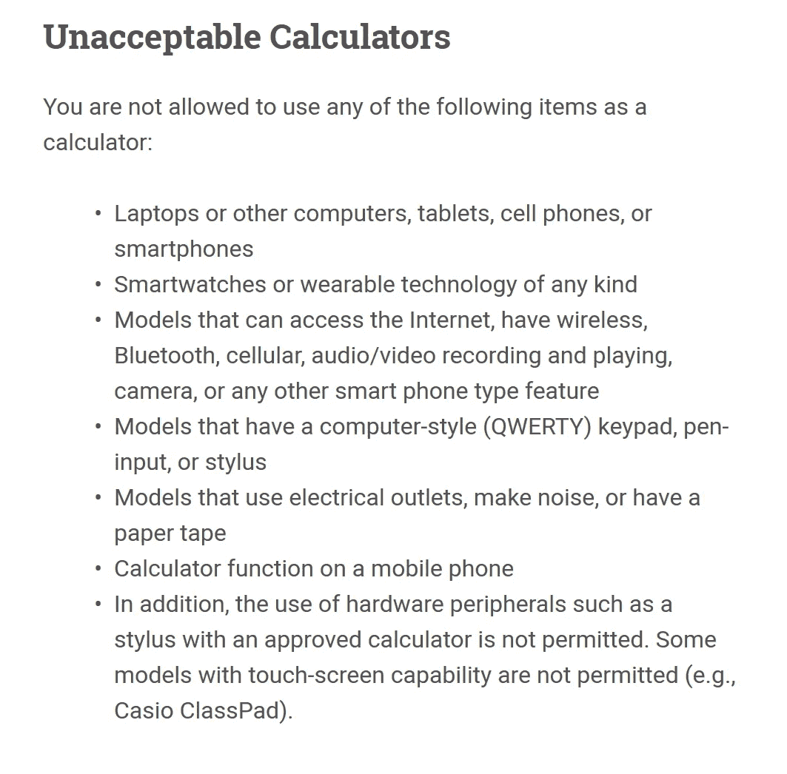

# 呼唤数据科学家的新设备

> 原文：<https://medium.com/swlh/the-call-for-a-new-device-for-data-scientists-c18cf77cf2af>

Richard Charles，博士——Charles Analytics，LLC 的创始人兼首席数据科学家

Photo by [Lanju Fotografie](https://unsplash.com/photos/BvAoCypqRXU?utm_source=unsplash&utm_medium=referral&utm_content=creditCopyText) on [Unsplash](https://unsplash.com/search/photos/space?utm_source=unsplash&utm_medium=referral&utm_content=creditCopyText)

我的第一台电脑是 1981 年的 Commodore Vic-20。我买了这个设备，因为 Ted Becker 先生的计算机编程课程让我产生了用 BASIC 编程的强烈愿望。我依稀记得从使用穿孔卡编程的痛苦过程到编写代码并立即观察程序运行的飞跃，当然是在你解决了所有的语法错误之后。尽管如此，这是令人兴奋和上瘾的！事后看来，这种上瘾的一部分是因为能够对这些复杂的计算进行编码，这些计算涉及到大得离谱的乘积和总和。

事实上，我第一次使用家用电脑是由我对终极计算器的设想决定的。我花了几个小时进行复杂的计算，用计算器根本无法完成。但是为什么会这样呢？考虑到当前技术的所有进步，如果我今天面临一项如此不同的新技术，它会吹走任何被认为是光年前的东西，我会做出什么选择？科学计算器在定义我们如何看待现代计算机方面扮演了什么角色？最后，对于当今的数据分析专业人员来说，什么是理想的设备？这些问题的答案将是本文的重点。

# 便携式计算器的历史

使用便携式设备进行实时计算的历史根源可以追溯到数学的早期起源。当早期人类开始交易货物时，为了防止损失，记录数量成为一项至关重要的任务。早期人类开始用手来计算小数量，然后随着对大数量需求的增加，开始计算整个身体的关节。在公元前 2500 年左右的苏美尔文化中，可以找到使用一种叫做算盘的专用工具的第一个证据。这些设备结合使用珠子和棒来记录更多的数字。随着我们的生活变得越来越复杂，科学和数学也在不断发展，各种设备应运而生。1916 年，纳皮尔的骨头、计算尺(1622 年)、帕斯卡的计算器(1642 年)、科尔马的计算器(1850 年)、柯塔计算器(1942 年)以及数字计算器(1970 年)、图形计算器(1985 年)都是新发明的数学技术的重大转变所产生的重大技术飞跃的例子。约翰·耐普尔对对数的发展从根本上改变了大规模乘法和除法运算的速度。随后，计算尺的发展和影响被很好地记录为美国太空计划的一个关键组成部分。特别是，水星号、双子座号和阿波罗号宇航员都接受了处理火箭推进数据、进行日常计算和计算重返轨道和轨道的广泛培训。在 60 年代，计算是宇航员训练的一部分，NASA 决定让尖桩计算尺成为阿波罗计划宇航员的标准装备。

拥有一台反映其所有者科学、工程、数学或技术贸易的复杂需求的设备是一种巨大的自豪感。如果口袋保护套和里面的东西代表了一个天才的标志，那么计算尺和最终的数字计算器就代表了这个天才解决问题的熟练程度。

# 从科学计算器到智能手机

当惠普在 1970 年开发数字计算器时，便携性成了游戏的名字。从 1970 年到 2008 年，基本计算器的几个版本包括:计算器手表、图形计算器、科学计算器和能够运行计算机代数系统(CAS)的计算器，这样只需按一下按钮就可以解决问题并导出解决方案或简化方程。最值得注意的是，TI-Nspire CX II、HP PRIME 和卡西欧 fx-CG500 都是具有这些功能的计算器的例子。然而，这些计算器公司中的许多都非常专注于支持教育测试行业，而不是创建一个面向需要即时分析数据的专业人员的功能集。最近访问大学委员会网站，你可以看到制造商允许的计算器列表。这个列表很长，但是不可接受的计算器的特性列表要简单得多。下图是详细信息的截图。

[https://collegereadiness.collegeboard.org/sat-subject-tests/taking-the-test/calculator-policy](https://collegereadiness.collegeboard.org/sat-subject-tests/taking-the-test/calculator-policy)

随着无按钮全玻璃手机的出现，被限制在只有一个按钮配置的设备中的想法被解放了。iPhone 在很多方面改变了游戏。在单个设备中，可以有多个版本的计算器来满足不同的需求。如果你需要绘制函数图形，你可以下载你选择的图形计算器软件。你现在只受限于应用开发者的创造力。即便如此，计算器硬件并不是计算的专用解决方案，而仅仅是电话和迷你个人电脑硬件的一种适应。如果设备是为了满足当今专业分析人员的计算需求而全新设计的，会怎么样？硬件和软件要求是什么？

# 一种提议的装置

我们可以有把握地假设，我将要概述的需求将需要硬件和网络方面的一些重大进步。我还想建立一个前提，即数据专业人员需要不同于学生所需的硬件和软件工具。此外，我建议将我们的思维锚定在一个概念上，即手持设备本身可能不足以支持当今专业人员所需的大规模计算。既然我们已经建立了基本规则，我想确定一些当今数据专业人员经常执行的任务和角色。

## 数据分析专业人员的任务和角色

作为一名数据科学家，以下是经常执行的任务和角色:

*数学建模—* 建模是对数据的收集和分析，其结果是创建一个能够最好地描述观察到的现象的数学方程。通常，建模过程包括四个步骤:创建模型、验证模型、评估模型和细化模型。能够使用能够观察现实世界现象并构建描述和捕捉这些现象的数学模型的设备将是非常有价值的。将这一概念扩展到设备将意味着捕捉现象的照片或视频将是有用的，但在其实施中受到限制。尽管对大量图像进行图像处理很有价值，但这里的挑战是缩小可观测现象的范围。例如，时间纹理识别可以区分风中的树木和池塘中的水波纹。这些现象与水在管道中的流动或热气球上升时半径的变化率完全无关。另一个挑战是确定数学模型的形式。应该是图表、方程式还是对现象的描述？我认为，所有这三种表达方式都将为我们认为理所当然的关系提供洞见。

*信号处理/时间序列分析—* 拥有快速创建和分析时间序列的能力将是巨大的，并且价值极高*。*目前可以从下载的股票价格中轻松生成一维时间序列。基于股票价格确定趋势，同时在视觉上和分析上检测由于随机游走导致的错误趋势预测将提供优势。当然，面部识别技术可以让人们快速拍摄照片，并根据人的数据库进行验证，这可能会在社交场合提供优势。我们已经有了允许 GPS、加速度计和相机组合来观察夜空中的星座的应用程序。如果我们可以使用一个设备网络来观察月球或恒星，并为类似的设备同步，包括一系列全球联网的研究望远镜，作为增强观察的数据，会怎么样？这可能需要在本地设备上安装更强大的镜头，或者利用网络摄像机。如果我们使用这样的功能来实时观察事件会怎么样？一个故事的多重视角将改变新闻报道和分析的方式。例如，来自一次枪击的音频可以在多种设备上使用，以精确定位来源的确切位置。

*机器学习/深度学习—* 监督学习(回归、分类)、聚类、降维、结构化预测、异常检测、人工神经网络和强化学习都需要能够从现实世界中提取数据，并应用算法来确定关系。此外，拥有一种能够快速识别变量之间关系的设备，并能够接入地区、国家或世界范围的认证数据库，从而可以在运行中进行更复杂的研究，这将具有巨大的价值。

*统计&数学—* 这个设备应该有标准的统计软件包，可以在最科学的计算器上找到。此外，更高级的应用程序绑定到统计软件包，如 R、Scikit-learn、Mlpy 和 Statsmodels。这些软件包将允许各种分类、回归和聚类算法，包括支持向量机、逻辑回归随机森林、梯度推进和朴素贝叶斯。通过支持 C++、Python、Java 和 r 的各种库访问数值算法。

*创建数据 API*—在与需要通过网络访问数据分析或需要新应用的客户打交道时，应用程序编程接口(API)是至关重要的组件。能够在一个健壮的开发环境中开发 API 是至关重要的，比如 Anaconda、R、SAS 或许多其他数据分析平台。同时，要注意任何可能管理你的 API 的规则。例如，对于财务数据的处理有严格的规定，而这些规定经常被新从业者所忽视。

*数据模拟、数据清理&仓储和数据查询* —拥有一台能够处理海量数据集的设备将需要比当前便携式设备更多的内存。运行模拟、清理、仓储和查询将需要一个健壮的架构。该设备需要能够处理 MapReduce 的分布式计算实现的需求，如 Hadoop 和 Spark。作为替代，图形数据库可以提供可以利用的计算效率

***操作系统***

该设备将需要能够运行多个操作系统，这取决于用户的要求。基于 Unix 的操作系统将是首选。能够拥有一个多重启动系统将是理想的，可以访问 iOS、Windows 10 和 Unix 应用程序。

***硬件要求*** 物理设备应具有全玻璃触摸屏，设备的一部分专用于拥有一系列传感器。这些传感器应包括基于所需应用的模块化选项:

1.  具有触觉反馈的触摸屏显示器，能够切换反馈
2.  接近传感器—这些传感器提供了一种快速切换设备各种模式的方法，以防止来自触摸屏的虚假输入。
3.  蜂窝无线电——虽然这种设备可以用作电话，但重点将是以多种形式收集数据。
4.  多个 GPS 天线—无源，可选择连接一个有源放大器以提高精度
5.  麦克风——智能设备通常不提供高质量的麦克风。然而，这款设备需要一个高品质的翻领电容话筒，以及一个具有正面心形模式和双振膜双向模式的便携式电容话筒。
6.  可拆卸蓝牙加速度计——根据应用确定设备方向并提供观察和实验数据
7.  红外线发射器和传感器，用于实时动态检测温度波动。Seek Thermal 和 FLIR 是领导这项工作的两家公司。在难以到达的地方，在电缆末端安装一个可选的传感器也有很大的价值。
8.  多摄像头阵列-广角，35 毫米，50 毫米，具有连接 80 毫米和 200 毫米镜头的能力。有一个
9.  蓝牙传感器阵列—一组可拆卸的蓝牙传感器，所有传感器的速率均为 96–128 Mbps，范围至少为 300 英尺，能够自定义传感器类型和分辨率。
10.  蓝牙书写笔/铅笔、键盘和鼠标
11.  医疗应用传感器套件包括:体位、体温、心电图、肺活量计、血压、脉搏血氧仪、血糖仪和脑电图

能够以 100 Mbps 的上传速度和 200 Mbps 的下载速度来处理任何即时计算的移动网卡也是所期望的。这也需要一台带有能够执行机器学习算法的图形卡的主机。

***RAM 和存储*** 该设备应该有足够的内存来处理大规模阵列，并配备一个八核处理器，内存至少为 32GB，存储至少为 2Tb。由于对处理器的要求和对热量的关注，该设备不需要采用传统的手机或薄平板的形式，而是可以近似为稍大、稍厚的设计。

***移动软件*** 软件应用的选择和性能将是我们提出的设备的关键组成部分。需要一个健壮可靠的移动集成开发环境(IDE)。需要 Matlab、R Studio、Spyder、MS Visual Studio、SPSS、SAS、MS Excel、Wolfram Alpha、MapReduce 实现甚至 Tableau 等数据可视化应用程序的开发人员的承诺和合作。这些应用将需要能够管理非常大的计算任务的硬件，同时平衡移动设备的长电池寿命需求。此外，MacOS、iOS 和 Windows 10 需要发展，以满足面向专业数据科学家的强大移动操作系统的需求。

# 结论

对于希望能够在移动设备上执行非常苛刻的计算任务的专业人员来说，需要一种新的设备。测试公司对现代科学/图形计算器有太多的影响。这导致功能范围有限，设计和应用方面的创新严重不足。数学是一门似乎停留在传统计算任务中的学科，尽管几十年来有许多技术进步。是时候转向一种设备了，它将我们带入一个充满新可能性的世界。你有什么想法？你会对这样的设备感兴趣吗？你认为对这种设备的成功至关重要的其他硬件和软件特性有哪些？让我们努力使一种新型设备成为现实。