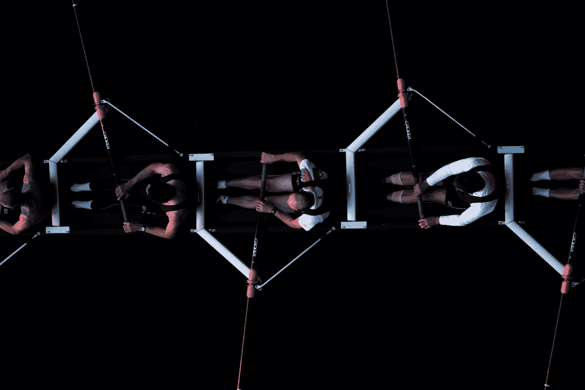

# 抛弃自上而下的个人绩效评估的理由

> 原文：<https://medium.com/swlh/the-case-for-ditching-top-down-individual-performance-evaluations-7664597452a5>

*并代之以基于团队的绩效评估*

你可能至少听过一次这样的话:“我们作为一个团队赢了输了”，“团队比个人更重要”，“我们不容忍聪明的混蛋”。

大多数公司明确表示他们*非常重视团队合作*。

但与此同时，他们使用自上而下的绩效评估体系，这种体系鼓励*的个人主义行为*，严重破坏团队合作，以至于最好的团队建设活动也无法弥补。

以下是 **4 个理由** **为什么公司**应该考虑抛弃*传统的自上而下的绩效评估流程* 而支持**基于团队的绩效评估**。

# **原因#1:感知比现实更重要，管理感知很耗时**

Is he jumping really high or … wait what?

在大多数公司里，经理会对员工的表现进行评估，这种评估通常是其他流程的关键输入，比如薪酬评估和*晋升*。

由于这是一个主观练习，**管理者对绩效的看法比实际绩效更重要，**这意味着自上而下的绩效评估过程不可避免地会激励员工积极向上管理。

我敢打赌，你们都知道——也曾经对——一些人感到恼火，他们在实际工作中表现不佳，但在管理上却很出色。

**不怪玩家，怪游戏。**

考虑到激励机制是如何建立在系统中的，管理我们经理的看法*是合理的做法*。如果我们想改变行为，我们首先需要改变系统。

雪上加霜的是，管理感知是耗时的，不仅因为它需要时间来影响管理者的感知，还因为它需要时间来塑造那些将影响管理者的人的感知。

你知道我要去哪里。

最重要的是，即使没有在感知管理上浪费时间的问题，年度绩效评估也是一项巨大的时间投资，有时会让公司完全停下来。

这值得吗？

# 原因 2:当我们被管理时，我们不善于察觉

你有没有想过政治行为是如何逐渐超越一家以开放和直接反馈文化起家的公司的？如果你的公司发生了这种情况，你可能想看看你的绩效评估过程。

在 HBR 一篇题为“[为什么有毒的人会得到提升？Klaus J. Templer 解释说，有毒的人得到提升的原因和卑微的人得到提升的原因一样:**政治技巧**。](https://hbr.org/2018/07/why-do-toxic-people-get-promoted-for-the-same-reason-humble-people-do-political-skill)

在他的研究中，他注意到“*”政治技能被上司高度评价的有毒员工更有可能获得高绩效评级。换句话说，虽然不是所有的坏人都拥有政治技巧，但那些在老板眼中能有效运用政治技巧的坏人被视为表现更好的人*。

很可怕，是吧？

> 自上而下的个人绩效评估不可避免地导致政治技能成为个人职业发展的关键。

为什么政治技巧如此有效？

我们只需要浏览一下[已知认知偏差列表](https://en.wikipedia.org/wiki/List_of_cognitive_biases)，就能找到我们的答案。许多偏见严重影响了我们察觉他人何时变得透明和真实的能力。

当我们试图评估员工的绩效时，我们不可避免地会受到最近偏差、可用性偏差、光环(或号角)效应、确认偏差、基本归因错误的影响……说真的，[查一下](https://en.wikipedia.org/wiki/List_of_cognitive_biases)，这个清单长得吓人。

换句话说，当我们被管理时，我们不善于察觉。

360 度反馈流程可以帮助收集额外的观点并减少其中的一些偏见，*但仅限于收集的*数据真实准确的程度*，因为大多数 360 度评估的设计和使用方式并不鼓励真实透明的输入。*

当一个人善于向上管理时，即使是最勤奋的经理也很难对他的表现做出准确的评估。

# 原因 3:强制排名增加了内部竞争，而不是合作

任何绩效评估系统都有一个明确或隐含的预期，即员工将被强制按照从低绩效者到高绩效者的正态分布(T21)进行排名。

自然的结论是什么？**我的队友** **正在角逐**进入“高术者斗”。

强制排名不可避免地会在一个人成为好队友、帮助他人成功和表现的愿望与一个人出人头地并被认可为团队中最高表现者的愿望之间产生利益冲突。

团队中的竞争态势显然会削弱团队发展信任氛围、心理安全和开放合作的能力，而信任、心理安全和开放合作是支持持续高绩效的必要条件[。](https://rework.withgoogle.com/blog/five-keys-to-a-successful-google-team/)

# 原因 4:绩效评估不能提高绩效

T 典型的个人绩效评估系统，当然也包括自上而下的系统，在实际绩效方面有一个重大缺陷:**它们削弱了内在动力。**

Edward Deci 和 Richard Ryan 对人类动机及其对绩效的影响进行了长达 40 年的研究，他们发现用于激励的传统工具，胡萝卜加大棒的类型，只在非常有限的情况下有效。也就是说，当一项活动需要很少的创造力，很少的合作，并且相当重复的时候。

但是，当工作需要更多的创造力、主动性和协作时，传统的胡萝卜加大棒的模式实际上会降低绩效。

影响薪酬审核和晋升的自上而下的绩效评估系统不被视为个人发展工具，**它们被视为奖惩工具**。

> “奖励能激励人吗？当然，他们鼓励员工获得更多奖励

[关于激励主题的研究](https://selfdeterminationtheory.org/SDT/documents/2000_RyanDeci_SDT.pdf)毫无疑问地表明，传统的奖励和惩罚工具确实会导致*更差的决策、更少的合作、缺乏创造力以及更不道德的行为*。

# 那么还有什么选择呢？

一些组织已经完全取消了绩效评估。在某些情况下，他们用每月检查来代替，以提供持续的指导，并采取一种“随做随管理”的方法。

然而，我的建议是将个人绩效评估转变为基于团队的绩效评估。

正确的基于团队的绩效评估不会有我们在本文中描述的任何问题，并且提供了一些额外的好处。

> “天赋赢得比赛，但团队合作和智慧赢得冠军。” *—迈克尔·乔丹*

基于团队的绩效评估方法:

*   在同一个团队的成员之间创造一种强大的联合力量，目标是重要的事情:*团队的成功*。这就引出了一个问题“成功是什么样的？”。我很高兴你这么问。
*   它迫使团队对成功有一个清晰的定义，包括回答这样的问题:“谁是*的客户*？”，“团队应该向他们交付什么样的*价值*”，“如何衡量*对这些客户的*影响*？”。*
*   *它使团队能够*持续评估他们自己的绩效*,因为成功的衡量标准变得清晰、透明并与可见的结果挂钩。绩效不再基于对更高权威的主观认知。*
*   *这反过来使经理和领导者能够将自己定位为团队的资源(教练、指导、导师)，而不是被迫成为他们表现的评判者。*

*如果你担心这种模式可能不会对个体成员产生足够的“压力”，请记住，与来自上级的压力相比，来自同行的压力是更好的动力来源。*

*我们都想成为胜利团队的一员。*

*如果我们致力于培养导致健康团队动态的行为(信任、开放交流、团结和心理安全)，那么我们需要设计与这些愿望一致的组织系统。*

*我希望你觉得这很有价值。*

*如果您有一些反馈或想更多地谈谈如何实施基于团队的绩效评估，让我们保持联系！*

*在 LinkedIn 和 Youtube 上找到我(订阅！)*

*[www.business-landscapes.com](http://www.business-landscapes.com)*