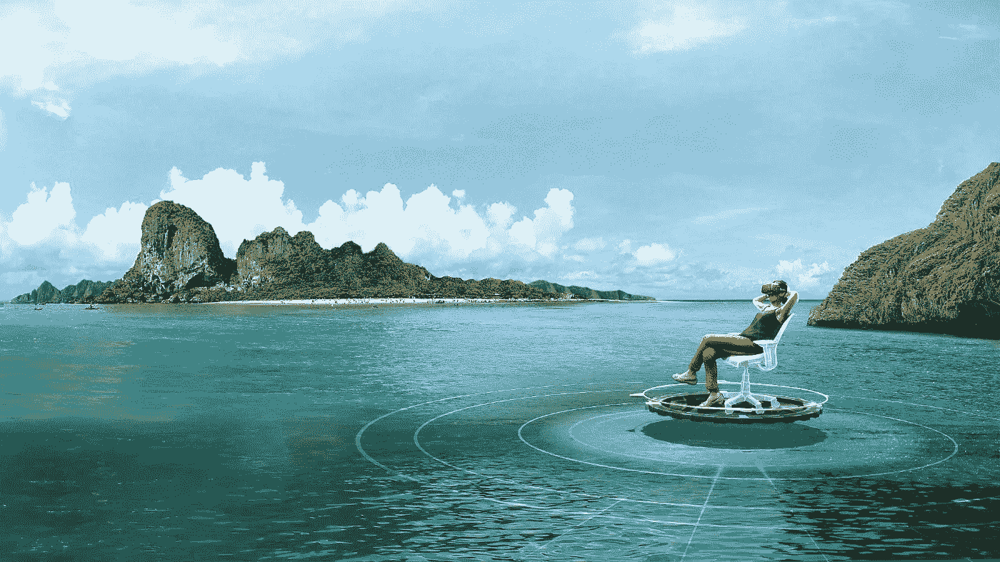
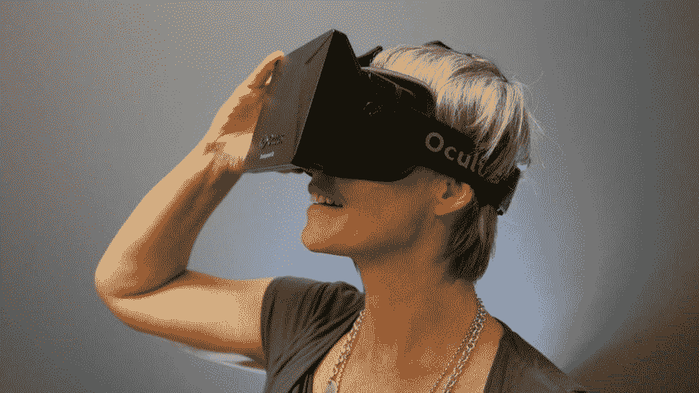
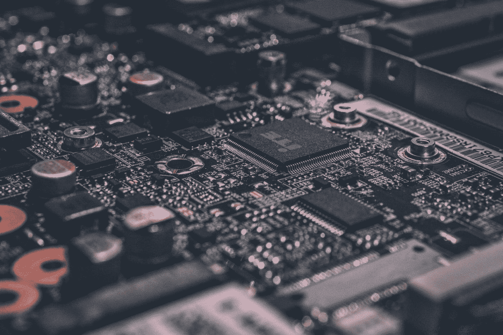

# 在一个日益科技化的世界里艺术的案例

> 原文：<https://medium.com/swlh/the-case-for-the-arts-in-an-increasingly-technological-world-bad40d5f3af2>

## 作为硅谷的前产品经理和专业音乐人，我看到了硬币的两面。

一个七岁的男孩在转椅上晃来晃去，脚趾尖几乎不接触地面，他兴奋地向他最喜欢的足球运动员挥手，当他们经过时，说出每个人的名字，并大声喊出他们的数据。

他的头上绑着一个三星 Gear VR，屏幕上播放的是美国国家橄榄球联盟(NFL)和 [Jaunt VR](http://jauntvr.com) (我工作的地方)为第 50 届超级碗举办的[电影虚拟现实体验](http://www.usatoday.com/story/tech/news/2016/02/04/super-bowl-fans-get-hit-virtual-reality-future/79737124/)。当男孩看着的时候，他的父母带着兴奋和喜悦看着他的反应。当他们三个完成演示时，我无意中听到男孩问妈妈和爸爸，他如何才能得到一个耳机，以便他可以再次观看剪辑，父母讨论他们对虚拟现实成为我们日常生活的一部分有多兴奋。

如果你还不熟悉上面的虚拟或增强现实体验，你会很快熟悉的。虚拟现实使用 360 度图像(无论是计算机生成的还是拍摄的)，通过虚拟现实耳机(如 [Oculus Rift](https://www.oculus.com/en-us/) 或[三星 Gear VR](http://www.samsung.com/global/galaxy/wearables/gear-vr/) )将观众沉浸在一个完全虚拟的世界中，这些耳机正在迅速从实验室的原型转变为日常生活中的应用。增强现实将虚拟元素覆盖在物理世界的顶部(想想全息图，就像图帕克在科切拉的“亮相”)，通过技术来增强物理体验。一些 AR 和 VR 平台还融入了其他设备，例如带有对运动做出响应的传感器的手套，这有助于进一步使观众沉浸在整体体验中。

随着这样的时刻越来越频繁地发生，人们不断谈论最新的技术进步以及它们能为社会做些什么也就不足为奇了。AR/VR、人工智能、机器学习和许多其他技术的进步使得各行各业的一系列重要创新成为可能。除了它们的实际意义，技术创新也具有内在的兴奋性——无论是在虚拟现实中与童年英雄互动的可能性，还是在自动驾驶汽车中通勤上班，在现实生活中获得幻想般体验的机会总是具有巨大的吸引力。

但是，随着所有关于技术的讨论，人们经常忘记艺术和人文学科，以及这些学科如何融入更大的图景。

Photo by [Alexandre Debiève](https://unsplash.com/@alexkixa?utm_source=medium&utm_medium=referral) on [Unsplash](https://unsplash.com?utm_source=medium&utm_medium=referral)

事实上，人们普遍哀叹他们正在慢慢“死亡”，他们需要被“拯救”，这意味着他们在我们日益科技化的世界中几乎没有任何作用。而且，从表面上看，很难看出艺术和技术之间的联系。

作为硅谷一家科技公司的前产品经理和古典音乐家，我看到了硬币的两面。我认为，艺术对于成功的技术进步至关重要，原因有两个:雇佣有艺术背景的人有助于工作场所的多样性和创新，将艺术视角融入新技术的开发，最终决定了该技术将在我们周围的世界中扮演什么样的角色。

# 艺术和创新

参与艺术对我们的大脑有巨大的积极影响。尤其是音乐的影响已经被很好地记录下来，作为一名音乐家，这些是我最熟悉的好处。[研究](http://syncproject.co/blog/2016/1/22/music-evoked-emotions-influence-cognition)发现，仅仅听音乐就能改变情绪，延长注意力持续时间，并帮助我们的大脑合成信息。

播放音乐有更强的效果；正如[安妮塔·科林斯的 TED 视频解释的那样](https://www.youtube.com/watch?v=R0JKCYZ8hng)，播放音乐对大脑来说是一种“全身锻炼”:

艺术和创新之间的联系并不是一个新发现。过去几个世纪许多伟大的创新者都因谈论他们的科学发现和艺术之间的联系而闻名。沃尔特·伊萨克森在《创新者》的导言中总结道:

> “……创新存在于艺术和科学结合的地方这一观点并不新鲜。列奥纳多·达·芬奇是人文科学和科学互动时创造力繁荣的典范。当爱因斯坦在研究广义相对论时遇到困难时，他会拿出小提琴演奏莫扎特的作品，直到他能重新找到他所谓的球体的和谐。

音乐中的自我表达、创造力和情感专注不仅仅是个人创意者的专利，也是大公司的必备条件，[迪士尼/皮克斯等公司的成功证明了这一点](http://www.wired.com/2014/10/big-hero-6/) …

Photo by [Daniela Araya](https://unsplash.com/@danielaraya?utm_source=medium&utm_medium=referral) on [Unsplash](https://unsplash.com?utm_source=medium&utm_medium=referral)

> “任何人都可以拍出用技术魔法让你眼花缭乱或者用辛辣的幽默让你捧腹大笑的电影。但这对[首席创意官约翰]拉塞特来说还不够。最重要的是，这位世界上最情绪化的高管希望拍出能让你产生共鸣的电影，能让你产生感觉的电影。”

正如柯林斯和艾萨克森所描述的，与艺术的深厚联系培养了生活各个方面的创造力和创新。有艺术背景的人通常拥有快速综合信息和找到解决难题的创造性解决方案的能力，这两者对创新都非常重要，正如美国国家科学基金会最近在调查艺术儿童与 STEM 教育之间的关系时发现的那样。雇用具有艺术背景的人将这些技能带入工作场所，并使工作环境成为艺术和技术的混合床成为可能，这是创新的主要催化剂。

# 大局

艺术不仅仅是在个人层面上鼓励创造力；他们在科技领域也扮演着更广泛的角色。《纽约时报》最近指出,[虚拟现实公司如何从科幻文学](http://www.nytimes.com/2016/02/17/technology/virtual-reality-companies-look-to-science-fiction-for-their-next-play.html?_r=0)中寻找灵感，从科幻小说和电影中获得灵感，塑造他们产品的未来。文章解释了原因:

> “[科技公司]仍在想办法让虚拟现实成为一种人们离不开的技术……这就是科幻小说的由来。科幻小说正在塑造公司用来营销技术的语言，影响耳机的体验类型，甚至为开发者定义长期目标。”

虽然这一开始可能令人惊讶，但实际上很有意义。技术上的突破解决了*如何*建造某物的问题，但是人们也必须回答*如何*处理新技术创新的问题。正如 NYT 的文章所概述的那样，在虚拟现实的情况下，工程师们在如何实现方面取得了一些令人难以置信的突破，现在科幻作家和其他具有艺术和人文背景的人正在帮助确定什么和为什么。

Photo by [Andy Kelly](https://unsplash.com/@askkell?utm_source=medium&utm_medium=referral) on [Unsplash](https://unsplash.com?utm_source=medium&utm_medium=referral)

在由技术创新驱动的行业中，一些艺术可以在很大程度上影响人们最终如何与新技术互动。

由于艺术对人类大脑的独特影响，艺术将继续在我们日益科技化的生活中发挥重要作用。在个人层面上，参与艺术有助于人们综合信息和解决问题，通常会导致科学和技术的创新突破。在全球层面上，艺术定义了技术进步塑造我们周围世界的方式。虽然在重大技术创新的显而易见的影响中，人们可能很容易忘记艺术的一些无形的好处，但艺术将继续成为我们受技术驱动的生活中的一个必要组成部分，因为它们悄悄地推动着技术创新。

*精选图片由* [*JauntVR*](https://www.jauntvr.com) *提供。*

*原载于 2016 年 3 月 15 日*[*https://www.creativestartups.org*](https://www.creativestartups.org/blog/case-arts-increasingly-technological-world)*。*

# 关于作者

*中提琴手 Deanna Badizadegan 经常在圣保罗室内乐团和匹兹堡交响乐团担任客座音乐家，她在 2018-19 赛季担任了一年的职务。她在新英格兰音乐学院完成了研究生音乐学习，在那里她师从金·卡什卡希安。她还拥有斯坦福大学的管理科学工程硕士学位和组织设计工程学士学位。在从事全职绩效工作之前，她曾在硅谷多家科技初创公司担任产品经理。*