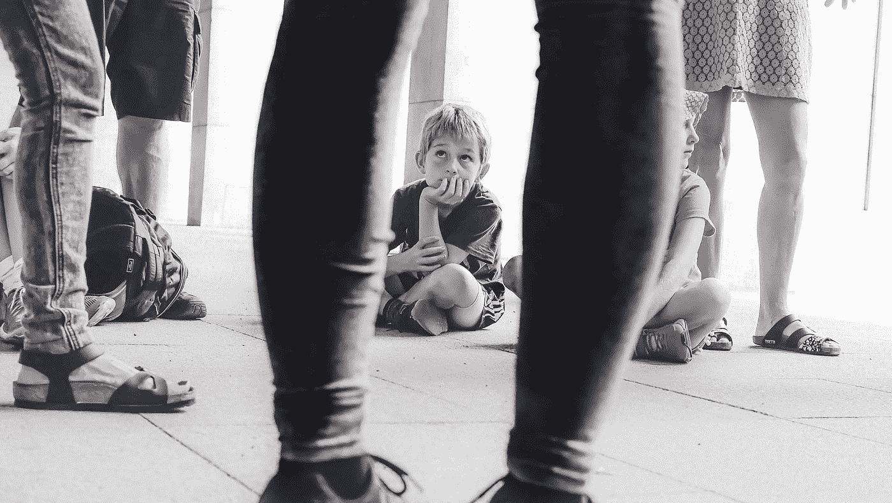

# 多动症的成因

> 原文：<https://medium.com/swlh/the-causes-of-add-adhd-c0c49f019fbd>

Photo by [Cristina Gottardi](https://unsplash.com/@cristina_gottardi?utm_source=medium&utm_medium=referral) on [Unsplash](https://unsplash.com?utm_source=medium&utm_medium=referral)

在我们的西方社会中，心理障碍的数量，尤其是儿童中的心理障碍，似乎与日俱增。这种现象让我们摸不着头脑。目前，似乎有两种方法来解释和治疗心理障碍，如 ADD(注意力缺陷障碍)。有些人会说，这些疾病是人们染上的疾病，类似于感冒，只是运气不好。其他人会说这些疾病是遗传的，这些人注定会焦虑、抑郁、令人讨厌或目中无人。特别是，人们指出这样一个事实，即多代人患有注意力缺陷多动症是很常见的，以此作为它是一种遗传疾病的理由。无论是哪种情况，对这些疾病的治疗通常包括试图控制个人的行为。在学校或家庭中，奖励和惩罚是最常用的控制方法。如果这些方法不令人满意，也可以使用药物，如精神兴奋剂，来帮助控制这种行为。

作为一个社会，我们似乎不顾一切地限制任何被认为不正常的行为，无论是我们自己的行为还是他人的行为。虽然成年人可以选择如何控制他们所挣扎的心理障碍，但儿童对于如何控制这种障碍往往没有多少选择。可悲的是，所采用的控制措施似乎更多地是为了那些与儿童互动的成年人的利益，而不是儿童本身的利益。

在我最近的一篇文章中，我讨论了患有 ADHD(注意力缺陷/多动障碍)的儿童的行为，并指出我们可以从这些儿童身上学到很多东西。虽然对我们来说很戏剧化，但是患有注意力缺陷多动症的儿童的行为可能会凸显我们社会中我们宁愿忽视的问题。也许患有多动症或注意力不集中症的儿童对他们周围的世界越来越敏感，这不是一件需要抑制的事情，而是需要密切关注的事情。这些孩子在告诉我们什么？如果他们越来越敏感并不是问题所在，而是我们没有能力做出反应呢？作为医生和作家，Gabor Maté博士写道，

> “只有当世界无法注意到个人微妙的生理和心理反应时，敏感性才会转化为痛苦和紊乱。”

网上搜索关于注意力缺陷多动症的信息发现，这些疾病的诊断和治疗方案被广泛讨论，而病因却很少被提及。如果给出了任何关于可能原因的信息，通常是一个粗略的句子。这与一种常见的社会误解并无出入，即给某物命名或贴上标签就是解释了它。标签不是解释。名字可能有助于描述特定的特征或行为；然而，名字并不能告诉我们为什么会发生这些行为。试图控制症状，却不了解是什么导致了这些症状，这极不可能长期解决问题。我们需要问的关键问题是:“导致这些症状的潜在因素是什么？”

当想到“注意力缺失”这个术语时，我们必须问，这些孩子在努力关注什么？许多父母非常担心他们的孩子在他们认为有必要让孩子集中注意力的情况下无法保持注意力。然而，他们忽略了一个事实，即他们的孩子可以在他们的兴趣被抓住的情况下保持注意力。这种注意力缺失有一个相关的组成部分，因为它经常指向未被选择的权威人物，如父母和教师。我们必须问这个问题，在这些关系中发生了什么导致了这些反应？

同样值得考虑的是，共病的 ADD 障碍在很大程度上是相关的问题。最常见的共病障碍是对立违抗性障碍(54–67%)，其次是品行障碍(20–56%)和焦虑症(25%)。有人认为，患有这种疾病的人表现出的行为仅仅是他们基因的产物，但这不一定是准确的。行为可以是后天习得的，也可以是对孩子经历的事情的反应。鉴于父母通常对孩子的影响最大，我们在寻求理解和治疗像注意力缺陷多动障碍这样的疾病时，必须着眼于亲子关系。

也可能有其他关于亲子关系的事情会导致 ADD。不该发生的事情发生了，比如身体上的，性上的，或者情感上的虐待，应该发生的事情没有发生，比如依恋。

当儿童受到虐待时，他们的身体会进入“生存模式”。这意味着要么进入一个固定和分离的状态，要么进入一个反抗的状态。在这两种状态下，孩子都试图重新获得生活中的某种控制权。通过脱离他们周围的世界，他们表达了对成年人的不信任，他们可能正确地认为成年人是不理性和不稳定的。通过表现出反抗，他们试图夺回控制权。孩子知道他们可能会从他们反抗的人那里得到反应，主要的事情是获得成人的注意。知道他们有能力让一个成年人“失去控制”并变得愤怒是孩子的一种应对机制。他们还能如何处理自己和成年人之间巨大的权力差距？虽然在现实中，成人行为反常的原因是成人无法自我调节，而不是儿童的行为。

我们生来就渴望依恋，如果我们在童年时没有得到它，我们会继续寻找它。对于那些患有注意力缺失症的人来说，这种依恋的缺乏可能会表现为上述寻求关注的行为以及焦虑。一个孩子只有和一个稳定的成年人建立亲密健康的关系，才能学会调节自己的情绪，而成年人可以成为如何自我调节情绪的榜样。一个没有被父母模仿的自我调节情绪的孩子会寻求外部的方式来调节情绪。这种自我调节的能力似乎是 ADD 和类似疾病与药物成瘾相关的一个重要因素。

> "对关系的理解比寻求任何行动计划都要重要得多."吉杜·克里希那穆提

如果我们要理解我们与孩子的关系，我们必须寻求以一种让他们感到安全和受重视的方式与他们交往。要让孩子参与进来，他们不能处于防御模式。如果他们处于固定或分离的状态，或者由于恐惧而处于战斗或逃跑的模式，他们就没有处于相对安全的位置。我们必须愿意问自己，孩子的反应是否是出于生存本能而不是因为“不听话”。那么，为什么不从一个充满好奇心的地方开始呢？为什么不寻求发现到底是什么导致了 ADD 的症状呢？当然，父母的任务是令人生畏的，甚至可能是可怕的。这样做意味着承认你在制造问题中扮演的角色。这也意味着审视父母自己的过去，并试图理解他们自己行为的起源。当父母开始这一旅程时，可能仍然会有许多挑战，因为孩子可能会继续以他们希望或理解的方式行事。也许甚至会有他们不知道下一步该做什么的时候。但是，任何想和孩子建立有意义的关系并真正想帮忙的父母都必须从好奇心开始。

Photo by [Xavier Mouton Photographie](https://unsplash.com/@xaviermoutonphotographie?utm_source=medium&utm_medium=referral) on [Unsplash](https://unsplash.com?utm_source=medium&utm_medium=referral)

然后目标从控制孩子转移到修复和加深与孩子的关系。实现这一目标需要父母的自省，这比简单地给孩子贴标签要难得多。在这个时代，这种自省尤其困难，因为对许多人来说,“正常”的人类生活意味着生活在紧张的关系中，节奏紧张。然而，努力并不意味着无法实现或不可取。

要对注意力缺陷多动症的长期解决方案抱有希望，我们应该问:到底是什么导致了这些症状？如果这些障碍的根源确实是关系体验，那么我们必须敢于对我们自己和我们的孩子更加好奇；认识到我们孩子的需要，尤其是他们对依恋的需要；在我们试图与孩子们重新联系时，表现出谦逊。

*免责声明:我不是医学专业人士，阅读我的评论时应该牢记这一点。我感谢加博尔·马特博士的工作。他的书和演讲对研究这个主题非常有帮助。*