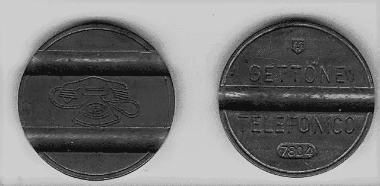
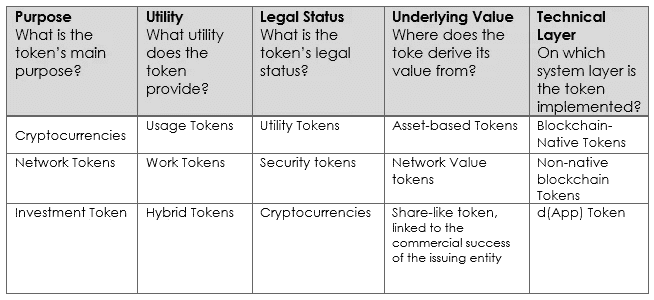

# 代币的分类

> 原文：<https://medium.com/swlh/the-classification-of-tokens-8d07fc700f7>

Italian Public Telephone Token — [Nicholas Gemini CC BY-SA 3\. da Wikimedia Commons](https://commons.wikimedia.org/wiki/File:Gettone_telefonico_italiano_-_1978_03.png) CC BY-SA 3.0

人们经常谈论**符号化**。我试着更详细地解释这个过程由什么组成，从令牌开始:令牌是什么，如何分类，设计令牌时应该问什么问题。

应该强调的是，关于这一主题的文献仍处于早期阶段，大多数来源分布在帖子、论坛、推文中；只有一小部分材料是学术性的。

让我们从第一个区别开始，加密货币和代币之间的区别:前者是区块链的本地组件(如比特币，以太)，后者是在区块链上创建的，并由*智能合约*监管(如[基于以太坊的占卜](https://translate.googleusercontent.com/translate_c?depth=1&hl=it&rurl=translate.google.it&sl=it&sp=nmt4&tl=en&u=https://www.augur.net/&xid=17259,1500003,15700023,15700124,15700186,15700190,15700201,15700237,15700242,15700248&usg=ALkJrhi7L7M19KvYeM3j8vxMBhoJnblmsw))。回想一下*智能合同*是嵌入在区块链中的代码片段，它自动管理合同执行的条款和条件。

相比之下，加密货币就像集成在移动网络中的短信服务，代币就像 Whatsapp 等通讯应用程序，建立在同一移动网络上，利用这一技术基础设施。

**代币以数字方式表示与商品、服务或权利相关联的价值。**它们因一些概括了优势的特征而结合在一起:

**流动性**，由于流动性，它们可以很容易地转化为货币或加密货币。

**可分性**，允许将值分成甚至非常小的单位。

**可交易性**，这使得进行销售和随后的所有权转移成为可能。

**不可变的所有权证明**。

令牌化流程还引入了可编程性的特征和优势，即在*智能合约*中引入特定业务逻辑的可能性，从而允许实现自动化事件。例如，在特定条件下发生的支付。

有几种途径和方法用于找到记号的分类。

我们可以从一个 [**角色——目的——特征方案**](https://translate.googleusercontent.com/translate_c?depth=1&hl=it&rurl=translate.google.it&sl=it&sp=nmt4&tl=en&u=https://medium.com/%40wmougayar/tokenomics-a-business-guide-to-token-usage-utility-and-value-b19242053416&xid=17259,1500003,15700023,15700124,15700186,15700190,15700201,15700237,15700242,15700248&usg=ALkJrhh5lBVZbJaKWXtesgF8zGQTF_1rLQ) 开始。例如，一个令牌可以代表一种利益/回报(角色)，并且具有通过利润分享(特征)来重新分配它的目的。

[通过与现有金融工具的相似性可以形成另一个分类，如下图](https://www.bitcoinmarketjournal.com/equity-token/):

**货币**，包含加密货币的情况。代币充当“纯”数字货币，其价格由市场力量决定。

**证券**，代表标的资产的价值。拥有代币并不意味着拥有“发行者”公司的股份。

**股权**，与前一个相似，但对所有者而言，它意味着所有权份额。

**Utility** ，制作代币、优惠券，可以在平台的生态系统内用于购买商品和服务。

**债务**，即代表基础债务的代币，类似于债券或抵押贷款。

在这一点上，应该强调的是，分类对监管者也很重要。最近几个月，许多 ico(*首次发行硬币，通过代币销售为公司融资)失败了，或者更糟的是，被证明是欺诈性的。处理金融市场监管的各个国家的机构，例如美国证券交易委员会，因此已经建立了许多类型的代币属于*证券*的类别，并且因此受到相同规则的约束:在前面的分类中，它们被认为是*证券*，证券、股权和债务代币。*

让我们回到寻找一种有效的分类方法的问题上来，这种方法可以捕捉到令牌使用的异质性和多样性。

[托马斯·欧拉(Thomas Euler)开发的框架](http://www.untitled-inc.com/the-token-classification-framework-a-multi-dimensional-tool-for-understanding-and-classifying-crypto-tokens/)基于五个维度对代币进行分类；他们每个人都用三个选项来回答关于令牌的特定问题。

Scheme adapted from [The Token Classification Framework](https://translate.googleusercontent.com/translate_c?depth=1&hl=it&rurl=translate.google.it&sl=it&sp=nmt4&tl=en&u=http://www.untitled-inc.com/the-token-classification-framework-a-multi-dimensional-tool-for-understanding-and-classifying-crypto-tokens/&xid=17259,1500003,15700023,15700124,15700186,15700190,15700201,15700237,15700242,15700248&usg=ALkJrhg2METlTNCQHbteg7_IyXDbi5xdbg) CC [BY-NC-SA](https://creativecommons.org/licenses/by-nc-sa/4.0/)

这些维度是互补的，因为许多记号可以落入一些或所有这些维度中。例如，以太是一种原生的混合网络令牌，对我来说，它也是一种加密货币。在这方面，术语“加密货币”在两个不同维度(目的和法律地位)使用的事实并没有使该方案特别清楚。

从这种结构的使用中，出现了允许将代币分组为四个“原型”的模式:**加密货币**、**资产代币**、**网络代币**和 ***每股代币*** (类似于证券)。

在我看来，最好的分类——更清晰、更全面——是苏黎世大学通过论文“ [*To Token 或 Not to Token:理解区块链令牌的工具*](https://www.zora.uzh.ch/id/eprint/157908/1/To%20Token%20or%20not%20to%20Token_%20Tools%20for%20Understanding%20Blockchain%20Toke.pdf) ”做出的，该论文由路易斯·奥利维拉、柳德米拉·扎沃洛金纳、英格丽德·鲍尔和格哈德·施瓦贝撰写。在这项工作中，不仅描述了分类，而且由于具体的案例研究，提供了能够指导令牌的设计和发行的决策树。

首先，从现有文献和经验数据出发，确定了十三个表征参数，分为四类:目的、*治理*、功能和技术参数。

在这个基本方案上，构建了一个列出八个令牌原型的表:

**加密货币**，是或渴望成为全球数字货币。

**权益令牌**，赋予持有者对资本收益的权利，如利润分享。

**融资令牌**，项目团队和社区的融资工具，被视为长期投资。

**一致性令牌**，通过这些令牌，保证数据有效性和一致性的区块链的节点得到报酬。

**工作令牌**，对完成某种动作或表现出某种行为的用户的补偿。

投票代币，赋予其所有者投票权。

**资产令牌**，代表资产的属性。

**支付令牌**，平台/生态系统内的支付工具。

这些原型中的每一个都可以呈现与上述四类参数相关的一系列属性。例如，这些属性可以与*资金令牌*相关联:

*令牌化的安全/实用令牌；* *用法- /基于工作；* *权利/价值交换/通行费；* *实物/数字；* *基于进度/一次性固定/全权委托；进入平台/使用平台/长期停留/离开平台；* *(非-) /可消费；* *可交易；* *(非-)/Destroyable；* *(非-) /可报；* *(非-) /可替换；* *区块链原生/协议/dApp；* *新/分叉代码，新/分叉链/在协议之上*

一个由参与名为*汽车档案*(存储在区块链中的汽车生命周期数据)项目的几名参与者组成的研讨会有助于优化苏黎世大学团队的工作。最后，创建了一个通用决策树:通过回答这个树上的问题，可以选择项目应该实现的正确令牌类型。显然，项目必须有一个有效的、设计良好的商业模型。

可以通过决策树到达的令牌(可以在提到的论文中看到)除了主要目的之外，还可以有次要用途:例如，*资金令牌，*也可以用作支付手段和授予投票权。

令牌的共享分类是使令牌化过程真正工作的必要步骤。

代币经济虽然前景看好，但仍必须克服几个障碍；我们已经提到了监管问题，这是一项正在进行的工作，鉴于区块链的跨国性质，它应该建立适用于所有司法管辖区的国际标准。这也有助于提高 ico 的声誉，如今，ico 保证了初创企业和公司的许多利益，但实际上对投资者没有任何保护。

还需要一个共享的法律基础架构来将传统合同转化为*智能合同。*

*更新:在苏黎世大学研究人员的许可下，我创建了他们的令牌决策树的交互式版本。* [*这里可以测试一下*](http://www.federicobo.eu/decision-tree-on-token-design/) *。*

参考

严琛，*[*区块链代币与创业创新的潜在民主化*。](https://www.researchgate.net/publication/320863631_Blockchain_Tokens_and_the_Potential_Democratization_of_Entrepreneurship_and_Innovation)*

**托马斯·欧拉，“ [*令牌分类框架:一个理解和分类加密令牌的多维工具*](The%20Token%20Classification%20Framework:%20A%20multi-dimensional%20tool%20for%20understanding%20and%20classifying%20crypto%20tokens.) 。”**

**何俊仁*、* [*总之，标记化是如何工作的呢？*](https://medium.freecodecamp.org/how-does-tokenization-work-anyway-afb5fed1ac47)**

**William Mougayar， *"* [*代币组学——代币使用、效用和价值的商业指南。*](/@wmougayar/tokenomics-a-business-guide-to-token-usage-utility-and-value-b19242053416)**

***Luis Oliveira，Liudmila Zavolokina，Ingrid Bauer，Gerhard 施瓦贝，*[*要令牌还是不要令牌:理解区块链令牌的工具*](https://www.zora.uzh.ch/id/eprint/157908/1/To%20Token%20or%20not%20to%20Token_%20Tools%20for%20Understanding%20Blockchain%20Toke.pdf) *。*”****

**埃里克·里德，“ [*股权代币与证券代币:有什么区别？*](https://www.bitcoinmarketjournal.com/equity-token/)**

**Gregory Van den Bergh，*[*令牌化如何改变区块链的真实资产。*](/fintech-weekly-magazine/how-tokenization-is-transforming-real-world-assets-on-the-blockchain-a637b2c3626f)***

******

## ***这篇文章发表在 [The Startup](https://medium.com/swlh) 上，这是 Medium 最大的创业刊物，有+411，714 人关注。***

## ***订阅接收[我们的头条](http://growthsupply.com/the-startup-newsletter/)。***

******