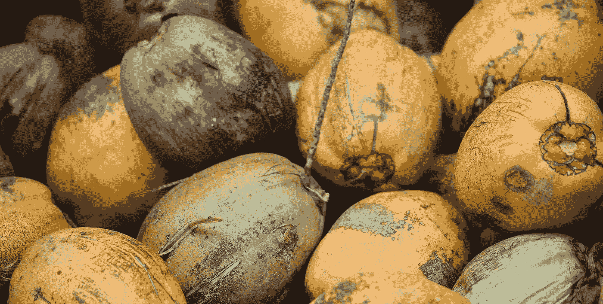

# 可可朋友和其他危险职业

> 原文：<https://medium.com/swlh/the-coco-frio-man-and-other-dangerous-occupations-9eea35130eb5>

每种职业都有其危险，有些比其他职业更明显。

Photo by [Max Lakutin](https://unsplash.com/photos/wodR2zj3Nvc?utm_source=unsplash&utm_medium=referral&utm_content=creditCopyText) on [Unsplash](https://unsplash.com/search/photos/coconuts?utm_source=unsplash&utm_medium=referral&utm_content=creditCopyText)

伍迪·艾伦开始了他的作家生涯。他太害羞了，不能成为一个喜剧演员，但他的智慧是不可否认的，他为每个人写小品和俏皮话。最终，他自己被推到了聚光灯前，因为他展示自己材料的技巧超过了其他人。