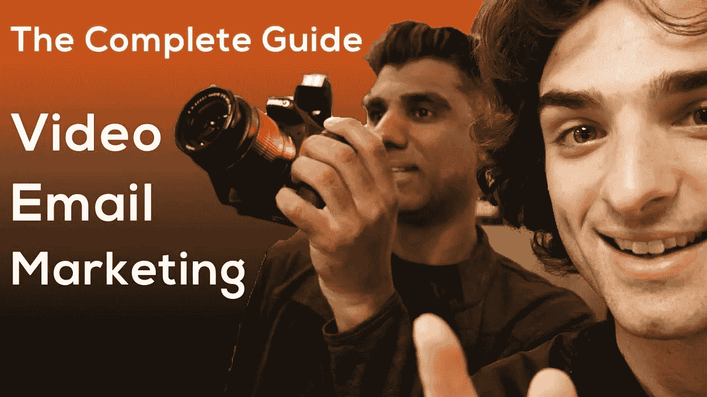

# 视频电子邮件营销完全指南

> 原文：<https://medium.com/swlh/the-complete-guide-to-video-email-marketing-b4094a95784b>

视频电子邮件营销是现代营销时代你可以追求的最具创新性和最有效的营销类型之一。它允许你以一种有效的方式分享视觉故事，并直接到达你的目标受众。

在本指南中，我们将涵盖您需要知道的一切，以便利用视频开展有效的电子邮件活动。

说到视频，请观看这个关于视频邮件营销的超级有趣且有教育意义的视频。以变形金刚中的大黄蜂为特色，好莱坞星光大道，和你真实的一些有趣的情况。

让我们开始吧…

# 第一步——确定你的目标

在你开始策划活动之前，写下你的目标是很重要的。这可以让你和你的团队清楚地为你的电子邮件营销建立前进的道路。你的策略应该根据你的目标量身定制，无论是获得注册还是带来电子书的曝光率。总的来说，在围绕你的企业开展运动的背景下思考你的目标。

# 第二步——选择加入或不加入

电子邮件营销没有捷径可走。我知道这有时很难听，但是，涉及获取未选择加入的电子邮件的方法可能比你想象的更有害。利用社交媒体内容建立订户基础，提升你的电子邮件列表。选择订阅是获得真实结果的唯一途径。你以后会感谢我的。

# 步骤 3 —创建视频内容

为电子邮件创建内容时，优先考虑视频。文本、图形和音频内容都是重要的格式。也就是说，视频应该是你的内容生态系统的核心。这是有原因的！事实证明，视频可以让人们保持参与，同时建立持久的关系。人们只是更喜欢看视频。当电子邮件中的图形和文本内容与视频结合使用来提供价值，同时培养**好奇心**时，这是非常有效的。使用带有视频播放按钮的动画 gif 让他们点击你的视频。请记住，视频的前几秒应该尽可能地吸引观众。

# 第 4 步—打包电子邮件

花时间优化你打包邮件的方式。告诉人们你在主题行中向他们提供了什么——他们无法预测电子邮件的另一面是什么——并确保在整个过程中保持清晰和诚实。以一种美学上令人愉快的方式格式化图形和文本，在电子邮件和你的登陆页面上的好设计将有助于增加转化率。此外，记得为移动设备格式化你的电子邮件——你优化的越多越好！如果您 80–90%的互动是在移动设备上进行的，请不要感到惊讶。

# 步骤 5——构建漏斗

把你的邮件序列看作一个漏斗

当你的电子邮件的目标是获得转化，开发你的登陆页面是关键。事实证明，在你的登录页面上使用视频是捕捉线索、提高转化率和建立品牌的最佳方式。事实上，我们的数据显示，将视频放在登录页面上，转化率最高可提高 300%。

# 第 6 步—数据跟踪

看看你能找到的所有数据。打开率有助于显示主题行的影响。请记住，转化率可以揭示你的内容的影响。使用像素并在登录页面上添加分析跟踪。这听起来可能很奇怪，但对退订率感到兴奋！这可以提高你的参与度，保持你的邮件列表健康，只给那些想看的人发邮件。这是

# 步骤 7 — A/B 测试

测试所有东西，因为通常你认为不起作用的东西最终会是最好的，反之亦然。进行单变量 A/B 测试，找出最佳解决方案。确保你的 A/B 测试集中在格式或设计的一个方面，这样你就可以准确地揭示什么是有效的，什么是无效的。你做的 A/B 测试越多，你就越能提高你的视频邮件营销效果！

# 第八步——个性化你的电子邮件

通过个人而不是公司帐户发送您的活动来建立关系。使用个人电子邮件签名，甚至可以考虑添加你的个人电话号码或谷歌语音号码！此外，制作一个 [Gravatar](https://www.gravatar.com) 也很有用——许多电子邮件收件箱都使用 Gravatar 服务来显示联系人的缩略图图标。在你的电子邮件页脚添加社交媒体账户，扩大你的社区。将您公司的地址添加到页脚，以遵守反垃圾邮件法。一般来说，熟悉电子邮件营销中防止垃圾邮件的法律很重要。

# 步骤 9 —发送时间

仔细考虑您选择发送电子邮件活动的时间。发送时间可能会根据您所迎合的受众、季节性、发送的其他电子邮件数量、当前事件和许多其他因素而有所不同。关于统计数据，对你在互联网上读到的东西要持保留态度，因为由于技术的进步和消费者行为的变化，行业指标正在快速变化。你能做的最好的事情是进行你自己的研究，然后尝试不同的发送时间，看看什么有效。

如果你遵循这 9 个步骤，你就有了一个很好的开始，用视频电子邮件营销作为你的秘密武器来推动你的电子邮件活动。

这里有几种类型的电子邮件，你可以发送。

# 电子邮件的类型

# 自动化电子邮件

Dropbox 在给那些对其软件感兴趣但没有完全安装程序的人发邮件方面做得很好。通过给那些不活跃的人发一封自动邮件，你有机会把他们再次吸引回你的生态系统。

# 网上研讨会公告

在你的领域被视为领导者的一个有效方法是举办一个网上研讨会，在那里你可以展示你的知识。Hubspot 很好地做到了这一点，它说明了你将如何从观看中受益，并包括一个强烈的稀缺(和兴奋)行动号召，以吸引人们注册。只需添加一份注册表格，您就可以成功举办网上研讨会了。

# 欢迎电子邮件

Buffer 很好地做到了这一点，如果您有任何问题，它会向您发送一封欢迎电子邮件，提供联系方法。即使只是一封简单的自我介绍邮件，也足以与你的新订户建立关系。包括任何有价值的内容或链接到您网站上的内容。

# 公告电子邮件

通知订阅者公司内部重大变化的一个简单方法是发送一封公告邮件。这让每个人都了解情况，并提醒你的订户为什么他们想和你签约。Postmates 无缝地发送公告邮件，向本地用户提供新的交易和送货折扣。他们还在同一封电子邮件中包含新的功能和机会，以吸引用户。

# 免费试用电子邮件

对于新用户，或者那些还没有完全注册的用户，给他们发送一个免费的广告或者软件试用版是吸引他们重新活跃起来的好方法。Kissmetrics 在这方面做得很好，它发送了一个 VIP 一对一演示，您可以注册。

一些公司甚至为现有客户提供升级选项或高级附加服务，包括相关信息和折扣。

# 即将举办的活动电子邮件

就像公告一样，你可以使用 B2B 电子邮件营销来推广即将到来的事件。这样做的诀窍是创造紧迫性、稀缺性和价值，从而激励你的订户采取行动。发送一系列带有倒计时的定时电子邮件，以及座位有限的通知。每封邮件都需要激发越来越多的紧迫感。沃达丰有一个非常棒的活动邮件策略。他们有一个倒计时钟，并无缝设置他们的电子邮件，以创造稀缺性，紧迫性和额外价值。

# 案例研究电子邮件

没有什么比社会证据更能说服一个人采取行动了。根据订户的数量，即使一个案例研究也足以吸引数百名新客户。将此案例研究与您的目标受众联系起来，以确保您有合适的人采取行动。Perfect Audience 有一个很棒的电子邮件活动，通知你所有使用他们产品的知名企业。因此，如果其他公司使用他们的服务，很有可能其他公司也会这样做！

# 视频邮件

我们都知道，视频是营销和联系受众的未来，所以没有什么比将视频纳入 B2B 电子邮件营销计划更好的了。Dubb 完美地做到了这一点，它允许用户在电子邮件中附上视频的 GIF 预览，并带有“播放图标”。一旦用户点击播放，他们将被带到一个自定义的视频登录页面，在那里他们可以观看视频(自动播放是一个选项，仅适用于桌面)。

现在你已经了解了 B2B 电子邮件营销技术中的一些顶级方法。

这些电子邮件营销的例子展示了一个好的电子邮件营销计划能为你的业务做些什么。感谢阅读(和观看)并订阅我们的频道(@dubbapp)获取更多视频！

如果您需要创建、托管、共享和跟踪网络摄像头、手机和屏幕视频方面的帮助，请访问 Dubb，a 以满足您对[销售和营销视频](https://dubb.com/)的需求。

# 特别优惠:要访问十几本免费电子书，了解如何有效地在业务的各个方面使用，请访问 Dubb Resources。

关于鲁本:鲁本是 [Dubb](https://dubb.com/) 的创始人。当他不创作下一个视频的时候，他可能会在玉米卷星期二或者和家人一起打鼓。在 [IG](https://www.instagram.com/rubendua) 、 [FB](https://www.facebook.com/rubendua) 、 [YT](https://www.youtube.com/theqbe) 、 [TW](https://www.twitter.com/rubendua) 、 [Medium](https://www.medium.com/@rubendua) 和他的[博客](https://www.rubendua.com/)上关注鲁本。

关于 Dubb: [Dubb](https://dubb.com/) 是一个流行的视频创作、托管、分享和跟踪平台。在 [IG](https://www.instagram.com/dubbapp) 、 [FB](https://www.facebook.com/dubbapp) 、 [YT](https://www.youtube.com/dubbapp) 、 [TW](https://www.twitter.com/dubbapp) 和 Dubb [博客](https://dubb.com/blog)上关注 Dubb。要获得 Dubb 的 14 天免费试用，[请求邀请](https://dubb.com/register)。

*原载于 2019 年 4 月 26 日*[*【https://dubb.com】*](https://dubb.com/blog/the-complete-guide-to-video-email-marketing/)*。*

## 这篇文章发表在 [The Startup](https://medium.com/swlh) 上，这是 Medium 最大的创业刊物，拥有+446，678 读者。

## 在这里订阅接收[我们的头条新闻](https://growthsupply.com/the-startup-newsletter/)。

