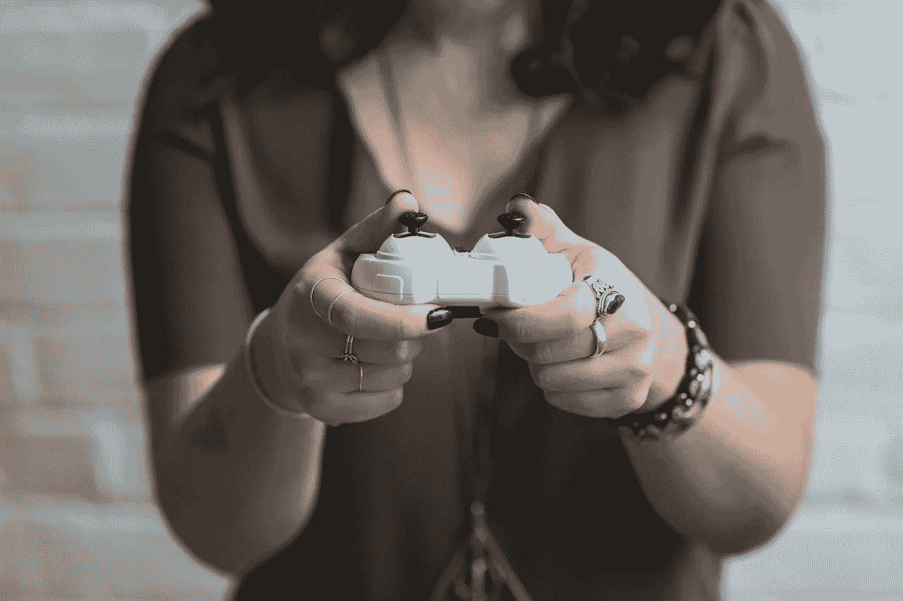

# 作为一名女性玩家的复杂性

> 原文：<https://medium.com/swlh/the-complexities-of-being-a-female-gamer-3bc8a1d762f4>

Photo via [Pixabay.](https://pixabay.com/)

电子游戏行业和文化长期以来被认为是男性和懂技术的男人的竞技场。然而，在过去的二十年里，媒介正在发生变化，在消费者和开发者层面都包括了女性。通过女性经营的发展中公司、全女性游戏团队和组织，以及女性激进主义不断增长的影响力，女性已经成为视频游戏媒体的积极赞助人。