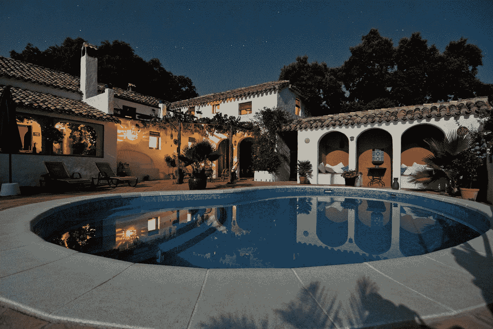

# 成功和幸福之间的复杂关系

> 原文：<https://medium.com/swlh/the-complicated-relationship-between-success-and-happiness-316ba734e4bf>

为什么不管你有多幸福，你总是想要更多。

Photo by [Marc-Olivier Jodoin](https://unsplash.com/@marcojodoin?utm_source=medium&utm_medium=referral) on [Unsplash](https://unsplash.com?utm_source=medium&utm_medium=referral)

带着一种敬畏和嫉妒的混合，我抬头看着我面前的三层楼的湖边房产。它的一切都很美；昂贵的户外家具，郁郁葱葱的庭院和景观，使它看起来像一个现代城堡的建筑。

在门外，我情不自禁地注意到了一面旗帜，那是我秋天即将开始就读的大学的旗帜。“这可能是我的未来！”我一边想着，一边上下打量着这座价值数百万美元的房子；美丽的湖景，令人惊叹的大理石泳池。

高中时，我整个暑假都和爸爸一起清理游泳池。我们的大多数客户来自与我相邻的极其富裕的社区，以科技公司的首席执行官和偶尔落魄的名人而臭名昭著。

我经常把这份工作比作希腊神话中诸神的惩罚。南方的高温大部分时间都在 90 度以上-100 度。虽然每个游泳池都充满了清凉的水，但我们从未被允许进入。这是一种特殊的折磨。

有一天，当我们在这座 3 层楼的豪宅里清理泳池时，主人出来和我们说话。

作为一个自豪的父亲，我的父亲告诉他，我将在秋天去这个人的母校。

他的回答直率而真诚。

“真的吗？你是怎么做到的？”

值得称赞的是，他意识到了自己的错误，并收回了祝贺我的话，但最初回应背后的原因是显而易见的；“帮助”是如何进入他的大学的？

接下来的对话紧张而尴尬。他问我想学什么，显然不喜欢我学心理学。他带着一种既批评又同情的眼神看着我，然后继续建议我做一个他让他儿子做的冗长的职业评估，这样我就可以知道自己“应该”学什么，找到一个真正能赚钱的“更好”的专业。

他建议我学商业或工程，没有问我对这些领域是否有兴趣或技能。

他给了我几分钟的不请自来的建议，让我回去照顾他的游泳池。

Photo by [Vita Vilcina](https://unsplash.com/@vivivi?utm_source=medium&utm_medium=referral) on [Unsplash](https://unsplash.com?utm_source=medium&utm_medium=referral)

那次谈话改变了我对成功的看法。在那之前，成功就是金钱；是大房子、好车和奢华的假期。我得到了我没有的一切，但我认为我需要成长。它得到了这个人的一切。

但是如果我很痛苦，这一切值得吗？难道没有其他的事情让生命值得活下去吗？

后来在大学里，在我的一门心理学课上，我了解到研究表明金钱真的买不到幸福，**只要有足够的钱。**(最后一部分很重要，但经常被忽略)。

这就是为什么我意识到我们需要拓宽我们的视野，去了解是什么让一个人成功。

成功的定义是完成一个目标或目的，那么当我们谈论成功时，为什么我们不谈论一个人生活中的所有目标呢？

成功可能意味着各种不同的事情:

成功可以是拥有一份你热爱的工作，即使它永远不会给你一栋湖边的三层楼房。

成功可以是走出你的舒适区，尝试新的东西，即使你失败得很惨。

成功可以是每天晚上回到家，看到一屋子关心你的人。

成功可以是在严重抑郁发作后终于起床。

成功可以是修复与家人或朋友破裂的关系。

现在，这绝不是呼吁平庸。很多人在经济上很成功，非常幸福，这一点也没什么不好(我当然希望有一天能达到这一点)。

相反，这是一个感恩的呼唤。我们经常迷失在做得更多、做得更好的文化中，忘记了后退一步，欣赏身边已经存在的东西。

我们忘记了在我们的关系、爱好和职业中寻找意义，而是专注于将自己与他人进行比较。

正是这种“越来越多，越来越多”的心态让人们陷入了不快乐的循环中，无论有多少成功都不够好。

所以深呼吸。环顾四周。

是什么让你成功？