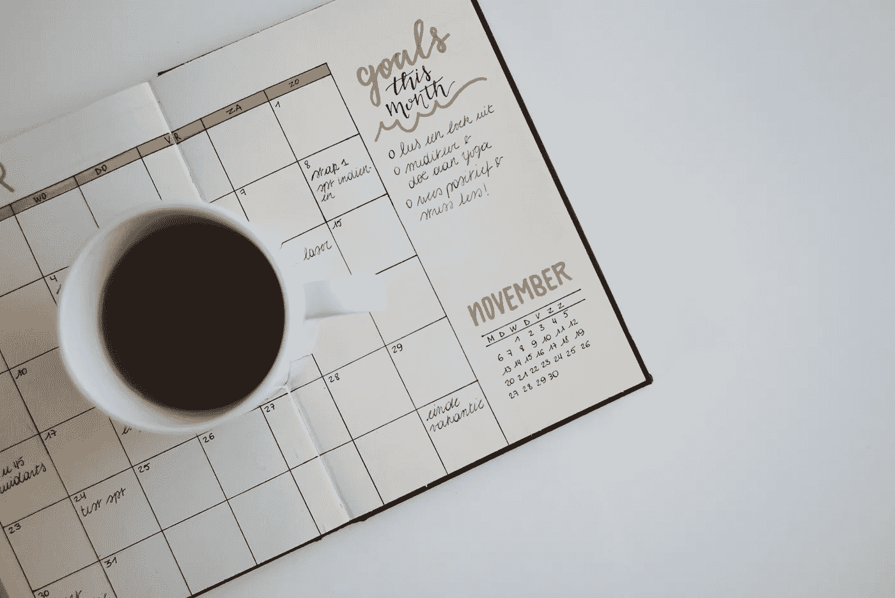

# “自我提升”的概念是误导性的

> 原文：<https://medium.com/swlh/the-concept-of-self-improvement-is-misleading-2253fd228f5>

Photo by [Estée Janssens](https://unsplash.com/photos/aQfhbxailCs?utm_source=unsplash&utm_medium=referral&utm_content=creditCopyText) on [Unsplash](https://unsplash.com/search/photos/goals?utm_source=unsplash&utm_medium=referral&utm_content=creditCopyText)

我越是沉浸在自我提升中，就越觉得矛盾。

一方面，不断成长、磨练自己的技能并成为“最好的自己”的想法很棒。另一方面，它通过让我坚持常规、富有成效、优化我的表现等等，给我带来了一些限制。