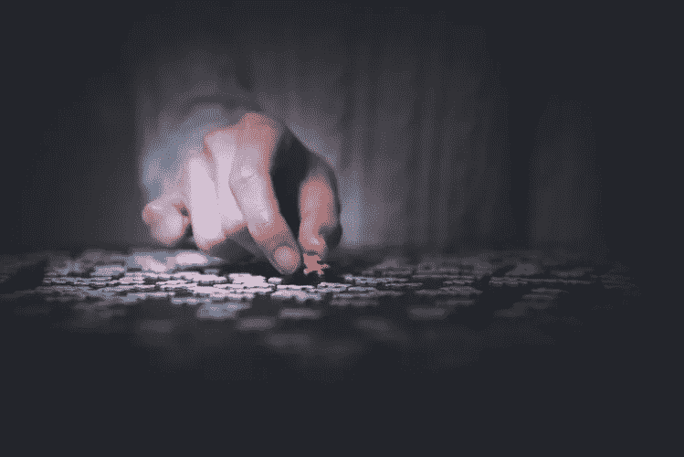

# 社交媒体上女性和少数民族自我的建构

> 原文：<https://medium.com/swlh/the-construction-of-the-female-and-minority-self-on-social-media-b7fff35f2576>

# 不管有没有社交媒体，作为女性，我们是谁？

现在科学证明了社交媒体会导致抑郁。你可以在这里阅读[，在这里](https://hbr.org/2017/04/a-new-more-rigorous-study-confirms-the-more-you-use-facebook-the-worse-you-feel)阅读[，在任何你想看的地方](https://www.msn.com/en-xl/northamerica/tech-science/for-the-first-time-researchers-say-facebook-can-cause-depression/ar-BBPOHYS)阅读[。](https://www.bloomberg.com/opinion/articles/2019-02-04/facebook-may-contribute-to-depression-nyu-study-shows)

我们都知道，研究结果比标题让我们相信的要微妙和复杂得多。然而，乍一看，证据似乎表明，放弃(甚至只是减少)使用社交媒体的人受益匪浅:

> “许多以中度临床抑郁症开始研究的人，几周后就以非常轻微的症状结束了研究”

就我自己而言，当研究开始看起来有权威性时，我浏览了这些文章，然后决定我没有什么可失去的。2016 年大选后，我自己的心理健康和世界其他地方一样受到了打击。每个人对脸书的信任都被侵蚀了，在任何平台上为公众消费而掌控自己的生活的想法开始变得令人感觉良好……恶心。

我没有停用我的社交媒体账户。我刚刚停止使用它们。每当我想无意识地滚动时，我就做些别的事情来代替。我看了看自己的照片，或者在 Kindle 上看了一本书。

那是在 2019 年 1 月，写了[这篇关于社交媒体这么多工作的文章](/@annalgrace/its-all-just-noise-really-on-social-media-burnout-a16177fdc3be)之后，哈！在某些方面，放弃它是一种解脱。从幼儿园开始，知道一个人的整个社交圈的每一分钟都发生了什么，这无疑是一种负担。这是“情绪劳动”的一个方面，试图跟上、喜欢、爱和做出令人鼓舞的评论。此外，拒绝滚动意味着放开 FOMO，研究认为这是我们不满的最大原因之一。

随着这种分离，我也感到悲伤。我没有和朋友们保持联系，因为工作和孩子的需要，我没有经常和他们见面。我失去了海外家人日常生活的线索。在开始我的实验六个月后，我可以诚实地说，我感觉我的情绪没有明显的变化:我的快乐商数没有巨大的改善，无论是积极的还是消极的。

离开脸书和 Instagram 后，我注意到的一件事是，我的生活缺乏记录、连贯和有条理的叙述(好吧，半有条理)。我认为，在一个被社交媒体关注和塑造的世界里，对许多人来说，这可能是一种去中心化和去稳定化的体验，这可能实际上*降低了他们的心理健康和幸福感。*

社交媒体为我们做了一些以前只能通过写回忆录(还有*想办法出版*，别忘了)或其他更正式、更难获取的方法来实现的事情。它记录了我们的生活，而这种记录曾经只提供给那些非常有名的人；那些大多是白人男性的人。不仅如此，根据我们的*自己的*解释，文档是我们自己的*声音。*

在一个妇女和少数民族的声音被忽视、淡化甚至抹杀的社会里，我们有机会控制和塑造自己生活故事的元素，难道不是一件完全坏事吗？难道*没有授权*以我们希望被看到的方式*呈现我们自己，而不是以我们被白人男性凝视的方式呈现(或更经常被抛弃)吗？*

历史上女性写日记和日志的方式总是让我着迷。这是一种社会认可的女性构建自我的方式，但仅限于私人领域。没有机会在公共广场上被看到，这带来了危险和潜在的增长，我们的自我概念不时被调整或挑战。

对于任何一代人来说，第一次,“普通的”和不出名的女人可以不再是“被注视的”,而成为一个积极凝视世界的人。她可以是“主体”而不是“客体”，能够自我反思并选择她希望强调的生活中的时刻和方面。她能够见证历史，也能够公开记录她的感受，以及她对此的反应——也就是说，她觉得自己有足够的权力，尽管/在父权制度的约束下。

在我们有机会在这种新媒体下充分发展之前，谴责我们集体自恋的圣歌已经开始了。然而，即使我们的# bestlife 帖子有时有点以自我为中心，我们也需要考虑这样一个事实，即女性和少数民族经常被推为“人类给予者”，而不是“人类”(这是阿米莉亚&艾米丽·纳戈斯基在他们的书《[倦怠:解开压力循环的秘密](https://www.amazon.com/Burnout-Secret-Unlocking-Stress-Cycle-ebook/dp/B07DT4GW16/ref=sr_1_3?keywords=burnout&qid=1562804299&s=gateway&sr=8-3)》中定义的概念)。对我们来说，抵制这种压力，展示我们强烈的自我意识和能动性难道不是正确的吗？我经常在我的社交媒体上看到女性这样做——她们穿起来很好看。

考虑到女性很难表达我们的心声，难道我们不应该收回一些话语权吗？*当然*感觉很自恋*当然*我们会被一些人指责自恋。我们知道，任何谈论或描写自己的人都只是一个普通人，我们都应该了解他的经历。(看看米勒，海明威，凯鲁亚克的例子。)一个敢说敢写自己的女人，简直就是……自私。看看 Anais Nin 过去和现在仍然受到各方面猛烈批评的方式。

以我的个人经验，我有时会冲动地使用社交媒体来表达强烈的感受或观点，然后随之而来的是情绪上的反弹；我直言不讳(这可能会让我看起来沮丧或愤怒)的羞耻感。我占用了人们宝贵的时间来分享内心的想法，有些人可能认为最好保持“私密”。最后，我开始质疑这是否让我成为了一个“注意力寻求者”。这经常让我退回我的帖子，从我的时间线中隐藏或删除它们，有效地将我自己从对话中抹去。(布伦·布朗的一些关于脆弱性的研究有助于区分哪些事情应该在社交媒体上公开，哪些事情应该保密。)

还有其他一些场合，我觉得发布负面想法比庆祝积极和成功的经历更安全，因为我担心别人会认为我在“完善”和过于小心地管理我的生活。

我一直站在脸书辩论的两边。我思考过(好吧，想多了)，考虑过，再考虑过使用或不使用社交媒体的方式。毫无疑问，脸书是一个有缺陷的空间，在一个有缺陷的家长制资本主义社会中，被有缺陷的个人所利用。我们已经被破坏和数据挖掘到死。没有人有义务在社交媒体上发布消息，但一个古老的哲学问题是，“如果一棵树在森林中倒下，而周围没有人听到，它会发出声音吗？“可以换成这个:

*如果一个女人生活在数字世界，却不在社交媒体上发一条帖子，她还有发言权吗？*

妇女和少数民族又一次将我们从公共领域抹去了吗？如果有，为什么？在这个特朗普式蔑视的时代，我们的积极缺席是对我们能够感受到的强加给我们的权力的真正有效的抗议吗？

我们愿意把空间让给那些长期以来试图殖民我们身体和思想的人吗？那些乐于看到我们被吓回顺从、被动、顺从的沉默的人？

还是我们试图改变我们思考和使用社交媒体的方式？我们是否在寻找新的、越来越有创意的方式来粉碎父权制，以意想不到的强大、肯定生活、改变世界的方式提高和放大彼此的声音？