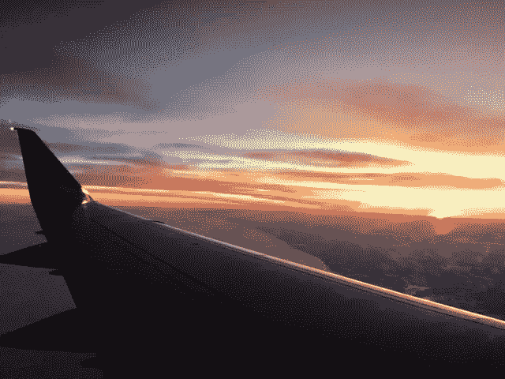

# 理解航空新闻的消费者指南

> 原文：<https://medium.com/swlh/the-consumers-guide-to-understanding-aviation-news-e0031b6efe13>

我们称自己为#极客。我们中的一些人出生在航空世家，就像我一样(我父亲是美国航空公司的金融分析师)。

其他人是有执照的飞行员和航空公司工作人员。更多的是记者或普通飞行员，他们自学了航空工作原理。