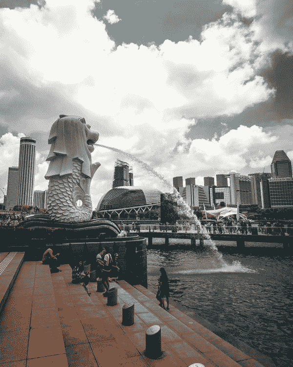

# 新加坡政府的共同所有权成本

> 原文：<https://medium.com/swlh/the-cost-of-common-ownership-to-the-singapore-government-f6b519b567eb>

Source: Pexels. [https://www.pexels.com/photo/merlion-singapore-1561863/](https://www.pexels.com/photo/merlion-singapore-1561863/)

通过中介金融投资的兴起，全球范围内的共同所有权有所上升。共同所有权的增加是否扭曲了在同一市场竞争的公司的行为，这个问题尚无定论。我和我的合著者、澳大利亚国立大学的健太郎·阿赛利用来自 22，000 多次公开拍卖的公开数据发现，拥有共同资产的公司…