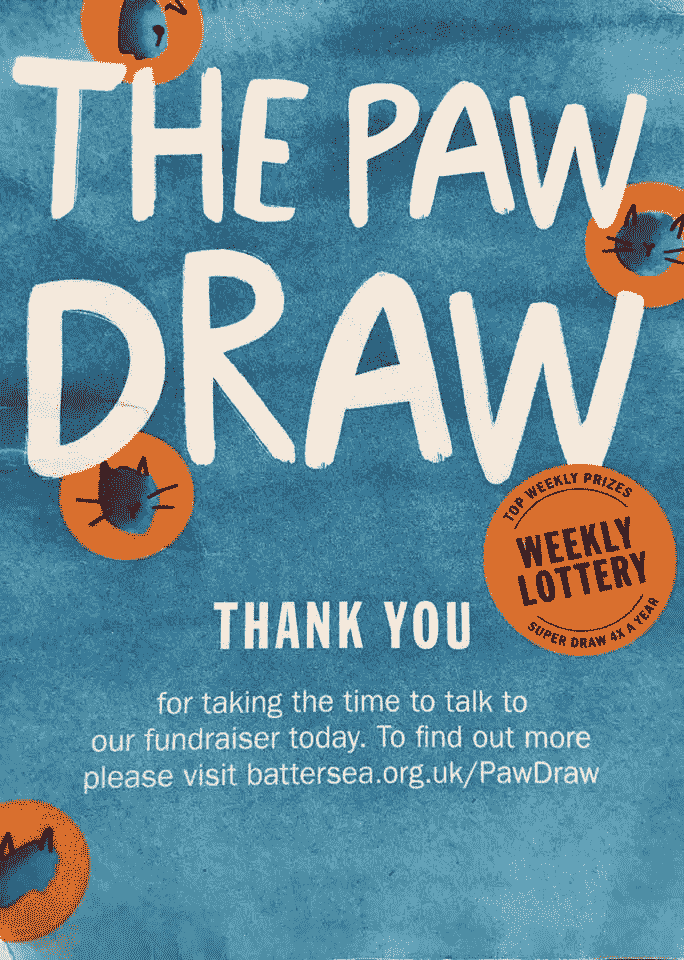

# 不付出的代价。

> 原文：<https://medium.com/swlh/the-cost-of-not-giving-9f5011182a5a>

Take a chance on generosity

上周，我在街上被一个筹款团队拦住，问我是否会考虑加入一个独特的 [**【爪画】**](https://www.battersea.org.uk/support-us/paw-draw-weekly-lottery) ，以支持一个领先的狗狗救援协会。

只要每周捐赠 1 英镑，我就有机会参加抽奖，赢得每周 600 英镑的奖金。当我问该慈善机构的现有定期捐赠者是否有资格参加这次抽奖时，该团队似乎不知道。作为一个养狗的人，我已经知道…