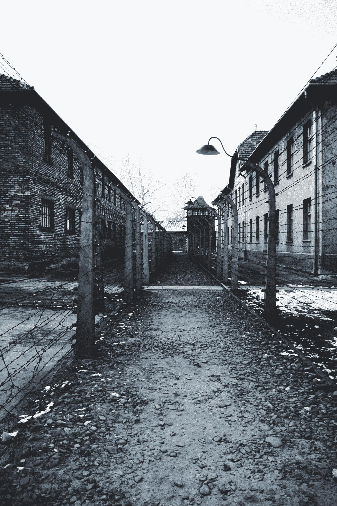

# 生存的成本

> 原文：<https://medium.com/swlh/the-cost-of-survival-bcbf3aaee5a>

# 评海瑟·莫里斯的《奥斯威辛的纹身者》

Photo by [Erica Magugliani](https://unsplash.com/@ericamagu_ph?utm_source=medium&utm_medium=referral) on [Unsplash](https://unsplash.com?utm_source=medium&utm_medium=referral)

想象你没有家。你被释放到一个你不认识的国家的乡下，远离家乡。你没有食物。没有水。没有家。没什么。想象这是你一生中最好的结果。除了生存的希望一无所有。除了你的生活一无所有。

海瑟·莫里斯的《奥斯威辛的纹身师》是一本一旦开始就无法放下的书。我发现自己一整天都在偷着读它，一回到家就一直读到最后。对我来说，在工作日的一天内完成一本书已经变得相当罕见了。这次我成功了。

这部小说是根据海瑟·莫里斯听到的真实故事改编的。我们跟随 Lale，因为他自愿去一个劳动营保护他的家人，不知道他们将被送往集中营几天后，他的离去。他的牺牲是毫无意义的。我们和他一起坐在一列火车的牛车里，车上挤满了人，他们无法坐下或休息。他们没有食物和水。

他们终于到达了目的地，在门口排起了队。他们已经到达奥斯威辛。他们都不知道这意味着什么。他们被告知留下他们的物品，并排队提供信息——他们的姓名、年龄、职业。然后他们去找纹身师，纹身师把他们的号码——他们的新身份——纹在他们的手臂上。

此时，Lale 意识到他再也看不到他小心翼翼地放在手提箱里的东西了——书和衣服。其他人带着财宝——钱、珠宝和其他贵重物品。我无法想象我的书会被拿走。

Lale 决定在这个恐怖的地方生存。还有很多恐怖的事情。他多次遇到门格尔博士。门格尔玩弄他的灵魂，在他的朋友身上做实验。他看到实验正在进行。

为了生存，他做他需要做的事情——他变成了一个合作者。他成了纹身师——负责残害带着新身份来到集中营的人的身体的人——一个号码。

当他遇到一个女孩 Gita 时，我们很震惊，我们意识到他能够和她在一起。他的职位赋予了他其他人所没有的特权。当然，这些特权是有代价的。在他的周围，人们在慢慢的饿死，工作到死，或者被处死。他看着他们建造毒气室和火葬场。在他们完成之前，他看着他们把要被消灭的人装上巴士，然后在巴士里装满气体杀死他们。在集中营里，人们被党卫军成员随意杀害。他被死亡和腐烂包围着，但他从未失去求生的意志。

尽管这本书以爱情故事为卖点，但我发现它更像是一本生存之书。莫里斯记录了在奥斯威辛集中营的生活经历，包括它的建立，使用的高峰期，以及结束时的破坏和解放。通过 Lale 的眼睛，我们经历了二战期间作为一个犹太人在欧洲的恐怖，我们也经历了伴随着幸存而来的恐怖。很难想象一个大屠杀幸存者经历了什么，但莫里斯让我们非常接近。

很难想象有多少不为人知的故事。那些我们永远不会听到的故事。数百万人被集中营机器压制的声音。整个家庭，整个城市，被消灭。

这些人没有自己的房间。他们没有收入。他们失去了一切。他们失去了接触书籍的机会。他们不会写字。他们唯一的希望就是活下来——不屈服于饥饿、苦役、党卫军的突发奇想——他们会随机选择死亡、酷刑或被送进毒气室。

这是一部强有力的小说，让我想了解更多。我想去参观奥斯威辛和比克瑙。我想站在他们曾经站过的地方，我想纪念那些逝去的生命。童年被偷走了，从集中营的恐怖中幸存下来的人将不再是原来的他们。

看了这本小说，我自己的烦恼都显得小了。我发现自己在写“如果 Lale 和 Gita 能挺过来，我什么都可以做。我需要停止抱怨我相对优越的生活中的事情。”这部小说也让我想到，我们会多么容易陷入类似的暴行。我思考着发生在美国和墨西哥边境的事情。我们如何把这些人放入类似的阵营。我们听到一些死亡的故事——包括儿童的死亡——但是我们知道他们在这些难民营中经历的真实情况吗？人类还有能力制造这种恐怖吗？

我得出的结论是，我们肯定有能力做这些事情。问题是，我们的自满会让我们转过头去，忽略周围发生的事情。我会有勇气在像 Lale 和 Gita 的世界里生存吗？我是否能够不择手段地活下去？我不确定。最终，读者不得不问，鉴于他们所经历的创伤和恐怖，生存是否比死亡更好。我仍然不确定如何回答这个问题。

这本书不仅仅是一个爱情故事。这不仅仅是一个生存的故事。这是一部复杂的编年史，记录了人类能够做出的恐怖行为。这是一个经历悲剧和见证奥斯威辛和比克瑙悲剧的故事。这是一个你不会放下的故事，我怀疑这是一个你永远不会忘记的故事。