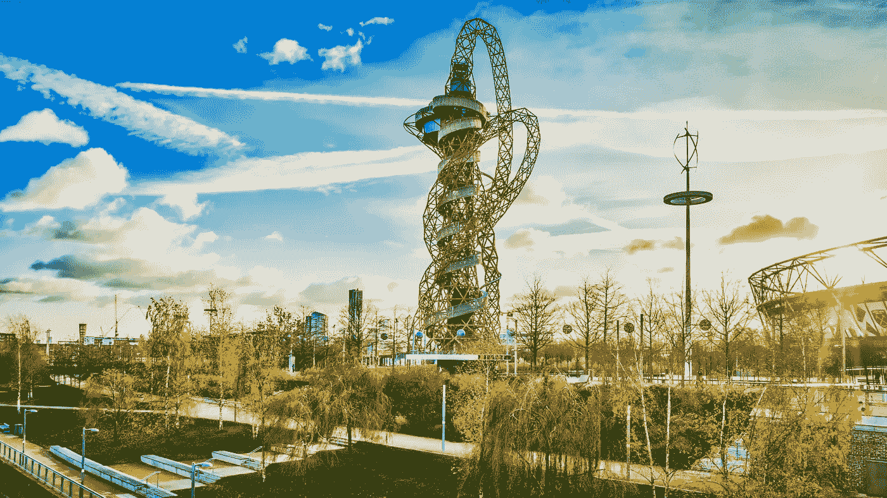

# 安尼施·卡普尔的创作生活

> 原文：<https://medium.com/swlh/the-creative-life-of-anish-kapoor-e5d5339f3e3d>

## 世界级艺术家的套路和流程

The ArcelorMittal Orbit Tower in east London, by Anish Kapoor in collaboration with the engineer Cecil Balmond

安尼施·卡普尔爵士是英国最著名的艺术家之一。他的作品在世界各地的主要艺术机构展出，而大型公共雕塑如芝加哥的云门(又名豆子)和伦敦奥林匹克体育场旁边的轨道塔已经成为地标和旅游景点，帮助复兴…