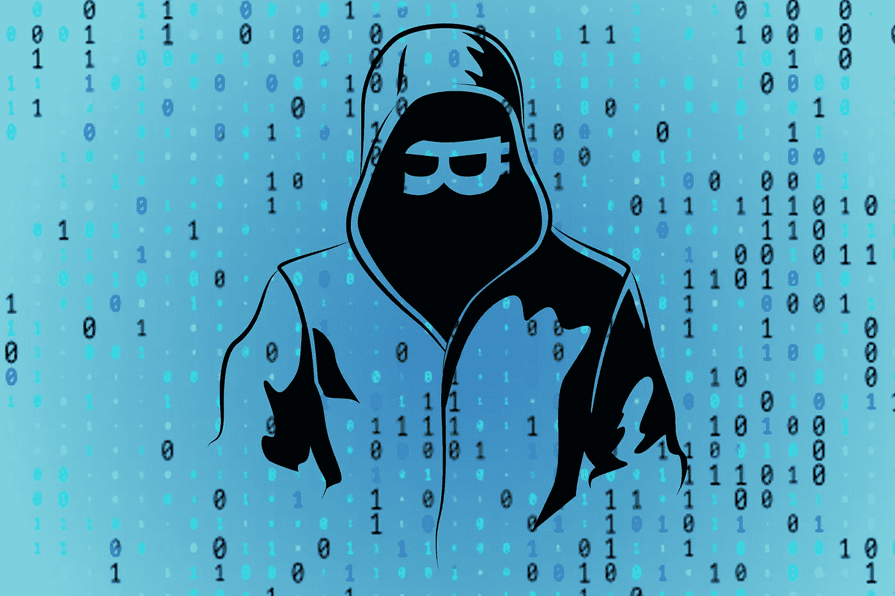
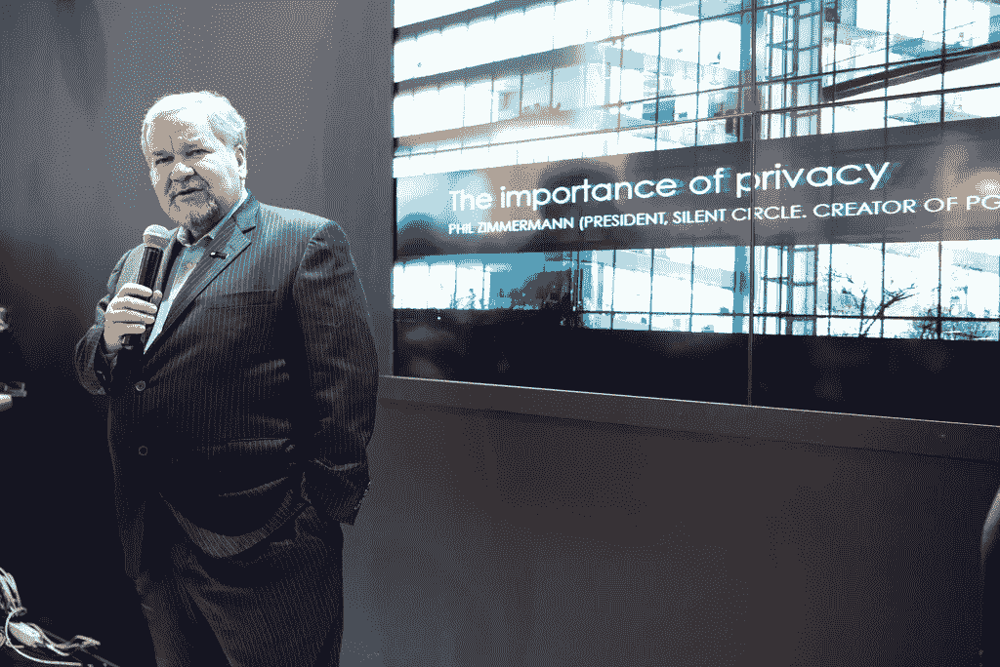

# 比特币的创造者中本聪很可能就是这个人

> 原文：<https://medium.com/swlh/the-creator-of-bitcoin-satoshi-nakamoto-is-most-likely-this-guy-8723eddb517c>

当今科技界最大的谜团不是比特币如何工作，而是谁是比特币的创造者。2008 年 10 月 31 日，一个名为**中本聪**的人在一个加密邮件列表上发布了一份白皮书。这件事改变了金钱的历史，我**让我们所有人都想知道这件事背后的主谋。**

多年来，许多记者和博客试图揭开笼罩在比特币创造者身上的阴影，但运气不佳。有很多候选人，其中一些甚至是自我提名的。然而，没有人对他们的说法给出明确的证据，所以我们仍然在寻找神秘事件背后的人。

然而，有一个突出的候选人。我不得不猜测，我会非常肯定地说，他就是比特币的创造者。在我告诉你我选择了谁之前，让我们评估一下我们对中本聪的了解。或者，更好的是，**他想让我们知道的**。

Satoshi’s profile on the P2P Foundation website

在 Satoshi 的 [P2P 基金会简介](http://p2pfoundation.ning.com/profile/SatoshiNakamoto)中，他自称是来自日本的**男子，出生于 1975 年 4 月 5 日。问题是他的举止和声音都不像来自日本的人。首先，他用**完美英语**写了白皮书和他的后续帖子。其次，对于生活在日本的人来说，他的睡眠模式非常奇怪。**

比特币论坛成员 Stefan Thomas 从 Satoshi 的 500 多篇帖子中绘制了时间戳。他发现中本聪在日本时间下午 2 点到晚上 8 点之间从不发布任何东西。所以，有可能——甚至很有可能——聪的整个身份都是虚构的。

但是他为什么要伪装成别人呢？

# 有一个很好的理由

就像有[非常好的隐私](https://en.wikipedia.org/wiki/Pretty_Good_Privacy)一样，这个项目使人们能够**互相发送加密信息**。 [Phil Zimmermann](https://en.wikipedia.org/wiki/Phil_Zimmermann) ，一位想要给持不同政见者一个**不受政府约束的沟通渠道**的活动家，创建了 PGP。然而，美国政府意识到了这项技术的潜力，并将其没收。PGP 和 Zimmermann 随后成为刑事调查的对象。

Phil Zimmermann

这项技术唯一能做的就是让两个人在不被窃听的情况下进行交流。因此，想象一下政府会如何对待比特币的创造者，这种技术可以在没有银行或中介的情况下实现自由资金转移。从政府手中拿钱的技术。

# 我们对比特币的创造者了解多少？

既然我已经掩盖了我对他的身份和隐藏原因的疑虑，下面是我们对中本聪的了解。

正如我已经提到的，metzdowd.com 和中本聪 [**的白皮书**](https://bitcoin.org/bitcoin.pdf) 出现在加密邮件列表 ***上。他在 2008 年万圣节提出了九页的文件*“一个完全点对点的新电子现金系统，没有可信任的第三方”*。***

Whitepaper screenshot

他随后创建了 [*bitcointalk*](https://bitcointalk.org/index.php) 论坛，并以笔名 ***satoshi*** 发布了第一条消息。他还做了一个域名为[*bitcoin.org*](https://bitcoin.org/en/)的网站，继续从事比特币软件的工作。2009 年 1 月 3 日， [Satoshi 开采出第一个比特币区块](https://cryptpresso.com/timeline/#genesis-block-is-mined)，被称为**“创世纪区块”。**

The first bitcoin

整个 2010 年，中本聪**与其他开发者**合作修改比特币协议。他**参与了比特币社区**，并与他们频繁通信。然后，**突然将密钥和代码**给了[加文·安德森](https://en.wikipedia.org/wiki/Gavin_Andresen)，并将域名转让给了社区成员。到 2010 年底，他已经停止了这个项目的工作。

然后，2011 年 4 月 23 日星期六，比特币的创造者再次现身 [**发布他的最后一条消息**](https://pastebin.com/syrmi3ET) 。当开发者[迈克·赫恩](https://plan99.net/~mike/#top)问他是否打算重新加入社区时，**聪回答说:**

> 我已经转移到其他事情上了。加文和所有人都很好。

# 这就是来自中本聪的

那个彻底扰乱了金融体系的人消失了。但是为什么呢？

[https://www.latimes.com/local/obituaries/la-me-hal-finney-20140831-story.html](https://www.latimes.com/local/obituaries/la-me-hal-finney-20140831-story.html)

我们还应该考虑到，Satoshi 的比特币地址曾经——现在仍然包含大约 100 万 BTC。2017 年 12 月，价格见顶时，**他拥有超过 190 亿美元**。在那短暂的一瞬间，中本聪成为世界上第 44 富有的人。直到今天，他还没有兑现一个比特币。

所有这些证据表明，比特币的创造者可能出事了。**这就是为什么我相信** [**哈尔芬尼**](https://web.archive.org/web/20140403012916/http://www.finney.org/~hal/) **就是中本聪**。

不幸的是，哈尔·芬尼在 2009 年被**诊断出患有**[**ALS**](https://en.wikipedia.org/wiki/Amyotrophic_lateral_sclerosis)**并与疾病抗争，直到 2014 年去世。我想象他**创造了金钱**的未来，但随后在病情恶化时不得不撤退。然后他死了，留给我们的只有关于比特币创造者真实身份的传言。**

他无法继承王位。

Screenshot: Comments on Bitcoin.com

# 哈尔·芬尼是谁？

哈尔·芬尼是一名计算机科学家，1979 年毕业于 T2 加州理工学院。作为一名学生，**他获得了同龄人颁发的“最有头脑”奖。大一期间，他选修了一门为研究生设计的引力场理论课程。芬尼似乎非常聪明，这符合成为中本聪的第一条标准。**

学生们还记得看到芬尼拿着一本**安·兰德的** [***阿特拉斯耸***](https://en.wikipedia.org/wiki/Atlas_Shrugged) 。如果他在阅读这类文学作品，他很容易就会形成自由主义的人生观。

**而他做到了**。他的观点将他推向了一个鲜为人知的自由思想者和编码者团体。90 年代初，**成为** [***赛博朋克***](https://en.wikipedia.org/wiki/Cypherpunk) 成员。这个运动致力于“*强大的加密技术和隐私增强技术的广泛使用，作为社会和政治变革的途径*”他们自称为隐私的捍卫者，芬尼将自己的知识用于实现秘密无政府主义者的愿景。

# 芬尼和齐默尔曼彼此非常了解

当有人在 *Cypherpunk 的*邮件列表上写下上述 Phil Zimmermann 和他对 PGP 的想法时，Hal 做出了回应。他联系了菲尔，并成为 PGP 公司的第一名员工，一直在那里工作到 2011 年退休。同年，中本聪**停止了与比特币**的联系。

芬尼为 PGP 协议的新版本做出了重大贡献，但是他不得不向政府隐瞒他的参与。所以他很清楚**菲尔对于 PGP 的问题。正因为如此，我能理解他在创造比特币时隐藏身份的愿望。**

## 但是他为什么选择做一个来自遥远日本的人呢？

Dorian Prentice Satoshi Nakamoto

嗯，他的虚构角色比看起来更接近 T1。离他家不到两英里的地方住着另一位名叫 [**多里安·普伦蒂斯**](https://www.newsweek.com/2014/03/14/face-behind-bitcoin-247957.html) 的科学家。有可能芬尼冒用中本聪的身份是为了隐瞒自己的身份。我的意思是，他们都住在坦普尔城的几率有多大，这个小镇只有 36000 人？一个密码天才和另一个名字与比特币的创造者一模一样:**太巧合了？**

# 让我们看看其他的线索

在邮件列表上发布白皮书后，中本聪**收到了三个回复**。其中两例**阴性**。不过第三个回答非常**肯定**，提振了比特币的接受度。猜猜是谁发的这条消息？你说得对，是哈尔·芬尼。

**消息是:**

> 这看起来确实是一个非常有前途和有创意的想法，我期待着看到这个概念如何进一步发展。

他甚至鼓励 Satoshi 编写代码，认为其他人一旦看到网络运行就会被说服。

 [## 第一笔比特币交易是什么？

### 回答(第 1 题，共 6 题):实际上有三笔交易。两台计算机之间的第一次交易暂停…

www.quora.com](https://www.quora.com/What-was-the-first-Bitcoin-transaction) 

故事的其余部分是这样的:当代码完成，程序准备好测试时，Hal 收到了第一个版本**。2009 年 1 月 10 日，他下载了代码并连接到比特币网络。他的电脑是第一台连接到聪网的电脑。**

**两天后，哈尔**收到了来自中本聪的 10 辆 BTC** 。[那是两台电脑](https://cryptpresso.com/timeline/#the-first-bitcoin-transaction)之间的**第一笔比特币交易**。对我来说，非常有趣的是 Hal 总是参与比特币最重要的时刻。**

**Hal’s famous tweet**

# **我认为事情的发生没有什么不同**

**我认为 Hal Finney 是 Satoshi 账户的幕后黑手，他给自己发了信息。**

**我知道，这看起来有点牵强。然而，如果你想故意隐瞒你对这个项目的贡献，这是一个好办法。他伪造了这些信息，并将第一批比特币寄给自己，以测试交易系统。**这就是他从不还钱的原因。****

**更不用说，[根据维基百科](https://en.wikipedia.org/wiki/Hal_Finney_(computer_scientist))，哈尔·芬尼创造了**第一个可重复使用的工作证明系统**。如你所知，这是比特币所基于的协议。此外，芬尼对 20 世纪 90 年代的**数字货币**非常着迷。1993 年，他甚至创造了自己的货币，名为 **CRASH** ，源自加密现金。**

****

**[https://cypherpunks.venona.com/date/1993/12/msg00218.html](https://cypherpunks.venona.com/date/1993/12/msg00218.html)**

**在此之前，[大卫·乔姆](https://en.wikipedia.org/wiki/David_Chaum)发明了**匿名电子货币**叫做 [DigiCash](https://en.wikipedia.org/wiki/DigiCash) 。美国的一家银行开始试验这种方法，Hal 立即在那里开了一个账户。问题是 Chaum 的**版本是中央集权的**，当他的公司倒闭时，DigiCash 也跟着倒闭了。芬尼对此不太感兴趣，于是他开始想办法让货币去中心化。**就像比特币**一样。**

# **但是哈尔·芬尼否认了这一切**

**当然，**这并不是**第一次有人认定哈尔·芬尼是比特币的创造者。《福布斯》记者安迪·格林伯格甚至去他家问他是否是真正的中本聪。哈尔断然否认了这一指控。作为证据，他的儿子杰森展示了哈尔和聪从 2009 年开始的对话。他还否认认识来自天普市的邻居多里安·普伦蒂斯·中本聪。**

**我想他只是想和家人共度最后的时光。由于他基本上瘫痪了，他不希望被媒体的马戏打扰。媒体并不是唯一的问题。在他死前不久，有人试图向他勒索 1000 BTC。想象一下如果罪犯知道他是真正的中本聪会做什么。我们更不要去想政府会对他做什么。**

****

**Hal Finney with his wife**

**所以，他决定保持低调。这是最好的选择。Satoshi 的匿名性增加了人们对系统的信任度。他给世界带来了非凡的东西，**一份他可以引以为豪的遗产**。如果比特币成功了，它将**把权力从**政府和企业手中转移到**个人手中**。**

**在技术时代，当我们的隐私受到威胁时，比特币是值得期待的。创造者背后的神秘留给我们想象的空间；**每个人都可以把自己的视野投射到比特币上**。**

# **遗产**

**虽然他的作品比他活得长，但我们不应该忘记哈尔·芬尼和他留给人类的遗产。即使我错了，他不是真正的中本聪，我们也应该永远记住他对比特币的贡献。在我们为更美好的明天而奋斗的过程中，他是一名优秀的战士。**

**Great painting of Hal Finney from a Reddit member**

****

## **这篇文章发表在 [The Startup](https://medium.com/swlh) 上，这是 Medium 最大的创业刊物，拥有+432，678 名读者。**

## **在这里订阅接收[我们的头条新闻](https://growthsupply.com/the-startup-newsletter/)。**

****