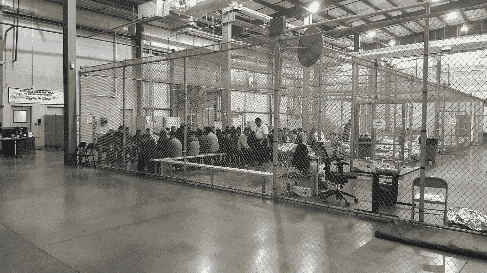

# 残酷是意图

> 原文：<https://medium.com/swlh/the-cruelty-is-the-intent-a0e6e8e94e11>

## 我们南部边境的集中营是如何为非人化机器服务的

[Source: Flickr](https://www.flickr.com/photos/cbpphotos/42831734412)

人道。不人道。

如果你一直在社交媒体和新闻中关注美国南部边境发生的事情，你很可能不止一次听到这些话，[包括来自善意的作家](https://www.pbs.org/newshour/show/a-firsthand-report-of-inhumane-conditions-at-a-migrant-childrens-detention-facility?fbclid=IwAR3LVwb0aThgFwShIpf9HevHoHFIKc8TDFio_Ic9MzJQ-Vyuah3RF7DgzEg)除了对人民的同情什么都没有…