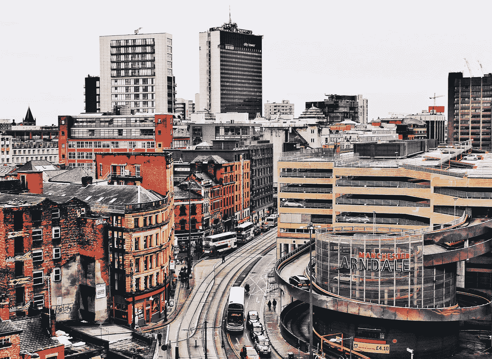

# 颠覆崇拜

> 原文：<https://medium.com/swlh/the-cult-of-disruption-ac8510a86984>

## 以及当它来找你时该如何处理

Photo by [William McCue](https://unsplash.com/@mrwilliamo?utm_source=unsplash&utm_medium=referral&utm_content=creditCopyText) on [Unsplash](https://unsplash.com/search/photos/shambles-manchester?utm_source=unsplash&utm_medium=referral&utm_content=creditCopyText)

1996 年(是的，我一直在挖掘我的过去)，爱尔兰共和军在英国曼彻斯特市中心放置了一枚炸弹。那是一个星期六，我正在中央购物区外面做我的第二份兼职工作。

上午 11 点 17 分，我听到一声巨响。英国有史以来最大的和平时期爆炸的炸弹…