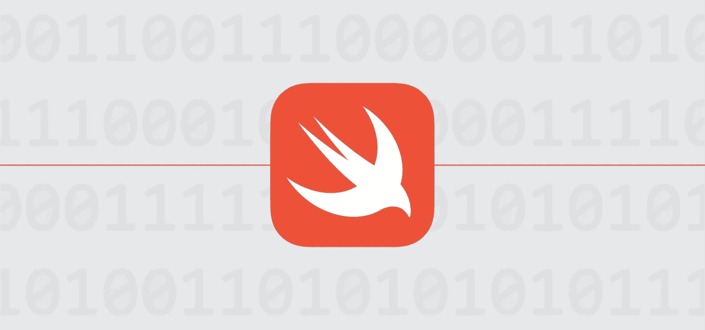

# Swift 中关联类型的奇特通用性

> 原文：<https://medium.com/swlh/the-curious-genericness-of-associated-types-in-swift-5e93a6c7eadc>

## 交往还是不交往才是问题！

# 在我们深入挖掘之前，协议！

Swift 引入了这一新范式，称为 POP 或`Protocol Oriented Programming`。对于刚接触 Swift 的人，尤其是那些来自 Java 或 C#等面向对象语言的人，协议可能看起来有点像接口…