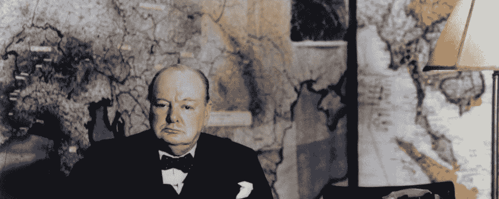

# 顾客是敌人

> 原文：<https://medium.com/swlh/the-customer-is-the-enemy-f9ffae21f018>

## 《美国海军陆战队手册》给创业公司的启示

> “因此，我们必须做好准备，在一个混乱、不确定、不断变化和摩擦的环境中应对——甚至更好，茁壮成长”

那些在初创公司工作的人会从初创公司圣地硅谷发布的博客和书籍中听出这种论调。

> “实际上…