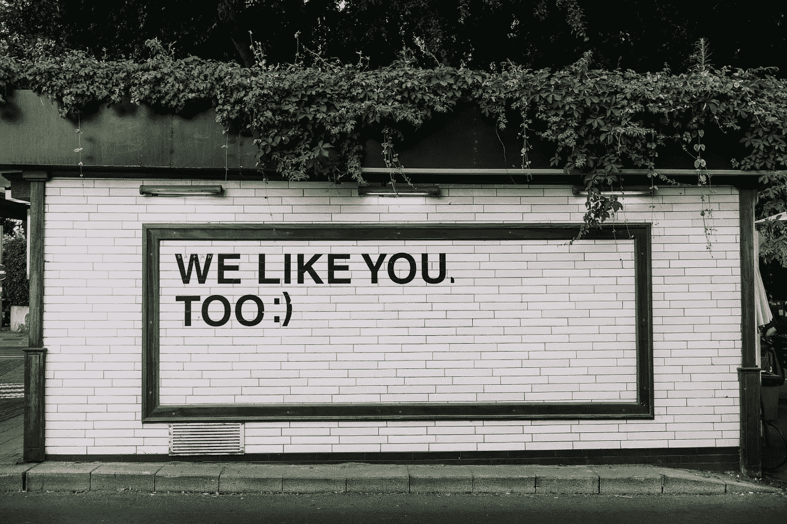

# 不断自我完善的危险

> 原文：<https://medium.com/swlh/the-danger-of-constant-self-improvement-cbeb132d9f60>

Photo by [Adam Jang](https://unsplash.com/photos/8pOTAtyd_Mc?utm_source=unsplash&utm_medium=referral&utm_content=creditCopyText) on [Unsplash](https://unsplash.com/search/photos/smiley?utm_source=unsplash&utm_medium=referral&utm_content=creditCopyText)

自我提升的核心是意识到我们自己有问题。毫无疑问，我们并不完美。这很容易识别。我不认为这个星球上的任何一个人不觉得他们没有改进的余地。

生活是一场激烈的竞争，它习惯性地需要我们证明自己不够好。当你站在世界之巅时，你可以确定的一件事是，它会打开一扇门，向你展示你失败的一面。

实际上没关系。保持谦逊很好。与我们对舒适的渴望相反，我们感到焦虑的时候实际上促使我们成长。

然而，当自我提升游戏变成一场永无止境的自我怀疑时，你就不得不开始担心了。当你取得了令人难以置信的成就，但你的大脑告诉你，你可以做得更好，你需要后退一步，意识到这种欲望有些危险。

这是什么原因造成的？比别人优秀是一种不断的需求吗？当你没有完全达到标准时，过去的一些事情困扰着你？还是更原始的东西——害怕被排斥？

不管是什么，都是不健康的。自我提升应该是为了享受和成就感。这不应该是你为了接受而做的事情。一旦它进入那个领域，它就会变成一个不受控制的怪物，让你觉得自己永远不够好。不断的自我怀疑不是自我提升之路。

如果你害怕，你就不能提高，这就是把自己逼得太远的危险。你怀疑这个，你怀疑那个，你甚至怀疑你是否有能力做出改变。

这种恶性循环对任何人都没有好处。如果这发生在你身上，花一分钟，或者一周，走出你自己。停止一切自我提升。坦然面对你是谁，而不是你认为这个世界想要你成为谁。获得清晰度。放松一下。吃奇多，睡懒觉。然后，一旦你重新找到了自己，回到健康的方式上来。

# 谢谢

感谢阅读！如果你现在正经历一段困难时期，我希望这有所帮助。这发生在我们每个人身上。重要的是要意识到世界上 98%的人都在经历和你完全一样的事情，只是他们没有足够的勇气承认罢了。

如果这引起了你的共鸣，请随意伸出手，鼓掌或评论。希望你有美好的一天。我是认真的。

## 这篇文章发表在[《创业](https://medium.com/swlh)》上，这是 Medium 最大的创业刊物，有+420，678 人关注。

## 订阅接收[我们的头条新闻](https://growthsupply.com/the-startup-newsletter/)。

