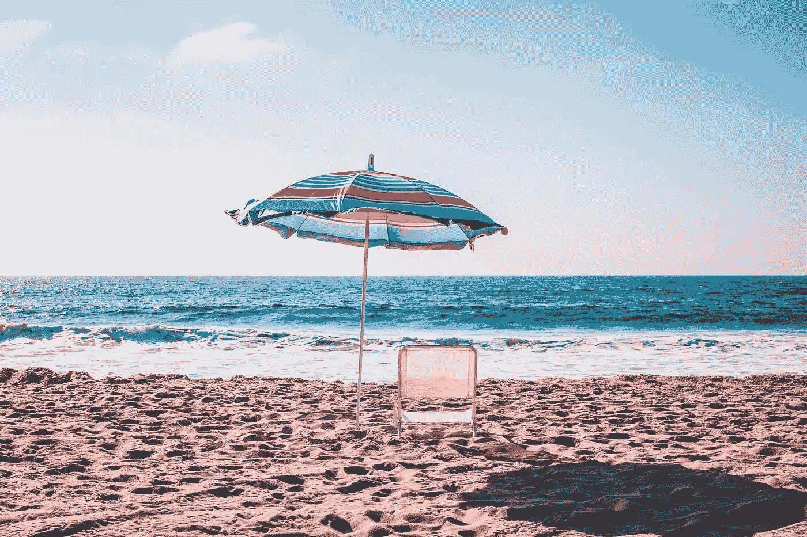

# 安全的危险

> 原文：<https://medium.com/swlh/the-danger-of-safety-8fb6340c2a83>

## 为什么舒适是你创造力最大的敌人

Look at that comfy, safe shade cast on the beach — by [Marion Michele](https://unsplash.com/@marion_michele?utm_source=unsplash&utm_medium=referral&utm_content=creditCopyText)

作为一名创意人员，你是脆弱的。无处可藏。不幸的是，创造事物总是涉及到其他人。当创造力被孤立时，它没有任何启迪。所以无论何时你创造了什么，其他人都会有回应。一种观点。批判。