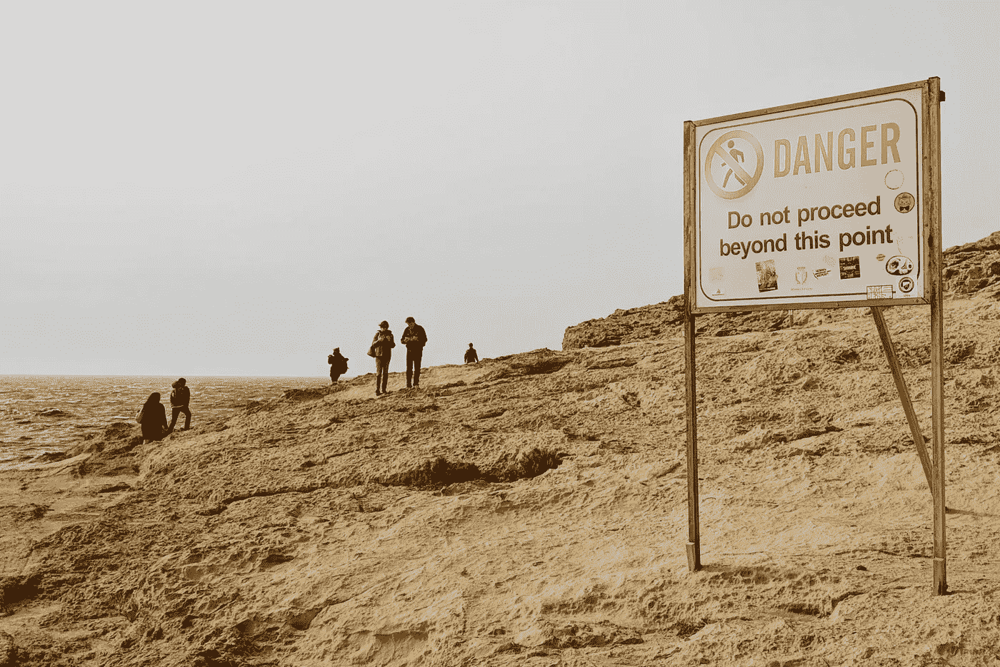

# 创业的危险以及作为一名企业家你应该做些什么

> 原文：<https://medium.com/swlh/the-dangers-of-starting-your-own-business-and-what-you-should-do-instead-to-be-an-entrepreneur-198ba3f09abc>

Photo by Micaela Parente on Unsplash

如今每个人都想成为企业家。

最近，我在我们当地的基督教女青年会给单身和低收入的妈妈们做讲座。

这是一个为期 10 周的项目的一部分，旨在让这些妈妈们掌握就业准备技能。