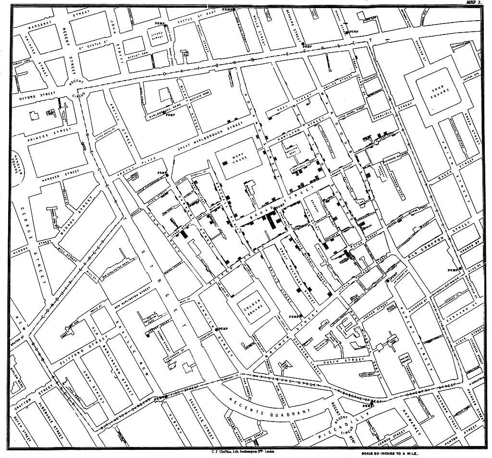

# 数据和故事

> 原文：<https://medium.com/swlh/the-data-and-the-story-2312e1f45908>

奥斯卡·王尔德写了一篇名为《夜莺与玫瑰》的短篇小说。如果你有时间，读一读吧——我下面的摘要对它不太公平。这与数据有什么关系很快就会变得更清楚。

> “她说如果我给她带红玫瑰，她就和我跳舞，”年轻的学生喊道；但是在我的整个花园里没有红玫瑰。
> 
> 我的花园里没有红玫瑰！他哭了，他美丽的眼睛里充满了泪水。

*夜莺听到了他的声音，并为他感到难过。它在花园里搜寻一株红玫瑰，但只找到了一株枯萎的不毛之地。灌木告诉夜莺，她将不得不唱一整夜来创造一朵玫瑰，并将不得不用她心脏的血来把它染成红色。她整晚都在唱《爱的元素》,是什么让它成长，它是如何在牺牲中达到顶点的。在夜晚结束之前，夜莺完成了，红玫瑰也完成了。学生把它拿给教授的女儿，她回答说它和她的裙子不相配，学生的富有的竞争对手送了她珠宝。学生沮丧地将玫瑰扔在街上，总结道…*

> “爱情是多么愚蠢的一件事，”学生边走边说。它没有逻辑一半有用，因为它不证明任何事情，它总是告诉一个不会发生的事情，让一个人相信不真实的事情。事实上，这是很不切实际的，在这个时代，实用就是一切，我将回到哲学和研究形而上学。
> 
> 于是他回到自己的房间，拿出一本厚厚的书，开始阅读。

*如果你读完整个故事，夜莺和学生都有关于爱是什么的所有数据。但其中只有一个人能够理解* ***的故事，从中了解*** *的爱情为何而生。*

《经济学人》将数据称为新石油。

话语塑造思想。

既然数据是新的石油，世界各国纷纷奔向 ***探索*** 他们的数据仓库的深处，从中应当产生 ***原油*** 数据，它们将 ***提炼*** ，由 ***蒸馏*** 见解，每一条都可以作为燃料注入战略中甚至直接被*货币化。*

*这是学生的想法，导致[在最微小的决策](https://iterativepath.wordpress.com/2012/10/29/testing-40-shades-of-blue-ab-testing/)中使用 A/B 测试。这种想法导致了数据的[直卖](https://www.theregister.co.uk/2019/01/08/telcos_customer_tracking_sales/)，因为你不知道该拿它做什么，但人们一直坚持认为它有价值。*

*夜莺的姐妹们居住在最不可能的地方，科学之地。*

*在科学中，数据带我们一步一步走向一个 ***故事*** ，一个超越简单观察数据相关性的完整解释。这并不是低估相关性的重要性，因为这是第一步，需要艰苦、有纪律的工作。但是，如果我们错过了 ***的故事*** ，还有工作没有完成，真相没有揭示，更好的行动方案没有探索。*

**

*在理论发展的第一阶段，我们观察宏观变量。数据向我们指出了它们之间的关系。玻意耳定律或声称在恒定的温度和质量下，不可压缩气体的压力和体积成反比，这是数据带来的观察结果。*

*随着时间的推移，我们积累了大量的这些理论，纯粹是通过观察数据*

*波义耳定律 *PV = const* if ( *m* ， *T* 常数)*

*查理定律 *V/T =常数* if ( *m，P* 常数)*

*盖伊·吕萨克定律 P */T = const* if ( *V，m* 常数)*

*这可能是气体的统一理论*

*化合气定律*PV/T = const*if(*m*常数)*

*对…的进一步观察*

*阿伏伽德罗定律 *V/n = const* if ( *P，T* 常数)*

*这些因素的充分结合给我们带来了*

*理想气体定律 *PV = nRT**

*它描述了一种气体在广泛条件下可以被*测量的一切。**

**然而，所有这些仍然是通过观察与数据相关的数据。这里的 ***故事*** 来源于 ***分子运动的动理学*** 。这个理论做了一组非常小的简化假设，然后将经典物理学应用于 ***解释为什么以及如何*** 理想气体定律会产生的机制。**

**你可以通过蓝色阴影的变化来观察点击率的变化，你一定会找到最佳的蓝色阴影。但是你可能会完全错过 ***故事*，解释用户行为变化的原因和方式的*机制*** 。一旦你理解了这个机制，你可能会用不同的颜色或者完全不同的方案得到更好的效果。**

**但是，这不是一个非常困难的问题吗？时间和预算有限。在蓝调上进行实验是可行的。对理论的思考将如何帮助我们超越蓝色邻域，并对其他颜色或其他方案做出基本推断，而不必在组合爆炸数字中运行相同的 A/B 测试？**

**毕竟梯度下降是可行的。是的，一个人必须做出一些跳跃，但有没有一种叫做知情跳跃的东西呢？**

**这就是人类的独创性和奥卡姆剃刀拯救世界的地方。做一些小的假设，做一些简化的假设，你会经常发现这些机制。这是一个例子。**

**1854 年，伦敦索霍区爆发了严重的霍乱。关于霍乱的起因，人们提出了两种相互竞争的理论——***瘴气理论*** 该理论假定某种空气传播的污秽物质将霍乱在人与人之间传播。 ***细菌理论*** 假定某种水生自我繁殖实体(这是在路易斯·巴斯德的工作之前)正在传播疾病。**

****

**约翰·斯诺(原文如此！)能够通过在旁边的地图中将霍乱发生的频率作为位置的函数来追踪 1854 年霍乱爆发的源头。源头原来是布罗德街和剑桥路口的一个手泵。通过移除泵的手柄，泵被禁用，并且疾病迅速下降。尽管斯诺是一位挑剔的研究人员，但他承认，随着人们逃离该地区，这种疾病可能已经在减少。但整个序列表明，疾病传播的机制是水，而不是空气。凭借这一点，他能够通过简单地改变水源来改变几个地区的命运。没有 ***的故事*** 和 ***的机制****这一切都不可能实现。仅仅观察到疫情集中在手泵周围，并不会导致在出现疫情的其他地区采取任何行动。***

***两种疾病传播理论中有一种被证明是正确的。为什么研究人员只局限于这两种可能的理论？这是奥卡姆剃刀在发挥作用。两者之间的选择是由与观测数据不一致较少的那一个做出的。***

# ***数据有助于照亮道路，但要继续沿着道路寻找完整的故事。***