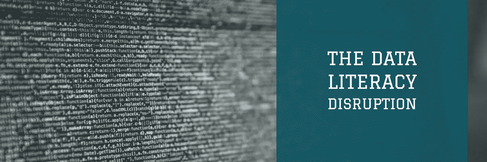

# 数据读写中断

> 原文：<https://medium.com/swlh/the-data-literacy-disruption-how-a-changing-job-market-should-change-education-81ab3d8e515e>

## **不断变化的就业市场应该如何改变教育**

> 就业市场对数据读写技能的需求正在增加，然而大多数数据读写技能都是在高等教育之外培养的。数据素养会不会颠覆传统的期望学历的就业市场？

**我有一个肮脏的秘密。对任何认识我的人来说，这并不是一个肮脏的秘密，或者…**