# 紫荆花之死:中国大湾区触角在香港的着陆点，东大屿山大都市——起源、危机与未来

> 原文：<https://medium.com/swlh/the-death-of-a-bauhinia-the-landing-point-of-chinas-greater-bay-area-tentacles-in-hong-kong-64822e0a777c>

**在《引渡法》工作“暂停”后不久，政府可以不“撤回”，而只提前 12 天通知就将修正案提交立法会再次通过。在混乱和香港人愤怒上街抗议的情况下，政府试图推行“大屿山明天的愿景”**

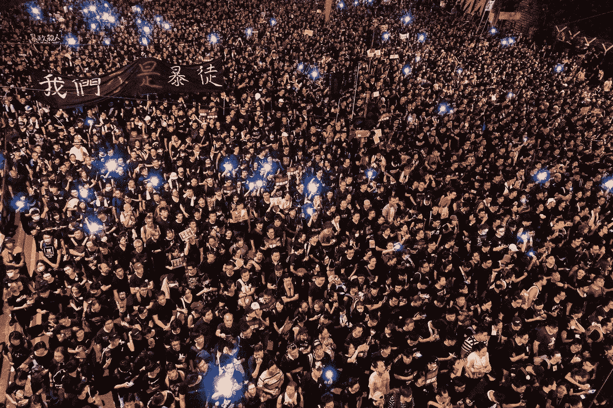

Protesters protesting the extradition law on 16 June 2019

**大屿山未来展望，顾名思义，就是对未来发展的展望。远景的核心是一个人工岛，称为东大屿山都会，位于交椅洲和平洲之间。这一愿景极具争议性，因为它的价格高昂，建设时间漫长，这意味着它可能会成为香港人和香港政府无休止的金融灾难或各方面的灾难。这一愿景需要惊人的 1 万亿港元作为其建设费(约 1280 亿美元)，这只是开始的基础，即为东大屿山大都市填海，不包括任何额外的成本，如基础设施和房屋建设。**

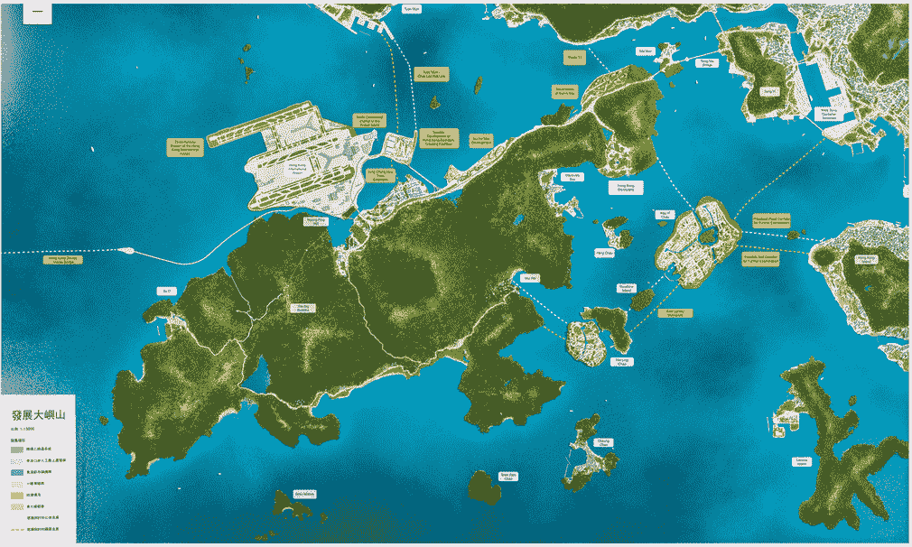

**The Lantau Tommorw Vision — with the East Lantau Metropolis as its main course, placed in the center position with link to other parts of Hong Kong. The Lantau Tomorrow Vision also includes the third runway for Hong Kong International Airport which is under construction and the Hong Kong-Macau-Zhuhai Bridge that was opened at the end of 2018**

**对于那些不知道一万亿港元意味着什么的人，请想一想。在回归 21 年后的 2018 年，尽管香港经济健康，而且香港政府以管理好自己的账目而闻名，但香港只是设法将外汇储备增加到了这一水平。**

然而，我们却被告知要把我们从祖先那里攒下的所有钱都花在一个我们永远无法实现的愿景上？随着海平面上升，香港政府日益成为中央政府的马前卒，这是香港人的计划吗？

对任何人来说，9 万亿美元听起来可能是一个荒谬的数字，但这正是香港政府从 2018 年开始的储备总额和超过总额。储备中储存的这笔荒谬的款项是政府平衡预算的财政政策的结果，这是基本法第 107 条所规定的。

政府引用这个一万亿美元的战略基础设施将促进香港的发展，建设一个充满希望的未来与耗资 2 万亿美元建造的机场核心发展计划的发展极其相似。机场核心发展计划，即今天位于赤？角的香港国际机场(HKIA)，俗称“玫瑰园”项目，是殖民政府于 1997 年兴建的。

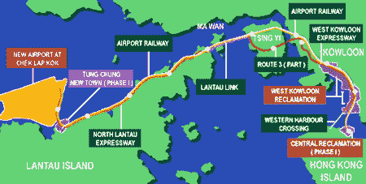

The Airport Core Development Program, commonly known as the “Rose Garden Project.”

The project was being built not only to build a better airport, is to assure Hongkonger’s confidence in the handover in 1997, where the Hongkonger’s confidence to China was hitting rock bottom after the Tiananmen Square Protest 1989\. The new airport was built on newly reclaimed land on Chek Lap Kok Island. The project, on a 22-years standpoint, is absolutely a success. According to Skytrax, a famous airline and airport review had placed the HKIA as one of a top tier airport of its kind.

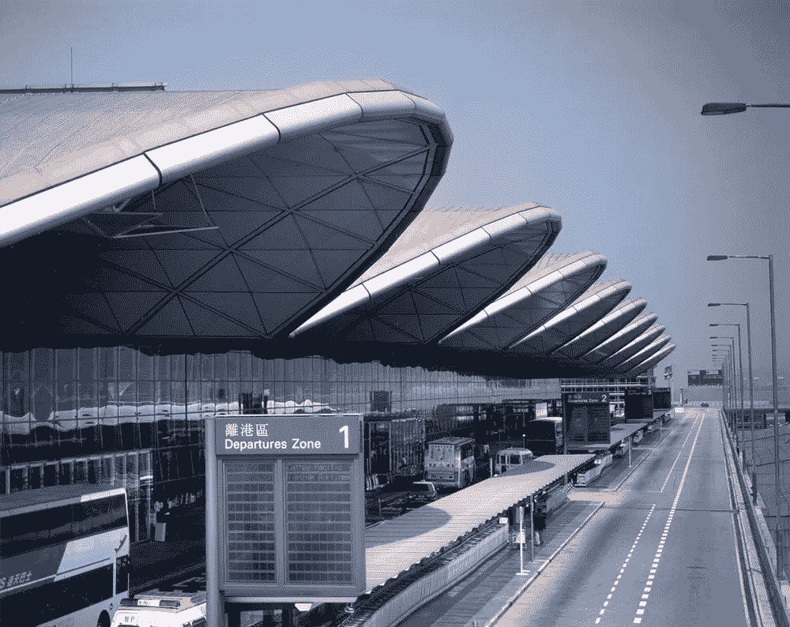

The Hong Kong International Airport opened at 1998

**Yet, does the Lantau Tomorrow Vision and the East Lantau Metropolis would resemble as one of the prides of Hong Kong as the HKIA?**

The government claimed that East Lantau Metropolis could bring a massive piece of land to build housing for Hongkongers that are desperate for housing because of the ever-rising housing price. A strong boost into the future quality of life and the economy of Hong Kong. They also stated that using reclamation to build more land is a usual way, which the cited is the most effective way of doing so.

When the trillion dollar plan was announced, Hongkongers did not associate the benefits of the plan. They associate the high cost of the project is a threat to government expenditure and stability immediately, same as when the new airport was announced.

Children that were protesting the “vision,” claiming that the “vision” would cost a mess for their generation because of the huge cost associated

30 years have passed since the Airport Core Project was announced in 1989, the environment, the situation and the needs of people had already changed. The most drastic change I would like to point is our decaying environment associated with our rapid development, the most fearful concern, therefore, in my opinion, is the environmental concerns–more precisely, is the sea level rise and the sixth extinction.

The government claims that they would develop the vision with climate change in mind, stated that they would follow the guidelines of the Ports Work Design Manual, published by the Civil Engineering Development Department (CEDD) that had standards and guidelines based on the prediction that was set by the Intergovernmental Panel on Climate Change (IPCC) in 2014\. They said they would build a stronger a higher seawall, which they opt to have a 1.3 meters seawall above sea level.

However, this had not taken effect on the newest estimates of the sea level rise, with humans carbon emission to the highest point of history in 2019, scientists had given a set of more stressful and gloomy numbers of sea level rise. Even the IPCC admits that their standard in 2014 is outdated and too conservative as soon it was published.

Moreover, the CEDD had measured the sea level on Kau Yi Chau during one of the strongest typhoons — Typhoon Mangkyut — in history, has a staggering record high 10 meters of sea wave slamming into the island. The 1.3 meters seawall that was planned to be reclaimed, sadly would just be breach during the typhoon season in last year’s summer.

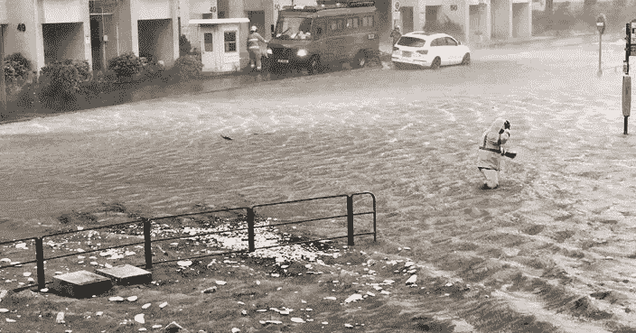

Typhoon Mangkyut that was striking Hong Kong during September 2018

根据目前的估计，海堤在夏季甚至无法抵御当前的台风，这一事实对于将生活在东大屿山大都市的人以及支付建造和维护费用的纳税人来说是一个可怕的事实。直到今天，政府仍未提供一万亿填海费用后的未来支出的任何信息。

这一万亿工程的不可估量的维护成本对香港人来说并不熟悉，特别是那些住在用木板隔开的小公寓里的人，他们需要住房援助以改善生活质量。人们认为这是现代贫民窟，因为生活条件难以忍受，例如，根据政府数据，平均公寓面积略超过 130 平方英尺，平均每套公寓住 2.3 人，人均居住面积为 49.6 平方英尺。

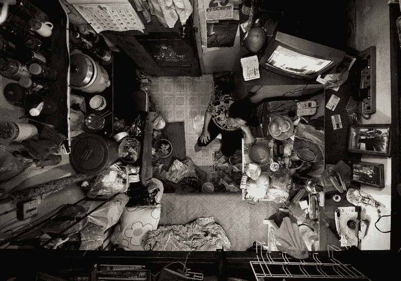

The unbearable living condition of sub-divided flats

此外，他们中的大多数人需要与其他邻居共用一个洗手间和厨房，他们中的大多数人甚至没有任何空调或窗户。然而，根据 2016 年的数据，令人惊讶的是有 20.9 万人住在那里，根据 Centa-City 领先指数，自那以来房价上涨了 100%。

这种难以忍受的状况也可以归因于高昂的房租，普通居民将 36%的支出用于房租。这些人被认为是比较幸运的，不太幸运的人住在所谓的“笼子里”，如下图所示。在香港这样的城市，很难想象人们会有这样的生活条件。

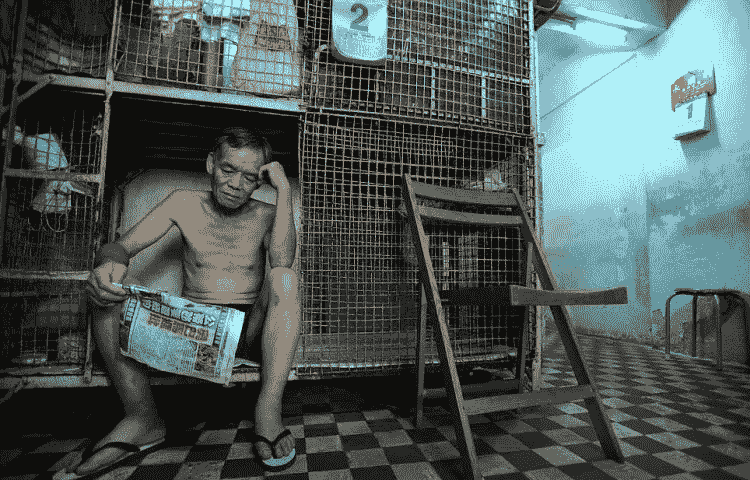

The living condition of “cage home” is more unbearable.

然而，我们忽略了香港的很大一部分，事实上，总面积的 75%没有被触及，因为根据香港规划署的数据，只有 1/4 的土地被开发。除了我们不能触及的部分，特别是 38%的土地专用于郊野公园和海洋公园，以保护生物多样性，在偏远的崎岖地形，很难开发，我们仍然有大约 36%的土地可以使用。

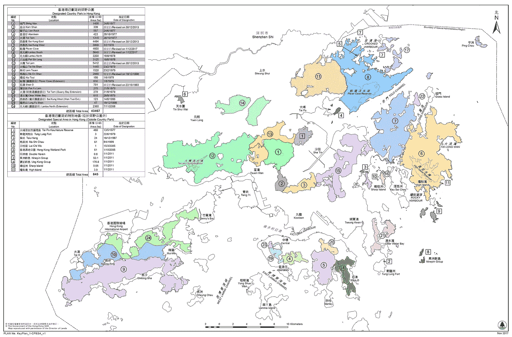

Hong Kong’s country park shown on the map from the Agriculture and Fisheries Department, which all are in close proximity to the urban areas. The close proximity of these parks is one the reason why it is famous.

那 36%是香港可笑的部分，这些土地大部分是富人的农田、棕色地带和俱乐部。自 1980 年代农业萧条以来，随着经济结构转向第三产业，廉价的中国农产品以低廉的价格涌入香港。许多农田被废弃，后来卖给了房地产开发商。一些农田被房地产开发商变成了棕色地带，进行垃圾场等工程，污染了环境。

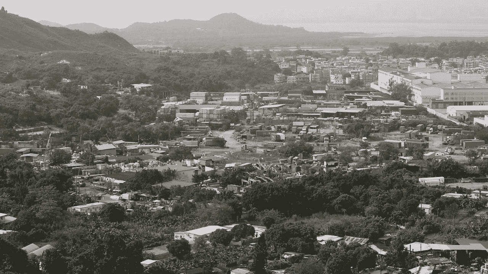

Hong Kong brownfield showed in the picture, where it is usually used as junkyards and containers yard

那么，为什么不用法律法规来开发或者简单地管理这些土地呢？富人拥有的土地正在扩大贫富差距，政府没有采取行动，这让人们想起了香港政府过去几年的所作所为，没有听取人民的意见。

尤其是当政府有法律和正义站在它一边的时候。根据香港法律。124 —土地收回条例，政府有权收回土地作任何“公共用途”事实上，在六十至八十年代发展的新市镇，包括沙田和屯门，主要都是在这条条例的帮助下发展的。

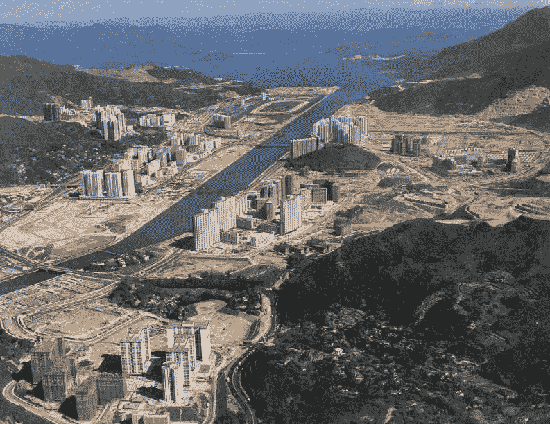

Sha Tin during its development in the 1980s

然而，情况如此糟糕的主要原因是，从 1997 年亚洲金融危机的教训中吸取教训，政府的土地和住房政策鼓励了高地价，产生了土地和住房供应不足。根据 Centa-City 领先指数，自 1997 年亚洲金融危机以来，直到 2012 年，房价从未回到 1997 年的水平。

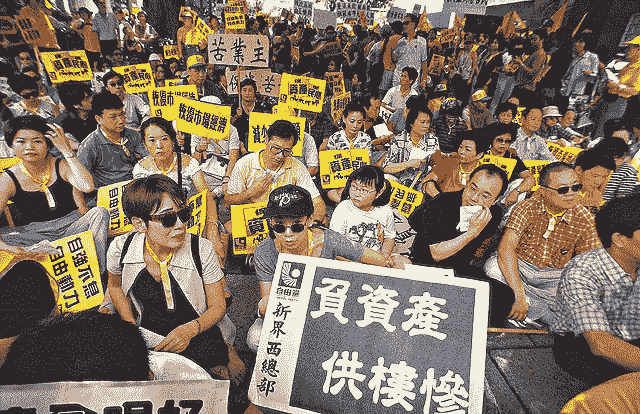

Hongkongers protesting the lack of support from the government from negative equity and the driving force of it — the “85000 policy” that the protesters claimed destroyed the housing market.

负资产危机是由房价下跌 70%引起的，伴随着大萧条而来。人们还联想到政府通常所说的“85000 政策”，该政策通过将公共住房目标定为 85000 个单位/年，旨在帮助在 1997 年遭受高房价之苦的香港人获得负担得起的公共住房。由于市场上每年多出了 85000 个单位，需求立即下降。它也被视为房地产市场暴跌的巨大推动力。

这就是为什么政府害怕干预房地产市场，允许疯狂上涨的租金和房价转嫁到每个个人和企业身上。2002 年至 2012 年期间，没有定期建造公共租赁住房，该期间的房主计划被无限期搁置，直至 2012 年。土地出售模式从公开拍卖改为“土地申请列表制度”，这有助于降低供应量。这创造了一个 10 年的窗口期，让房价上涨，而房价确实上涨了。然而，缺乏长期规划导致政府无力阻止市场疯狂。

今天，尽管政府努力工作，但供应仍不能满足需求。这就是为什么香港的住房是复杂和糟糕的。目前，它更倾向于富人而不是穷人。然而，更糟糕的部分还在后面。政府公布了名为**的战略规划【香港 2030+:迈向 2030 年的规划远景与策略】*这就是“大屿山明天的远景”第一次被提及的地方——噩梦开始了。*

*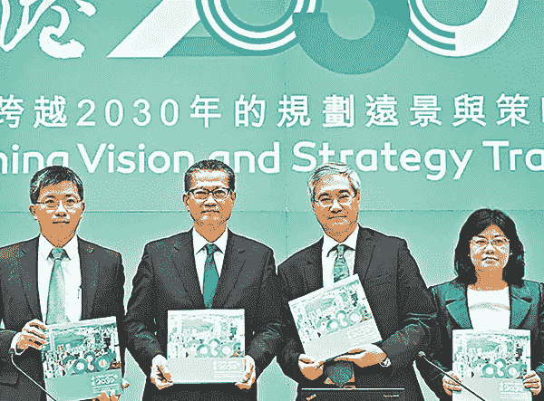*

*Officials announcing the “2030+” plan*

*“*Hong Kong 2030+”*确实认识到了当前住房市场存在的问题，但它不愿提及我们可以开发棕色地带，这些棕色地带与准备解决住房问题的现有基础设施更好地连接，即使在政府重建公共住房并决定冷却住房市场之后。更不愿意提及的是，在市中心有许多俱乐部，只有富裕的俱乐部成员才能进入，包括板球俱乐部和粉岭高尔夫球场。这些俱乐部使用短期租赁，总共占有 408 公顷土地，几乎所有这些土地都很容易获得。*

*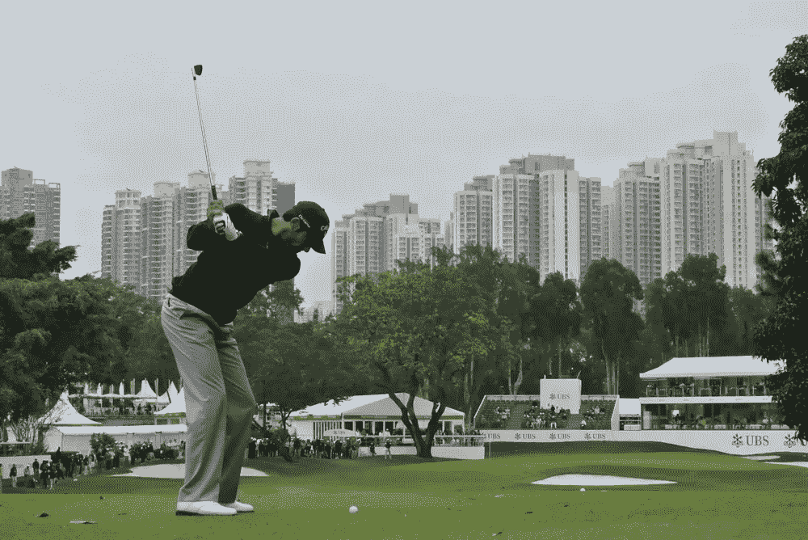*

*The Fanling Golf Course, which is in proximity with the Fanling city center as shown in the highrise building on the background.*

*唯一可以联系的原因是，政府不愿意解决这个问题，因为香港政客和香港商界精英关系密切。事实上，前行政长官曾荫权被发现犯有腐败和与房地产开发商勾结罪。*

*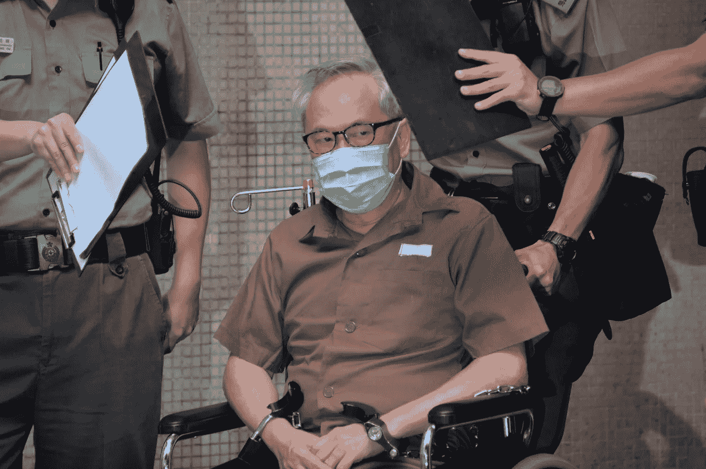*

*Former Chief Executive Donald Tsang was found guilty of corruption and collusion*

*最近，就在 2018 年 9 月高铁开通几个月后。[有传言称中国将建设第二条高铁](https://www.hk01.com/01%E8%A7%80%E9%BB%9E/238261/%E9%80%B2%E5%85%A5%E9%AB%98%E9%90%B5%E5%B9%B4%E4%BB%A3-%E9%A6%99%E6%B8%AF%E9%A0%88%E6%80%9D%E8%80%83%E5%BB%BA%E8%A8%AD%E6%9B%B4%E9%AB%98%E6%95%88-%E5%8F%AF%E9%9D%A0%E8%BB%8C%E9%81%93%E7%B6%B2%E7%B5%A1)。*

*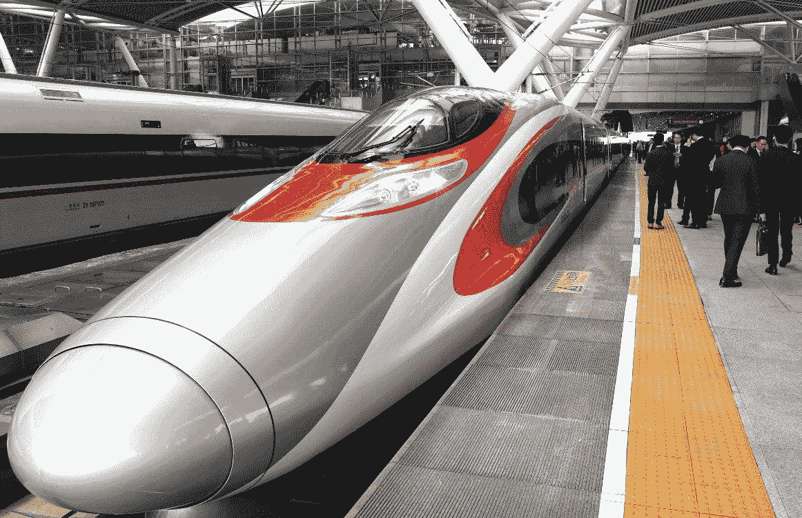*

*The High-speed Rail Link, running from Hong Kong West Kowloon station directly to mainland China.*

*这些传言一天比一天清晰，因为中央政府希望从规划中的东大屿山大都市建设第二条更快的铁路线。就在几天前，[新闻机构](https://news.mingpao.com/pns/%E4%B8%AD%E5%9C%8B/article/20190619/s00013/1560883484768/%E7%A9%97%E9%AB%98%E9%90%B5%E7%B6%B2%E9%A7%81%E3%80%8C%E6%98%8E%E6%97%A5%E5%A4%A7%E5%B6%BC%E3%80%8D-%E5%8D%97%E6%B2%99%E6%8A%B5%E6%B8%AF%E5%83%85%E5%8D%8A%E5%B0%8F%E6%99%82?fbclid=IwAR1hPHWMaMEaQMJuHFTh_RPpsPzgIfVFJ5z1EGXyshRUHpiFlUg1D0oX3j8)发现[广州有第二条高速铁路连接规划](http://www.gz.gov.cn/sofpro/gzyyqt/2018myzj/myzj_zjz.jsp?opinion_seq=13967)连接规划中的大都市。这意味着，如果该计划成功，香港纳税人将不仅为一个正在下沉的大坑买单。他们还将为由中央政府直接控制的中国国有企业的利润丰厚的合同提供资金，在中国经济面临贸易战的直接威胁时，使它们免于破产。*

*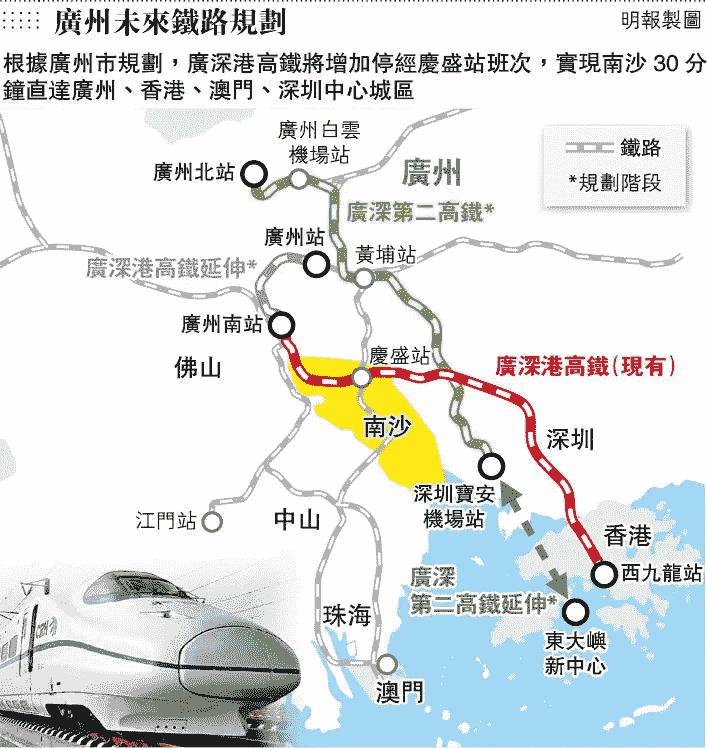*

*This is a map for Guangzhou’s future plan for its rail. The red one is the existing Guangzhou-Shenzhen-Hong Kong high-speed rail link. The green one is the planning highspeed rail link to Shenzhen airport, which plans are also ready for an extension to the East Lantau Metropolis with grey dotted lines.*

***最可怕的不是香港与中国有更密切的联系，最可怕的是根本不会有香港这种东西。**另一个特区，澳门已经列出了如何通过消除障碍来与大湾区倡议合作，一些人怀疑香港政府因此一直在修改引渡法。*

*建设东大屿山大都会？现在你明白为什么这是自杀了。*

*#Goodluckhongkong #香港加油*