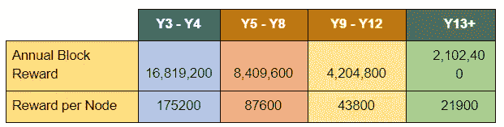

# MasterStaking UND(统一)的权威指南

> 原文：<https://medium.com/swlh/the-definitive-guide-to-masterstaking-und-unification-4b07867691c7>

> 最新的[加密货币新闻](https://www.coincurb.com/news/)、[空投清单](https://www.coincurb.com/airdrop/?status=active)、[赏金清单](https://www.coincurb.com/bountyc/?cat_id=188)、 [IEO 清单](https://www.coincurb.com/category/active-ico/)，请访问 CoinCurb.com。

[Unification](https://unification.com/) 是集成了两个主要组件的协议:公共主链和混合公共/私有 [WRKChains](https://unification.com/foundation/workchain) 。由 96 个节点组成的网络批准公共链上的交易。这种网络发展了参与组织共识的概念，以利用一种称为分布式利益相关者治理(DSG)的新机制。每 3 天，从 96 个赌注最大的钱包中选择 96 个节点来管理网络；被选中的节点验证主链交易，并获得批量奖励和网络费用。

因为任何一个有足够资金进入前 96 名持有钱包的钱包都可以成为验证过程的一部分，没有一个实体可以控制主链。此外，如果一个被选择的节点试图验证一个未被其他节点批准的交易或阻止，它将遭受信誉损失*。*降低的信誉降低了节点在未来集合中被选为验证者的概率。

因此，正确执行他们的职责符合验证者的最大利益，否则他们会因为被选为验证者的几率降低而面临失去块奖励的风险。此外，由于主链作为公共链在网络上提供透明性，它保留了与任何其他公共链(如以太坊)相关的信任。

> 最新[加密货币新闻](https://www.coincurb.com/news/)、[空投清单](https://www.coincurb.com/airdrop/?status=active)、[赏金清单](https://www.coincurb.com/bountyc/?cat_id=188)、 [IEO 清单](https://www.coincurb.com/category/active-ico/)，请访问 CoinCurb.com。

# **通过 WRKChains 进行区分**

Unification 提供的主要好处是通过与 WRKChains 一起交付主链。WRKChains 是面向企业的私有链，能够运行源自公共主链的各种功能，很像智能合同。

智能合约只是根据假设条款行事，而 WRKChains 则让[企业](https://unification.com/foundation/enterprise)能够在一个更大的公共生态系统中建立一个私人运营。这意味着企业可以构建接入 wrk 链的应用程序，而不会在公共网络上泄露客户或专有数据。但是，跨 WRKChain 的交易将在主链上声明，从而有助于减少任何运营的透明度，这些运营需要外部实体可以轻松访问。这创造了一个双重功能，企业可以在 [WRKChain](https://unification.com/foundation/workchain) 运营中保留私人数据，也可以通过主链披露数据，这些数据应该是透明的。

# **成为验证者的回报**

验证者可以从整体奖励和网络费用中获得被动收入。由于[生态系统](https://unification.com/foundation/enterprise)需要时间来获得更广泛的采用，mainnet 的片场奖励非常丰厚。整体奖励逐年缓慢下降，因为 Unification 的增长将确保网络费用抵消整体奖励的减少。

为简单起见，以下模型显示了仅考虑有保证的块奖励且不包括任何网络费用的验证节点上的 ROI。

**第一年的整体奖励如下:**

**第 0–50 天:**每块 100 元—产生 28，800，000 元

**第 50-100 天:**每个区块 50 元—产生 14，400，000 元

**第 100 天至第 365 天:**每个区块 25 元—产生 38，160，000 元

**第一年总计= 8136 万元**

**第二年，整体奖励如下:**

**第 0-150 天:**每块 16 元—产生 13，824，000 元

**第 150-365 天:**每块 12 元—产生 14，860，800 元

**第二年总计= 2868.48 万元**

要赢得 block 奖励，钱包必须在前 96 名持有者中。或者，持有者可以选择拥有 1.042%的流通代币，并保证自己在前 96 名中占有一席之地。一个节点的投资回报率完全取决于购买的金额，无论是有保证的位置还是前 96 名所需的最低金额。

鉴于目前第 96 位持有人令人难以置信的投资回报率，一旦 mainnet 上线，200 UND 就足够了是极不可能的。更合理的估计是将担保钱包占净供给的 1%或 2%。即使在这种情况下，纯块奖励的投资回报率(不包括网络费用)也是令人难以置信的。

> 最新的[加密货币新闻](https://www.coincurb.com/news/)、[空投清单](https://www.coincurb.com/airdrop/?status=active)、[赏金清单](https://www.coincurb.com/bountyc/?cat_id=188)、 [IEO 清单](https://www.coincurb.com/category/active-ico/)，请访问 CoinCurb.com。

# **超越第二年**

整体薪酬每年都在变化，遵循递减曲线。第二年以后的整体奖励在全年保持不变，而不是在一年内遵循多级奖励制度。

随着时间的推移，代币经济学变得更加复杂，因为每天都有新的代币发行。计算投资回报率是困难的，因为仅仅知道块奖励是不够的。现在，基金经济体中的每一个国家都将受益于不购买任何额外的基金，并继续获得回报。

如果是这样的话，只需持有净供应量的 1%或 2%,而不用担心基金经济中的其他参与者为一个节点积累代币，回报将如下:

如果对 UND 节点的需求保持较低水平，并且只有一小部分(2%)净供应量将用于主节点，则 UND 将提供比加密领域中任何其他主要主节点都高得多的投资回报率。

然而，考虑到高投资回报率，人们有动力积累优秀的代币来获得一个节点。因此，现有的节点持有者将不得不保留他们的块奖励，或者甚至购买新的来保持他们的位置。

除此之外，统一基金会将通过[算法令牌分发(ATD)](/unificationfoundation/unification-und-token-metrics-it-is-not-what-you-think-b41c728beb50) 每天发放少量新令牌。这是一种新颖的代币发行形式，该项目将在交易所出售当天代币量的 3%。这确保基金会在未来几年有足够的资金，从而为正在进行的项目开发提供流动性。同时，即使验证节点拒绝出售令牌以维持其地位，新进入者也将有机会从市场获得令牌。

代币发射可以根据代币流行度在很大范围内变化。目前每天的交易量约为 3 万美元。如果令牌达到与 CMC 200 令牌(CoinMarketCap 的第 200 个位置)相同的容量，则容量会有很大不同。鉴于纽约大学的 IEO 硬帽很小，该项目开始时是一个低帽，因此拥有 200 级硬币的体积是相当令人印象深刻的。

当然，体积可以是第 200 枚硬币的体积和目前的 30，000 美元之间的各种数字。下面来看看将通过交易所的 [ATD](/unificationfoundation/unification-und-token-metrics-it-is-not-what-you-think-b41c728beb50) 发行的代币的美元价值。

根据价格的不同，上述美元价值排放可能意味着市场供应增加了不同数量的美元。每天 100，000 美元的交易量将导致 3，000 美元的 ATD。这 3000 美元可能意味着 30，000 元代币，如果元成本为 10 美分，或者它可能意味着 7，500 元代币，如果元成本为 25 美分。

在考虑到各种数量和代币价格的情况下，我们来看看一年内通过 ATD 将增加的潜在资金量。

任何想要获得验证器节点的人都可以购买这些令牌。给定数据，自然的竞争将随之而来，以获得用于维护节点的令牌。因此，投资回报率将取决于许多因素，包括块奖励，网络费用和基金代币价格。只有块奖励是可预测的，因此，为了简化计算，该模型被限制为一个未知的:UND 令牌价格。网络费用将被视为零，因此以下投资回报率模型是极端保守的，因为显然会有网络费用。

上表纯粹基于块奖励计算 ROI(以 UND 表示)。

它说明了在各种价格和数量下拥有一个有保证的节点所需的资金量。由于该表仅记录了投资回报率，值得注意的是，如果美元升值，绝对回报自然会大幅增加。因此，主节点持有人最有兴趣帮助网络发展，因为更高的价格不仅确保 ATD 导致更少的令牌释放，而且还确保他们持有的固定价值增加。当然，节点也会收取网络费用；因此，统一基金会促进生态系统增长的努力可能会成倍增加投资回报。

目前，该项目已经与 200 万名患者建立了合作关系。像整合统一的 [WRKChains](https://unification.com/foundation/workchain) 到政府合同这样的其他公用事业正在考虑中。而且，项目最初的数据流动性目标也可以整合到 UND 生态系统中。因此，除了奖金之外，还有大量的网络费用可以收取。

> 最新的[加密货币新闻](https://www.coincurb.com/news/)、[空投清单](https://www.coincurb.com/airdrop/?status=active)、[赏金清单](https://www.coincurb.com/bountyc/?cat_id=188)、 [IEO 清单](https://www.coincurb.com/category/active-ico/)，请访问 CoinCurb.com。

