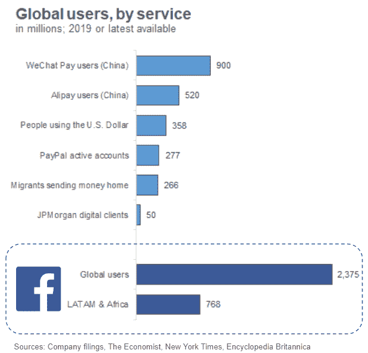
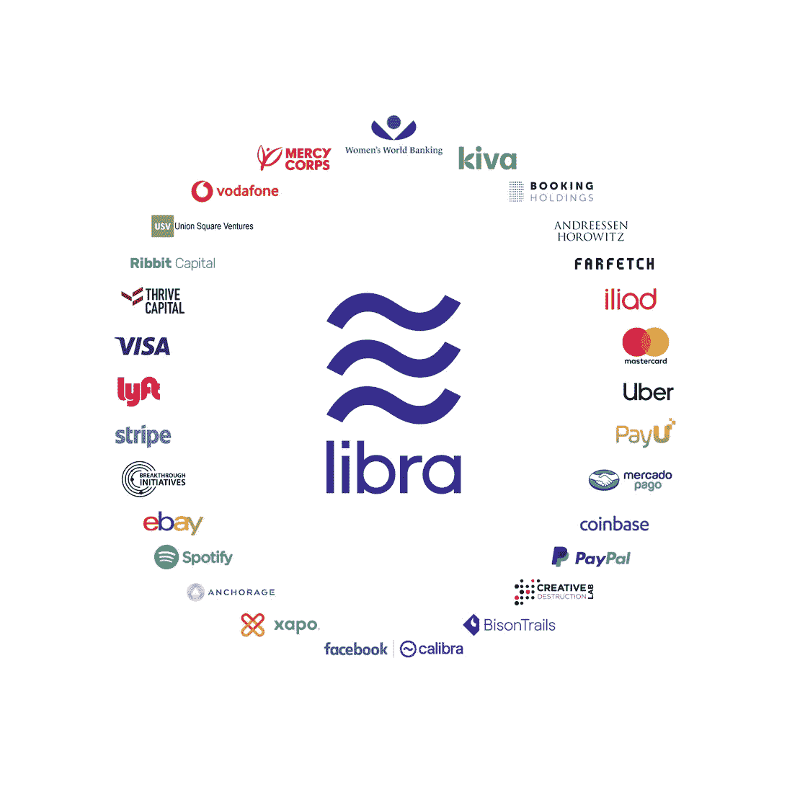

# 脸书天秤座加密货币的命运

> 原文：<https://medium.com/swlh/the-destiny-of-facebooks-libra-cryptocurrency-dc7dccefbd8a>

# 大规模采用还是大规模失败？

现代金融体系在许多方面都是非凡的。手指轻轻一抖，你就可以开立银行账户、支付账单、申请信贷、转账或购买股票。然而，这个系统并不是为所有人服务的。全球有 17 亿没有银行账户的人不成比例地承担着基本金融服务的高成本。平均而言，国际汇款成本为 7%(不常用货币的成本更高)。许多没有银行账户的人生活在经济和货币高度不稳定的国家。

我们理应拥有一个更具包容性的金融生态系统，而且(或许)令人惊讶的是，脸书希望成为提供这一生态系统的国家。2019 年 6 月 18 日，脸书宣布了 [**Libra**](https://libra.org/en-US/white-paper/) ，这是一个总部位于区块链的支付网络，预计将于 2020 年推出，脸书认为它可以降低跨境成本，为全球数百万得不到充分服务的人带来基本的金融服务。

> *如果脸书 24 亿全球用户中只有 15%采用 Libra，它将比美元使用更广泛。*

从表面上看，社会应该接受这个雄心勃勃的使命。发达国家的消费者不需要反对:快速安全的信用卡(提供诱人的回报)、支票和储蓄账户(支付利息并有联邦保险)以及中国的 PayPal 或微信支付(WeChat Pay)和支付宝(Alipay)等数字支付系统足以满足大多数人的需求。

然而，可以理解的是，消费者对将更多权力集中在一家公司手中持谨慎态度，该公司通过其隐私做法浪费了公众的信任(尽管脸书已经承诺不混合财务和社会数据)，并且官员们已经对 Libra 可能给现有货币体系带来的系统性风险表示担忧。

那么，天秤座会引起金融革命吗？

**更有可能的结果不是颠覆全球金融体系，而是 Libra 成为当前和未来帮助解决全球金融需求的众多服务之一。**

Libra 在推动采用方面面临着巨大的挑战，尤其是:

*   获得政府许可，
*   商家和用户采用 Libra 的激励成本，
*   第三方钱包可能征收的费用(这可能会侵蚀任何储蓄)，以及
*   没有银行账户的用户如何将 Libra 转换成实物现金的问题。

如果 Libra 真的达到了超大规模，它将与政府和央行发生冲突，这些政府和央行可能会感觉到对其货币主权或金融稳定的威胁。然而，政府和消费者完全拒绝 Libra 将是一种耻辱，Libra 也有可能为全球 17 亿无银行账户的人和 2.66 亿移民带来巨大价值，他们将在 2019 年总共汇回 5500 亿美元。

要了解 Libra 会变成什么样，我们必须探索 Libra 实际上是什么，它的潜在利益和风险，以及它与许多现有支付网络的比较。

# 天秤座是怎么工作的？

用最基本的术语来说， **Libra** 是一种证券化的数字(“加密”)货币，旨在以接近零的费用实现全球支付。

脸书正在推动这项倡议，并为将支撑该网络的开源区块链编写了代码。然而，鉴于剑桥分析公司丑闻后[对脸书的信任下降了 66%](https://www.nbcnews.com/business/consumer/trust-facebook-has-dropped-51-percent-cambridge-analytica-scandal-n867011) ，脸书战略性地选择了分散对天秤座的控制。相反，天秤座将由**天秤座协会**管理，这是一个新成立的由大公司和投资者组成的财团，脸书只是其中的一个节点。对脸书来说，这种策略有一个便利的好处，即*将 Libra 的潜在影响*扩大到脸书生态系统之外，同时*将监管和行政负担*转移给协会。

Libra 网络将由几个关键部分组成:

*   **Libra 货币**——每当用户用一美元购买 Libra 时，这笔美元就会进入一个名为 **Libra Reserve** 的储备基金，一个等价的 Libra 货币被创造出来并交给用户，用户把它放在一个数字“钱包”里(比如脸书自己的 **Calibra** )。消费者将能够转账，从参与的商家购买，并在任何时候兑现他们的天秤座。每个天秤座都将由**天秤座储备**担保，该储备将投资于一篮子以稳定货币(美元、欧元等)计价的低风险资产。)来最小化天秤座价值的波动。由此产生的 Libra 加密货币被称为“稳定币”，与比特币等其他加密货币不同，比特币不安全，极易波动，因此主要吸引加密传播者和投机者(只有 1%的比特币交易用于实际支付)。
*   **天秤座区块链**——在其“最纯粹”的形式中，区块链是一种匿名的、完全分散的公共分类账，完全依赖于网络中的参与者来验证交易(这一过程被称为“工作证明”)，理论上消除了对银行或信用卡公司等可信中介的需要。然而，这种权力下放需要在效率上进行权衡。比特币需要巨大的计算资源和能量，网络才能达成验证共识。因此，比特币每秒只能处理 7 笔交易，而 Visa 可以处理数万笔交易。脸书声称，通过放松一些使比特币效率低下的限制，Libra 每秒钟将能够处理多达 1000 笔交易。天秤座区块链将在**天秤座协会**成员中联邦化(或“许可”)，而不是完全去中心化，这些成员将验证天秤座交易并管理区块链。*尽管用户将不得不信任这个联盟，但是消除昂贵的工作证明系统可以极大地增加吞吐量，降低处理成本和必要的费用。*
*   **Libra 协会**——脸书宣布了 Libra 协会的 28 个创始成员，包括 Visa、万事达、PayPal、Spotify、Lyft 等，目标是在 Libra 于 2020 年推出时达到 100 个成员。除了验证 Libra 交易之外，新成立的瑞士非营利组织的成员将负责选举一名董事总经理，资助一只小猫以激励商家和个人采用(至少 1000 万美元的投资)，并招募更多的创始成员以刺激生态系统。成员将管理 **Libra 储备**，并在扣除费用后，从保持 Libra 价值稳定的基金中获得一定比例的利息。Libra Association 的投资可能还将用于激励合作伙伴和开发人员通过监管合规流程(如了解客户和反洗钱)来“拉”客户，这可能会增加用户的额外摩擦，但也减少了与其他加密货币相关的欺诈([黑客在 2018 年窃取了 17 亿美元的](https://www.cnbc.com/2019/01/29/crime-still-plague-cryptocurrencies-as-1point7-billion-was-stolen-last-year-.html))。

Source: Facebook

*   虽然任何人都可以在开源的 libra 区块链上建立钱包，甚至智能合约应用程序，但脸书擅自建立了自己的钱包，以支持 WhatsApp 和 Messenger 应用程序上的支付和转账，旨在通过其 24 亿用户的庞大网络推动 Libra 的采用。因此，脸书将在 Libra 货币化方面拥有明显的先发优势，并将有能力通过 Calibra 提供额外的金融服务(如贷款或投资)，正如[微信和阿里巴巴](https://www.nytimes.com/2017/07/16/business/china-cash-smartphone-payments.html)在中国成功做到的那样。

# Libra 与其他支付网络

全球支付行业承受着极其激烈且日益加剧的竞争和监管审查，尤其是当经济活动转向在线时。

*Libra 将不得不与所有其他支付形式*竞争，包括信用卡和借记卡、银行账户转账、PayPal 或中国微信支付等数字支付服务、西联汇款等汇款提供商、其他数字货币以及支票和现金(仍占美国交易的 40%)等线下支付方式。

这些数不胜数的支付形式演变成服务于广泛的使用案例、客户和地域。许多公司规模庞大，具有系统重要性。那么这个世界为什么需要天秤座呢？

天秤座最直接的潜在市场似乎是国际汇款，这个行业的平均费用为 7%,每年花费外国人 500 亿美元。

获得许可的 Libra 区块链可以弥合贝宝(PayPal)等集中式系统和比特币(Bitcoin)等分散式系统之间的差距。贝宝在全球有 2.77 亿人使用，但国际费用很高。比特币的令牌高度不稳定，因此不适合用于投机以外的目的。

然而，目前还不清楚 Libra 将如何连接国际交易的两条“腿”,因为通常至少有一条腿涉及现金。汇款巨头西联汇款公司自诩拥有一个由全球 50 万个实体站点组成的昂贵网络，用户可以通过该网络发送或收取现金。

# 场景和含义

Libra 的风险回报情况最终取决于其未来的采用水平。考虑以下情况:1)大规模采用，2)失败或从未推出，或 3)介于两者之间。

## 1)大规模采用

为了便于分析，假设 Libra 被广泛采用，并取代了现有支付生态系统的大部分。它不仅让全球 2.66 亿外籍人士的汇款变得更容易，而且在脸书 24 亿用户中，有很大一部分人使用 Libra 的智能设备进行日常交易。Libra 协会将不得不招募数百名成员(可能包括银行，目前没有成员)贡献数十亿美元的资金，以激励商家和消费者使用 Libra。

在我看来，这种极端情况是最不可能的结果，主要是因为两个限制因素。

1.  首先，Libra 将与发达国家现有的金融体系展开激烈竞争。信用卡之所以被广泛使用，是因为它们为用户提供了便利、回报和获取非安全信用的途径。消费者享受支付利息和提供联邦保险的银行账户。微信支付(WeChat Pay)被 9 亿中国人使用，因为每个人都已经用微信交流了，交易费用为< 0.1%。Libra 不太可能完全压倒为数十亿人提供真正价值的服务。
2.  第二，天秤座要达到临界规模，它必须克服*与决策者和央行行长在经济影响力上的冲突*。那些经济和货币不太稳定的国家——它们的消费者实际上可能更适合天秤座——很可能会强烈反对对其金融主权的威胁。此外，由于占世界人口 37%的中国和印度的政府限制，全球采用将受到限制。脸书和大多数西方社交媒体网络在中国被禁止，中国已经禁止了加密货币交易和首次发行硬币。由于印度对西方科技强国尤其是加密货币日益增长的敌意，脸书已经确认 [Calibra 不会在印度推出](https://techcrunch.com/2019/06/19/calibra-india-launch-whatsapp-pay/)。

## 2)失败或从不发射

现在考虑相反的极端。到目前为止，Libra 只是一份白皮书和测试代码，由一群只做了临时承诺的大公司支持(也就是说，没有人真的开出 1000 万美元的支票)。对脸书的信任急剧下降，美国、欧洲和其他地方的官员迅速做出反应，担心占主导地位的天秤座生态系统可能带来系统性风险。区块链技术的主流应用没有先例；预计监管者会过于谨慎。

Libra 的采用将取决于与全球政策制定者和监管机构的友好关系。一系列国家可能会阻挠或推迟天秤座的发射，无论是谨慎地给予更多的时间来评估它还是断然禁止它。

尽管如此，Libra 在上市前就被广泛禁止似乎不太可能。Libra 有一个合理的价值主张——让 2.66 亿全球外籍人士及其家人能够保留更多他们的收入——对于大多数或所有国家来说，直接拒绝一个可以为最需要的人提供合法工作的体系将是一种耻辱(也不太可能是共识)。官员们将不得不解释为什么他们故意限制金融服务的竞争，并可能剥夺其公民更具包容性的金融体系。

## 3)介于两者之间

考虑到每种极端情况下的挑战，天秤座最有可能的结果是在中间的某个地方。

Libra 可以解决全球消费者的几个痛点，尤其是全球 17 亿无银行账户的消费者。Libra 可能会在降低全球汇款成本方面有所作为。它可以作为数字和实体零售商的另一种支付选择，以减轻信用卡费用的负担。开发人员有可能在 Libra 上构建“智能合约”应用程序，从而拓宽其潜在的用例。

然而，由于像美国这样的发达国家有太多的选择，对脸书的广泛不信任，以及中国和印度可能被排除在外，天秤座的最终影响力将受到限制。Libra 的推出可能会推迟到 2020 年以后，其采用速度可能会比脸书愿意承认的要慢得多。

天秤座不会取代传统货币，但它可能是历史上被忽视的一个有价值的选择。Libra 还将成为区块链技术主流应用的一个关键测试案例，标志着创新的分水岭，或者预期已经见顶。