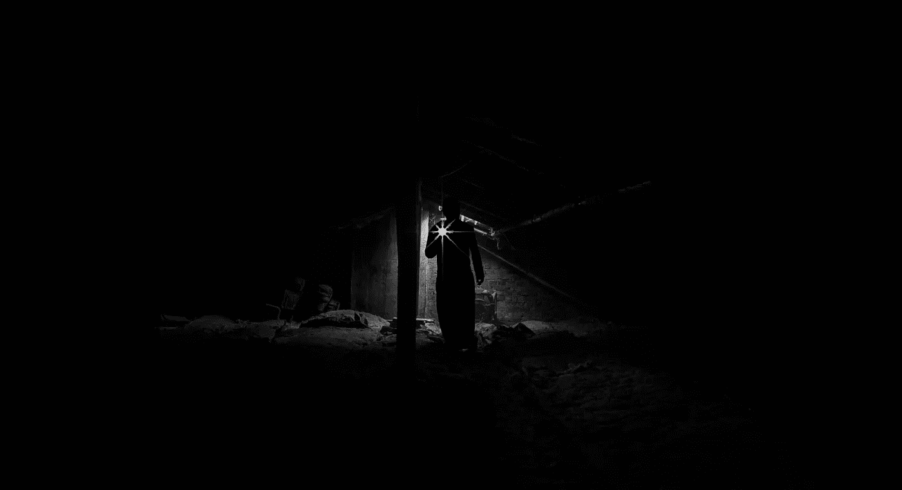

# 内心的魔鬼

> 原文：<https://medium.com/swlh/the-devil-inside-11e64677ac2a>

Photo by [Master Wen](https://unsplash.com/@36chambers?utm_source=unsplash&utm_medium=referral&utm_content=creditCopyText) on [Unsplash](https://unsplash.com/search/photos/devil?utm_source=unsplash&utm_medium=referral&utm_content=creditCopyText)

“躲在我后面，撒旦！你是我的绊脚石；你没有想到神的关心，只是人的关心……”马太福音 16:23

当我年轻的时候，我常常只以一种方式读这首诗。你看，我从小就非常虔诚，我的信仰对我来说非常个人化。我“牢记上帝的关怀”现在，我用一种完全不同的方式来解读这段文字。

这是一篇非常难写的文章，仅次于我正在写的下一篇关于性的文章。谁知道这能否让它离开剪辑室。不管怎样，我在这里写的分享了我藏在心里多年的痛苦的一瞥，害怕我不能和任何人分享。但是当我在旅途中，特别是最近几年，甚至是最近几个月，我觉得有必要分享。

我从[安妮·拉莫特的《一只鸟接一只鸟 :](https://www.goodreads.com/work/quotes/841198-bird-by-bird-some-instructions-on-writing-and-life) 一书中看到了这些话

"*…你拥有发生在你身上的一切。如果你的童年不太理想，你可能在成长过程中认为如果你说了实话……一只瘦骨嶙峋的白手指会从云层中伸出来指向你，同时一个令人不寒而栗的声音吼道，“我们告诉过你不要说出去。“但那是过去的事了。只要把你现在能记得的一切写在纸上…你拥有发生在你身上的一切。说出你的故事。如果人们希望你热情地写他们，他们应该表现得更好。*”

所以我要说出真相，不管有没有声音从云层中发出。

说实话看起来很简单，但事实并非如此。当你分享它时，有一种感觉就像魔法一样，尤其是在你压抑了这么久之后。诚实和开放是可怕的，但是它们发展了占据空间的力量，宣告你自己的价值，并且让其他人也赞美你的价值。所以为了拥有自己，我必须停止隐藏，好像我应该被隐藏一样。人们不需要我的保护，就好像他们无助于拥有自己的决定。我有责任拥有自己，也有权利期待别人拥有自己。我不能被其他人当作人质，假装我不拥有我的故事，因为如果我分享它们，他们会受到伤害。我的伤害也很重要，但更重要的是——真相很重要。

很明显，真相可能会有很多痛苦。尽管我试图智取、避免甚至克服它，但我总是失败。事后看来，我很高兴我知道。我不能绕过去，也不能从上面或下面穿过去。我需要经历它，去面对它。这就像来自*好地方*的珍妮特，她会恳求和尖叫人们不要“杀死”她(看节目)，但她每次都更强大地回来。不管我怎么辩解，我都要经历一遍。

就像圣经上说的:“真理会让你自由。”

所以这里有一个道理。

这是我的一个丑陋的故事。

这并不是说谁好谁坏。反正我觉得那些形容词不太适用于人。将人们简化为只有这两个形容词似乎有些幼稚。我很少发现世界上有任何二进制的东西，忽视 0 和 1 之间的无限剥夺了我们发现丰富性、救赎和揭示生命真正是什么和可能是什么的能力。你不是坏人。

我不认为“好”或“坏”适用于我们对上帝或魔鬼的看法。

许多人会不同意我的观点，尤其是那些认为世界上有魔鬼存在的人。事实上，当我在经历离婚时，我被亲近的人告诉我，我被魔鬼利用了。

或许他们是对的。

我来解释一下为什么我从魔鬼那里找到了大量的灵感，不过还是先从上帝说起吧。

Photo by [Aaron Burden](https://unsplash.com/@aaronburden?utm_source=unsplash&utm_medium=referral&utm_content=creditCopyText) on [Unsplash](https://unsplash.com/search/photos/child-reading-book?utm_source=unsplash&utm_medium=referral&utm_content=creditCopyText)

**上帝的担忧**

当我还是个孩子的时候，在教堂里，一位牧师在他的一次布道中提出了一个观点，“对一些人来说，这个世界离天堂已经很近了。”

这一直困扰着我，让我很难过——不仅仅是因为我从来不确定我是否会去天堂。但更让我难过的是，这么多人将在这里生活、挣扎、受苦——经历所有的消极、痛苦和孤独——然后发现真正的地狱永远在等待着他们。

从我小时候到 20 多岁，地狱一直让我恐惧。想想看——如果你在这方面做得不好，你在另一方面将永远只有痛苦和折磨。即使死亡也无法将你从痛苦中解救出来。没有缓解。没有救赎。没有希望。

永远。

诅咒。

小时候，六年级后的那个夏天，我觉得自己被诅咒了。我认为我犯了不可饶恕的罪——一个耶稣只提到过一次的神秘的、不确定的罪:亵渎圣灵。对于像我这样焦虑的孩子来说，我相信我不小心做到了。怎么会？例如，不要去想大象。你刚才想到大象了吗？现在不要想着诅咒上帝。不要想着亵渎圣灵。

我幼小的心灵无法区分思考和真正为自己思考。我的心灵听到了“诅咒你，圣灵”——我觉得我对此负有责任。我记得那一天——那是我生命中一条明显的分界线。前一天我还是我，第二天我就被诅咒了。

永远。

而当我不忙着担心自己犯下了不可饶恕的思想罪行时，我却忙着担心自己无论如何都没有真正得救。我不够了解，我不够相信，我没有得到正确的洗礼。

我一直在想“永远…地狱是永远的。”这是一些人最接近天堂的地方，也是我最接近的地方。

Photo by [Katherine Chase](https://unsplash.com/@thekatiemchase?utm_source=unsplash&utm_medium=referral&utm_content=creditCopyText) on [Unsplash](https://unsplash.com/?utm_source=unsplash&utm_medium=referral&utm_content=creditCopyText)

**渴望被拯救**

我一直在读我的圣经，而且几乎完全是在读。我不再收集漫画，除了基督教书籍和学校布置的任何书籍，我不读任何书籍。与音乐一样，我听基督教音乐，甚至从列出世俗乐队和相应的基督教乐队的青年会议上获得转换图表。

我跪在地上祈祷，并关上了门。有时我妈妈会进来，放下要洗的衣服或其他东西，我会尴尬的跳起来。我的膝盖会发红，我会一笑置之，装作什么都没发生。他们可能并且有理由认为我在做任何一个中学生在自己的房间里关着门做的事情。即使在别人家，我也会不停地走进浴室，锁上门，祈祷。有一次在我奶奶家，当我从洗手间出来时，我叔叔笑着说“你经常去洗手间……”对此，我婶婶用肘推了他一下，说“别说了，所有的男孩都这样做。你让他很尴尬。”我真的不知道他们在谈论什么——我不应该看着一个女孩对她产生欲望——但她说我感到尴尬是对的。我知道我很奇怪。

没有这种压力，我永远也不会喜欢做任何有趣的事情。如果我有时间找乐子，那么我就有时间找到我永恒的归宿。这是我能做的最重要的事情。

我试着假装对其他人来说我很好。我很少告诉任何人我在这一切中挣扎——我不想让他们感到羞耻。知道他们的儿子，他们的兄弟，他们的朋友要下地狱了，除了在我被扔进火湖之前让我在这里足够舒适——这是我最接近天堂的地方——之外，什么也做不了。永远。

诅咒。

我相信每个人都像上帝一样。在任何时候，我都可能犯下不可原谅的事情，他们会透露他们有多恨我。我想象自己会如此轻易地失宠，失去生命中的每一个人。没有人会留下来。任何时候都可能出问题，可怕的事情会发生，人们会离开我。更糟的是，我觉得我活该。他们这样做是对的。

我经常独自坐在房间里。

“留守”系列很受欢迎，这个想法是，在任何时候，被提都会发生——所有的基督徒都会从地球上消失，与上帝在一起，留下我们其余的人一起承受世界崩溃的痛苦。有时候，当我走出房间时，我不知道有人在哪里，我会绕着房子跑，然后跑到外面，最终发现他们在花坛或谷仓里工作。

我害怕我被遗弃了。

有时候我很难看到年轻的克里斯托弗。有这么多的故事，这么多的小方法和大方法，我精心制作我的生活试图生存的地狱。那么多的方式让自己难堪，欺骗自己，伤害自己。我付出了很多努力去面对这些事情，去处理它们是如何突然出现在我的生活中的，尤其是害怕失去亲人，害怕被遗弃。

Photo by [Maria Lupan](https://unsplash.com/@luandmario?utm_source=unsplash&utm_medium=referral&utm_content=creditCopyText) on [Unsplash](https://unsplash.com/search/photos/devil?utm_source=unsplash&utm_medium=referral&utm_content=creditCopyText)

**神之下**

在我的房间外面，世界一片凄凉。

在教堂里，我们的牧师经常谈论这是一个基督教国家，以及我们如何需要小心社会正在培养的罪恶。甚至在整个大学期间(我去了一所基督教大学)，这个主题一直延续着。牧师经常引用我们的基督教遗产，并背诵《历代志下》7:14 — *“如果我的子民，就是称为我名下的人，谦卑祷告，寻求我的面，转离他们的恶道，那么我必从天上垂听，我必赦免他们的罪，并医治他们的地。”*

末日即将来临。一位牧师宣称，虽然我们不知道确切的时间，但我们知道时间一定很快，因为撒旦甚至不再躲藏了。他绝望地把自己的罪恶发泄到街上。这就是为什么我们到处看到如此多的性，所有的同性恋都公开宣扬他们的生活方式，以及如此多的人对上帝失去了信仰。

我相信了。所有的一切。

我很努力地想和上帝在一起。我在高中两次将我的生命献给基督，然后在大学接受了洗礼。我从小就想成为一名牧师，但是一位老师劝我不要这样做。甚至在大学毕业后，我就考虑去神学院攻读神学硕士学位。

Photo by [Dan Meyers](https://unsplash.com/@dmey503?utm_source=unsplash&utm_medium=referral&utm_content=creditCopyText) on [Unsplash](https://unsplash.com/search/photos/devil?utm_source=unsplash&utm_medium=referral&utm_content=creditCopyText)

**另辟蹊径**

目前为止我只分享了小克里斯托弗的旅程。从年轻的克里斯托弗到今天的克里斯托弗是一个漫长的旅程，所有这些都不适合这篇文章。但这是一个从许多感觉像大风险的小步骤开始的旅程。事后看来，这一切都是微不足道的，但在当时，每一小步都像是我所了解的世界的大灾难——每一步都是公然的罪恶。但是一步接一步，最终，我迈出了更大的步伐。所有这些步骤——或大或小——把我带到了今天。

我是从举重的角度来考虑的。前阵子开始举重的时候，只能举小重量。现在看来很可笑的重量。但是我必须从那些小重量开始，那些在开始时威胁到我的重量，那些我现在甚至不能考虑锻炼的重量。我记得当我开始举重时，我坐了 100 磅的板凳。现在我已经超过 200 磅了。但是我不得不先争取 100 磅，令人惊讶的是 100 磅比 200 磅更疼。

我有一个面对事物的规则，那不经意间开启了我的旅程。面对我的恐惧对我来说非常重要，而且一直如此。我觉得只有这样才真诚。因为我想成为一个真诚的信徒，如果我害怕阅读我不同意的书籍，那么我就含蓄地承认我害怕面对不同的真理。但如果我真的相信上帝，那就不会有不同的真相。面对我的对手是行使我的信仰的责任。

*撒旦*意为对手。

所以在某种程度上——我去见了魔鬼。

Photo by [Lennart Wittstock](https://www.pexels.com/@lennart-wittstock-94105?utm_content=attributionCopyText&utm_medium=referral&utm_source=pexels) from [Pexels](https://www.pexels.com/photo/low-angle-view-of-man-standing-at-night-316681/?utm_content=attributionCopyText&utm_medium=referral&utm_source=pexels)

**我的对手**

我的一个质疑他信仰的朋友正在读《上帝的语言》这本书，所以我读这本书是为了支持他。它是由一个基督徒写的——弗朗西斯·柯林斯，他领导了人类基因组计划——他提出进化论是正确的。它点燃了我的心灵，开启了许多关于世界的新思想。几年后，我才决定研究进化论，但阅读这本书是我迈出的第一小步，也是必要的一步。它把门撞开了。

最令人兴奋的是它的合理性。它诉诸于我的理性，而不是我的信仰。这种对我思想的尊重给了我一种价值感，这种感觉我以前并不习惯。这本书期望我自己去思考一些事情——进化。进化论是异端邪说，在我就读的基督教大学里，这是一门在高中被跳过、用稻草人辩论来教授的学科。

我对自己的这些想法——质疑神创论——一直伴随着我。

笛卡尔说的话很有深度——“我思故我在。”

我开始更多地为自己考虑——相信自己的想法，寻找越来越多的对手。追赶他们。面对魔鬼。它耗时数年，涉及的不仅仅是书籍。有时候我会崩溃。[在之前的帖子中，我分享了这个公式，以及不得不面对它。非常痛苦。我伤害了一些人，让他们失望。](/@christopher.guarnera/the-ugly-stories-fba42868b4b)

但是我一步一步地坚持下去。尽管有时我感觉自己像是在一条河流中倒下了，当我试着呼吸时，让它带着我前进。有些日子我的大脑会疲惫不堪，思考会对身体造成伤害。当我敞开心扉接受新思想时，有一种创伤，其中许多我开始同意。尽管很痛苦，我觉得我又活过来了。

我继续前进。

我现在有一个原则，如果我害怕什么，我就必须去做。

我不再呆在我的房间里了。

Photo by [Arthur Brognoli](https://www.pexels.com/@arthur-brognoli-1180470?utm_content=attributionCopyText&utm_medium=referral&utm_source=pexels) from [Pexels](https://www.pexels.com/photo/person-holding-woman-s-hand-2379178/?utm_content=attributionCopyText&utm_medium=referral&utm_source=pexels)

**知识之树**

我喜欢上了克里斯托弗·希钦斯、理查德·道金斯、山姆·哈里斯、阿亚安·赫西·阿里(*异教徒*——读作*异教徒*)以及其他许多人的辩论和演讲。我惊叹于他们对这个世界的兴奋，他们如何拥抱为自己思考的权利，以及他们如何不害怕地狱。它鼓励了我，鼓舞了我，培养了我的自尊感。我在为自己思考，而不是学习思考什么。

这感觉就像是我最接近天堂的地方。

自尊让我相信自己。去关心我是否快乐，而不仅仅是我是否适合某个公式。决定我是重要的。决定我可以掌控自己的生活。

决定我不会下地狱。

当我离开地狱时，我开始学习热爱活着。

有时感觉不对劲。感觉很罪恶。魔鬼的。为什么寻求知识和下定决心让我感觉很邪恶？现在尝试回答这个问题，我认为答案很简单，因为它曾经是。

对我来说很有趣的是，在圣经的第一个故事中，我们看到魔鬼和夏娃在谈论关于善恶智慧树的问题。夏娃坚持说，上帝告诉过他们，如果他们吃了它的果实，他们就会死去。

“你不一定会死，”蛇对女人说。因为神知道，你们吃的时候，眼睛就明亮了，就如神一样，能知道善恶。

*女人见那棵树的果子好作食物，也悦人的眼目，且能增长智慧，就摘了一些吃了。她也给了和她在一起的丈夫一些，他吃了。“创世纪 3:4–6*

然后上帝回到花园，亚当和夏娃藏了起来。他们最终面对他，上帝诅咒他们并把他们赶出伊甸园。但是上帝首先诅咒了蛇——魔鬼。这让我很感兴趣——这个故事没有提到藏在人类中间的蛇。它已经在那里了，面对着上帝。对手。

这也是一个有趣的洞见——上帝后来对自己宣布为什么他必须把亚当和夏娃逐出伊甸园:

*“这个人现在已经变得像我们中的一员，知道善恶。不可叫他伸手又从生命树上摘果子吃，就永远活着。」创世纪 3:22*

他们没有死，相反，他们获得了知识，变得如此像上帝，他把他们赶出了伊甸园。

当我读到这个故事的时候，我不禁要问，谁真的撒谎了？

Photo by [Rakicevic Nenad](https://www.pexels.com/@rakicevic-nenad-233369?utm_content=attributionCopyText&utm_medium=referral&utm_source=pexels) from [Pexels](https://www.pexels.com/photo/man-with-fireworks-769525/?utm_content=attributionCopyText&utm_medium=referral&utm_source=pexels)

**仅仅是人类的担忧**

关于我们是否是一个基督教国家，我的观点也发生了变化。我们诞生于启蒙运动的原则。像托马斯·杰弗逊和托马斯·潘恩这样的人写了大量关于人权的文章——直接挑战了当时流行的观点——君权神授。詹姆斯国王(是的——詹姆斯国王版本的《圣经》中的“T8”詹姆斯国王版本的“T9 ”)写了大量关于神权(也称为“上帝的命令”)的文章，并说:“君主政体是地球上最至高无上的事物，因为国王不仅是上帝在地球上的副手，坐在上帝的宝座上，甚至上帝自己也称他们为上帝。

这种广泛持有的信仰来自多种经文，其中一个特别是罗马书 13:1–2—*让每个灵魂都服从更高的力量。因为没有权柄不是出于神，所有的权柄都是神所命定的。所以凡抗拒掌权的，就是抗拒神的命令。抗拒的必受咒诅。*

又来了。

诅咒。

*反抗的人。*

对手。

但我们不假思索地称他们为爱国者。他们建立了法治，保障言论自由和宗教自由。对于我们这些选择了自由的人来说，这意味着脱离宗教的自由。

被视为叛乱的战争是以独立宣言开始的，这难道不有趣吗？人们起来说他们不再是国王的臣民？人们宣称他们的价值不是来自于为他人服务？

我同意托马斯·潘恩在他的书《理性的时代》中的观点:“我不相信犹太教会、罗马教会、希腊教会、土耳其教会、新教教会以及我所知道的任何教会所宣称的信条。 ***我自己的头脑就是我自己的教会*** *”*

Photo by [José Ignacio Pompé](https://unsplash.com/@joseignaciopompe?utm_source=unsplash&utm_medium=referral&utm_content=creditCopyText) on [Unsplash](https://unsplash.com/search/photos/triumph?utm_source=unsplash&utm_medium=referral&utm_content=creditCopyText)

**我是**

但这与信条无关。这不仅仅是我头脑中的想法。这是关于拥有我的灵魂。

在希伯来语中，耶和华的名字——上帝的名字——意思是“我是”有一段时间，虔诚的崇拜者出于对上帝的崇敬和恐惧，习惯不说*我是*这几个字。很长时间以来，我都是这么做的——否认自己存在的合法性——在对地狱的恐惧中畏缩，独自坐在房间里，担心这是我最接近天堂的地方。

实际上现在我很自豪地相信。这个世界是我最接近天堂的地方。这是我的家，我爱它。我拥有它和我自己。尽我所能，我会把它变成天堂。

我是。

它可能是一个黑暗的地方，孤独而充满痛苦。但是它有巨大的美、深刻的内涵和丰富的快乐——尤其是犯错的快乐，对世界如此美好感到惊讶的快乐。人们是多么美好和鼓舞人心。

很难回头看年轻的克里斯托弗，但他做到了。他成功是因为他是谁，我是谁。一个面对魔鬼找到自我的人。

你看到魔鬼是如何激励我的吗？

逆境。知识。独立。这些都形成了我，但这是一个漫长而艰难的旅程，需要一些真正的灵魂探索。就像拿破仑说的:“一个人不能仅仅因为希望而成为无神论者。”我也爱他的话，“我不能再顺从；我已经尝到了指挥的滋味，我不能放弃它。”

就像《不可征服》这首诗所说的那样，我掌控我的生活——我是我命运的主人，我是我灵魂的船长。

我仍然是一个有信仰的人；我相信我自己。就像俗话说的，“你成为你所相信的人。”

如果我能回到过去，见到年轻的克里斯托弗，我会走进他的房间，坐在他旁边，告诉他真相。“地狱是真实的——诅咒不是。有时候，事情会伤害得很深，你也会伤害到其他人。但是你会被爱，并且爱别人。在地球上所有的天堂和地狱中，你找到了你自己，你锻造了你自己，你变成了我。第一次，我喜欢做我自己。”

然后我会给他留点苏格兰威士忌。

这就是为什么我认为分享这个故事是如此重要，我想让我的女儿和我爱的每个人知道:地狱是真实的，诅咒不是。这不是永远。我们可以成长、学习、原谅和寻找快乐——不管我们有时觉得自己的价值有多低。

无论生活有多丑陋，我也不想像上帝一样——一个人们因为自我感觉不好而逃避的人。诅咒和谴责的人。称自己的愤怒是正义的，让别人独自承受痛苦的人。如果你不爱他，他就会诅咒你。

我宁愿做魔鬼。