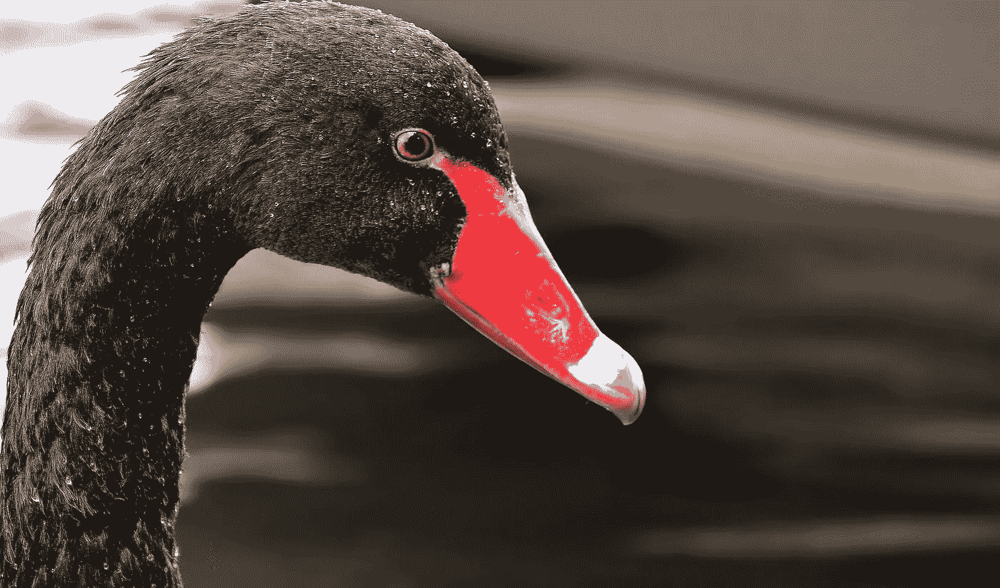

# 野心、奉献和机会之间的区别

> 原文：<https://medium.com/swlh/the-difference-between-ambition-dedication-and-opportunity-d436d6828857>

几年前我写了这篇文章，今天和 2010 年一样。享受吧。

# 追求

有些人有。有些没有。许多人没有意识到它是什么。韦氏词典对雄心的定义是“*实现特定目标*的愿望”。简单来说，就是想要成功完成某件事。想要和渴望做一些事情是重要的，但是如果没有奉献和机会，你的雄心只会在你良心的地下室里闷烧。多年来，我一直渴望成为一名游戏开发人员，但我没有将这种渴望与抓住实现这一愿望所需的机会的奉献精神相匹配。然而，欲望是奉献的燃料。雄心是以升来衡量的，这意味着你拥有的越多，你就越能利用它来获得你也需要的奉献。如果没有成功的野心，你就不可能专注于软件开发。需要有时试图披上野心的外衣，但正如我向我的孩子们解释的那样，需要和欲望是两个完全不同的层面。人们**需要**工作岗位。他们**想要**职业。人**需要**去上班。他们想让 T9 对他们正在做的工作感到兴奋。野心会把自己伪装成需要，尤其是如果你的野心很大，而不是相反。这意味着我有能力完成我需要做的任务，但如果我对自己诚实，我也必须认识到我不会在这些事情上做得那么好——不会在我真正雄心勃勃的事情上做得那么好。

# 奉献

有些人有。有些没有。许多人知道这是什么，却不能做出牺牲。韦氏词典将奉献定义为“*自我牺牲的奉献*”。现实是，我们有时只看到他人自我牺牲奉献的成果。我们看到了成功。我们看到了 100 万的下载量。我们看到冠军赢了。我们看不到的(通常)是长时间的日日夜夜挤在一个变暗的屏幕周围，试图弄清楚为什么你的人工智能代码会让你的敌人毫无理由地挤在你关卡的角落里，而且你几乎要为此抓狂了。独立开发者知道这种情况会发生——这些事情的发生让我们想要放弃。这就是为什么我喜欢死后的谈话，仅仅是因为我能看到幕后的东西。给我们的同龄人带来痛苦的事情。失败了。突破。知道别人的成功是你可能必须付出的那种奉献的直接衍生物，让你确信成功是可能的，即使有时你不能清楚地看到它。当你的成功看不见的时候，正是在这些时候，雄心开始发挥作用，推动你的奉献达到一个点，在这个点上，成功不是最终的游戏场景，而是做你喜欢的事情的过程让你快乐，而不是让你富有。就我个人而言，这是我正在学习的一课。不幸的是，我们都有我们同样关注的外部现象。一个妻子。一个家庭。你的孩子。你的日常工作(如果兼职是你的另一面)。只要你记住，你对一件事投入越多，你就牺牲了对其他事的承诺。时间是一颗粉红色的钻石。

# 机会

野心，检查。奉献，检查。伟大的产品，检查。现在，钱在哪里？出版协议在哪里？“造一只熊”公司的毛绒玩具销售协议在哪里？机遇是黑天鹅。正如塔勒布所定义的，这是一个高度不可预测的事件。我同意这个立场，只是稍微同意。时机(机会)对时间(奉献)。如果时间是宝贵的，那么在我看来，正确的时间是非常特殊的事情。然而，尽管看起来不可能，但还是有办法预测未来，并在“正确的时间”到来。气象学家和进港/离港公告板一直都这么做，对吗？是的，他们也会弄错。如果你注意的话，我们会分析市场数据和趋势。我们甚至克隆——都试图与他人的成功相媲美。仔细分析，有些时候，通过回顾历史，我们可以预测未来。其他时候，发布在 YouTube 上的最愚蠢的视频几乎在一夜之间获得了 400 万次观看。我在这里说什么？做好准备。无论你的预测是否成真，或者机遇是否从天而降，你的雄心和奉献精神让你充满信心地赢得比赛。

我们有雄心壮志。奉献的理想平衡是我们想要的。完美的机会是我们所需要的，把你的 4 小时/晚上的演出变成你梦想的职业。

去抓住他们，老虎。

## 这篇文章发表在 [The Startup](https://medium.com/swlh) 上，这是 Medium 最大的创业刊物，拥有+414，678 名读者。

## 订阅接收[我们的头条](http://growthsupply.com/the-startup-newsletter/)。

