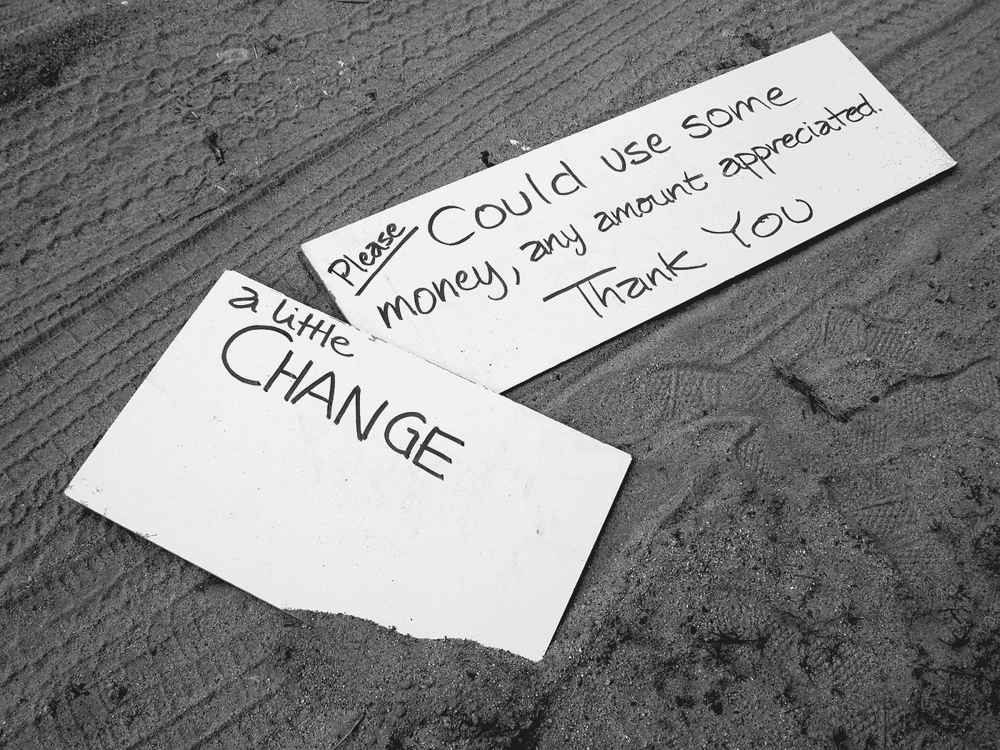

# 瑜伽的(肮脏)勾当

> 原文：<https://medium.com/swlh/the-dirty-business-of-yoga-8f05666b6f80>

Matt Artz from unsplash.com

一位前瑜伽老师的自白

在我瑜伽教学生涯的早期，一名学生问我是否“对金钱来说太过精神化”。她问的是:如果瑜伽本质上是一种精神追求，为什么我要收费？她只是半开玩笑。

我不喜欢资本主义，但我必须在这个社会中生存，所以，是的，我收了学费。