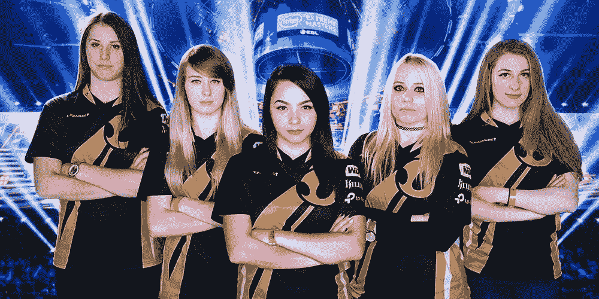

# 男性和女性电子竞技选手的区别:应该有全女性比赛吗？

> 原文：<https://medium.com/swlh/the-divide-between-male-female-esports-players-should-there-be-all-women-tournaments-49a14e8b8772>

Current World Champions, Team Dignitas, (pictured back in 2017) have been invited to play in the DreamHack Showdown CS:GO tournament.

目前电子竞技界最大的争论之一是男女玩家是否应该一起玩。

此前有消息称，电子竞技组织 DreamHack 宣布，他们将举办一场全女性的《反恐精英:全球攻势》(CS:GO)锦标赛，奖金池为 10 万美元。