# 医生在:健康应用程序界面和健康追踪器的未来

> 原文：<https://medium.com/swlh/the-doctor-is-in-health-app-interfaces-and-the-future-of-health-trackers-2dd12bdfdec1>

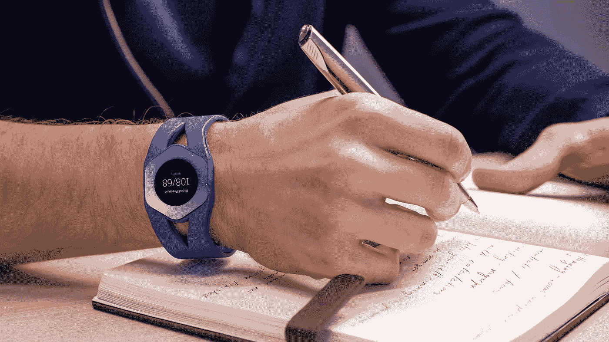

没有人喜欢生病，我们倾向于推迟去看医生，直到我们真的不舒服。因为这就是我们，我们创造了各种各样的小工具，可以帮助诊断疾病，而不用去看医生。健康追踪器的主要吸引力是能够在不离开沙发的情况下监控你的身体状态。如果你正确使用它们，健康追踪器真的可以提高你的生活质量。然而，不言而喻，100%依赖他们并不是最好的主意。

我们开发了自己的原型健康追踪器，它采用了最新的技术。我们将通过本文中的一些案例研究来研究如何使用它。一些案例已经得到应用，而其他案例仍处于开发阶段，可能会变得显而易见，比如说，在没有侵入性程序的情况下计算出血糖水平。

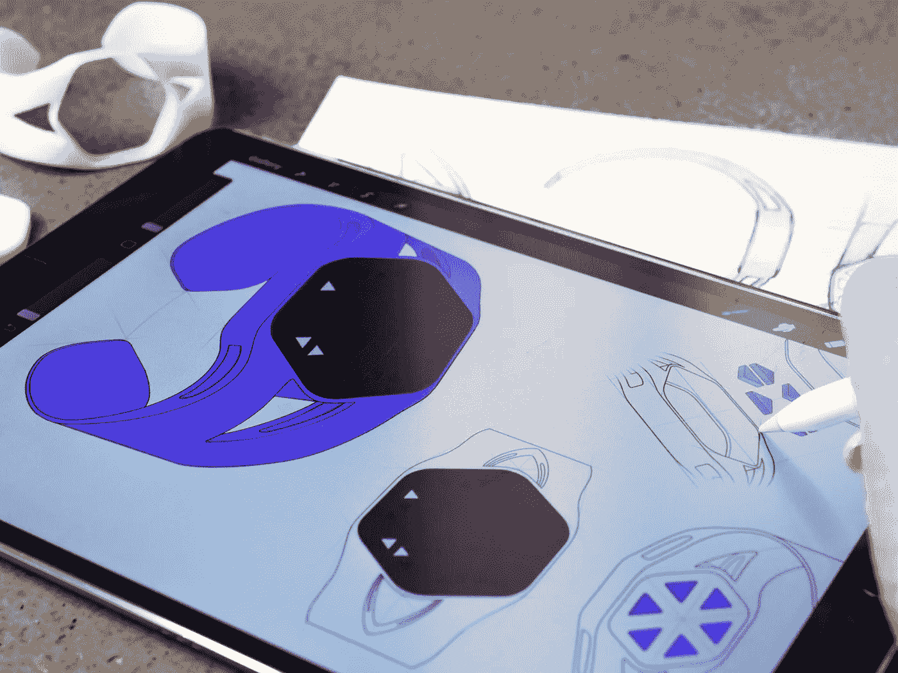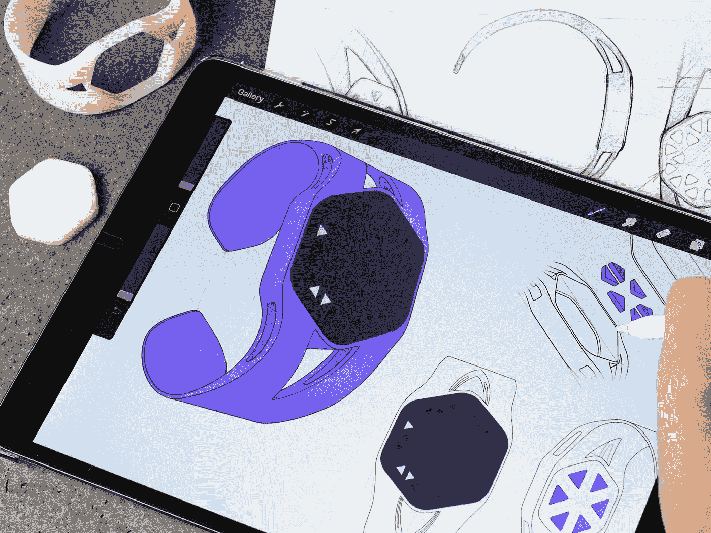

首先，值得注意的是，健康和健身追踪器的受欢迎程度正在逐年下降。简单地说，它们没有功能，没有信息。与此同时，智能手表正在加速发展。但是，它们在控制你的健康方面功能有限。这主要是因为今天的技术在智能手表机身上缺乏必要的传感器。我们认为每个设备都有它的位置，健康追踪器不会为你的手腕假装一些奢侈的口音，所以它不会取代经典的手表。

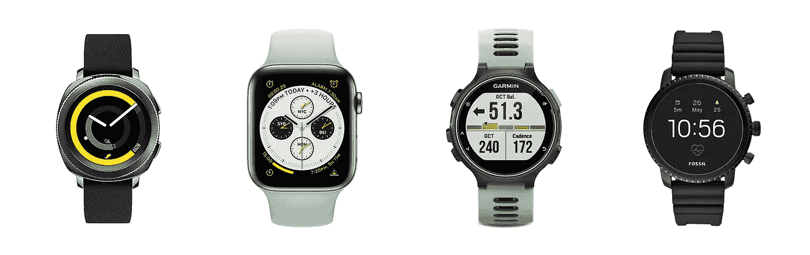

Smartwatch examples from other manufacturers

市场上有大量不同的可穿戴设备可以与智能手机一起使用，但它们变得不必要的复杂，也不符合我们对未来紧凑型手环的愿景。我们的追踪器的基础配备了特定的传感器，可以捕捉到用户独特的生理特征。追踪器总共有 6 个这样的传感器，每个传感器负责用户的身体方面。例如，确定心率或血糖水平。

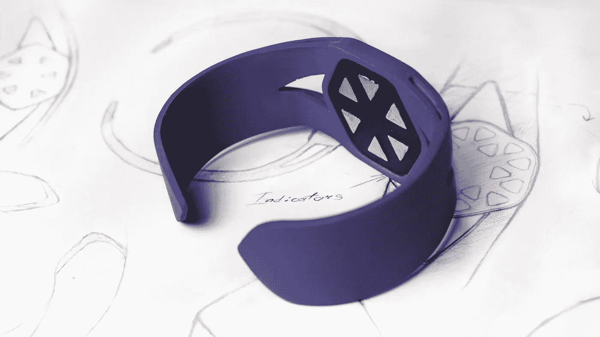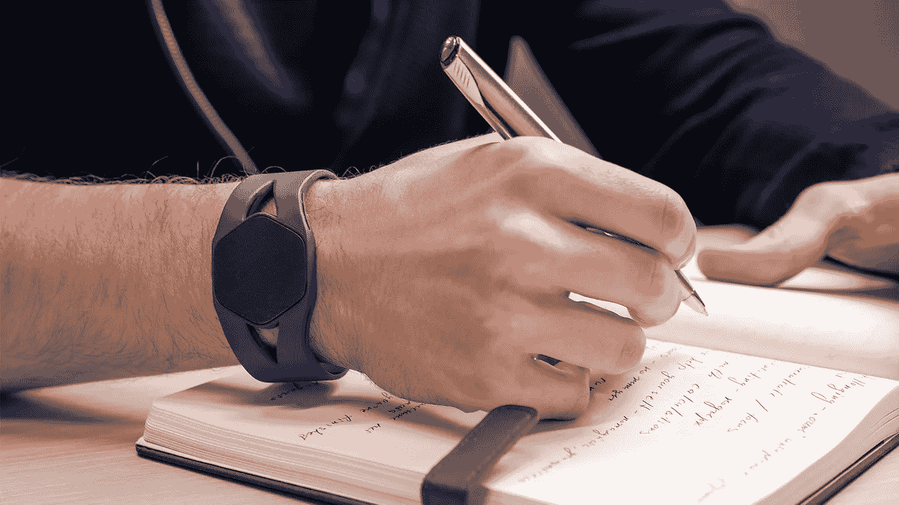

本文不打算深入追踪器的技术细节。相反，我们要回顾一下我们想象出来的案例。

# 仪表盘

首先对跟踪器的界面有一个总体的了解是很重要的。我们调查了大量的健康和健身应用，并没有留下深刻的印象。具有大量功能的应用程序有过载的界面，这使得导航变得混乱。我们的视觉从轻盈和简单的信息传递中得到暗示。这里，我们仅突出显示那些当前处于活动状态或需要用户注意的物理参数。

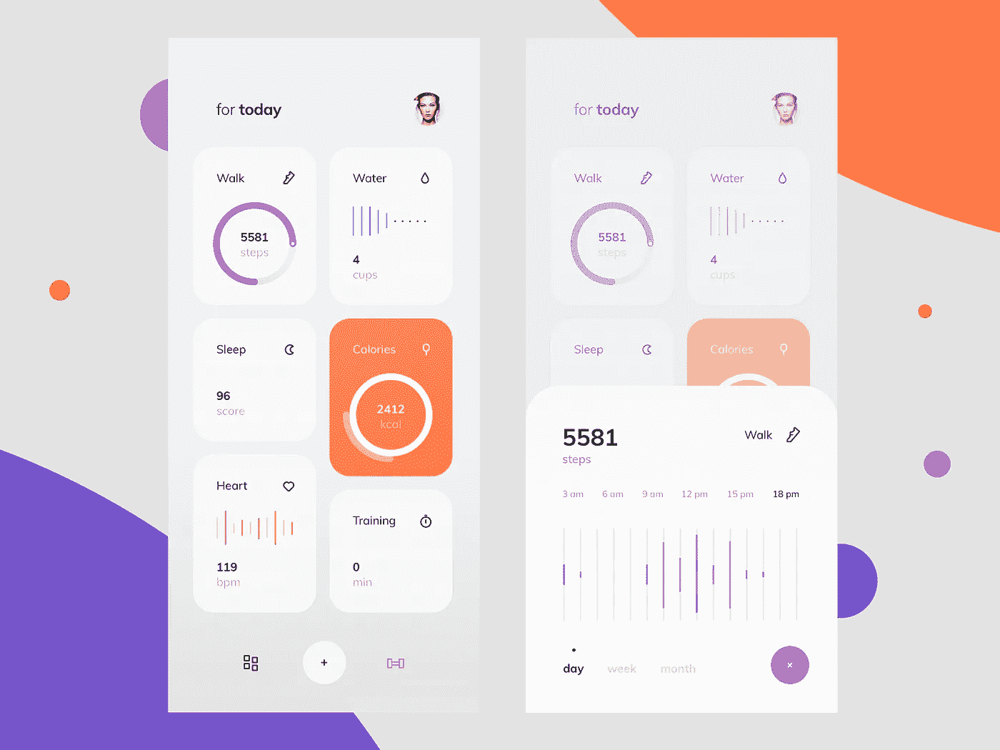

[https://dribbble.com/shots/5312501-Fitness-Activity-Tracker-Dashboard-3](https://dribbble.com/shots/5312501-Fitness-Activity-Tracker-Dashboard-3)

# 计算步数

计步是健身追踪器和智能手表最普遍的功能之一。让·费尔内尔在 1525 年发明了第一个计步器。甚至在那个时候，人们就知道体育活动和健康之间的关系。为了保持最佳状态，一个人每天至少需要走三千步，理想情况下是一万步。在这种情况下，我们不会提供让·费尔内尔不知道的任何东西，但我们制定了视觉组件，因为当前版本不能满足我们，也不符合未来的发展。

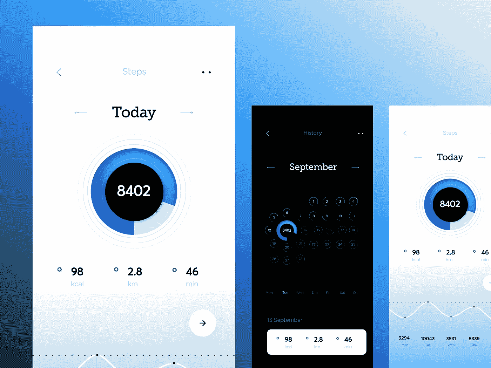

[https://dribbble.com/shots/5279565-Step-Tracking-UI](https://dribbble.com/shots/5279565-Step-Tracking-UI)

# 卡路里消耗跟踪器

这里也没有什么新东西，但是我们想提供自动计算卡路里的功能，因为在其他地方，卡路里必须手动输入。这项技术的开发始于 2014 年，已经吸引了 800 万美元的投资。但是由于一个巨大的错误，手镯令人失望。事实是，对功能的需求仍然很高，因为人们不使用当前的卡路里监测器，因为手动输入每一口的细节很困难。以下是对这种情况的一些超现代概念:

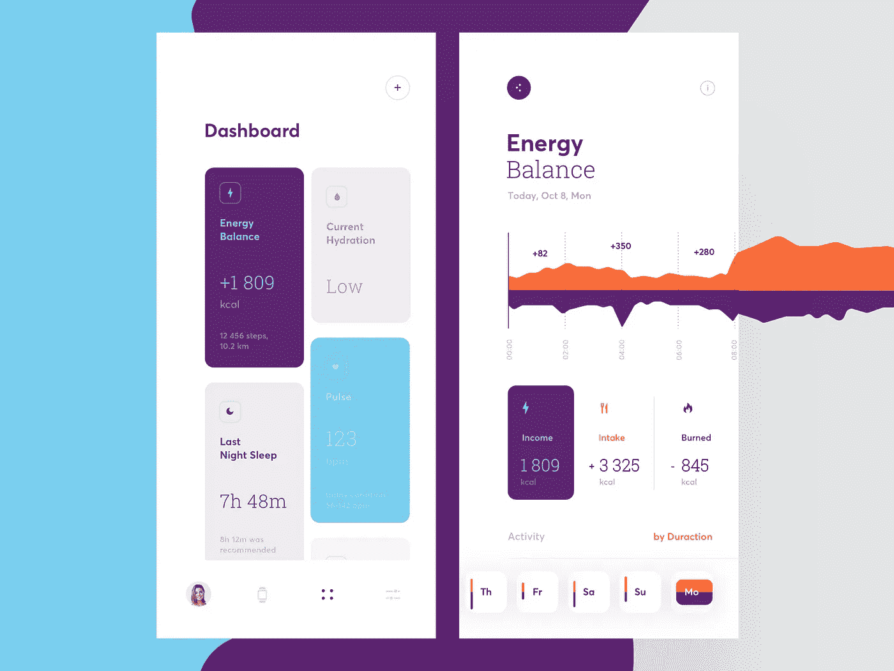

[https://dribbble.com/shots/5376242-Calories-Consumption-Tracker](https://dribbble.com/shots/5376242-Calories-Consumption-Tracker)

# 心率监测

现在我们来看大事件，那些不可否认与你的身体状态有关的事件。监控这些参数肯定会对你的整体健康产生影响。显然，在检查心脏健康方面，没有什么比标准心电图更可靠的了，标准心电图通常有 6 个胸导联。我们的追踪器概念仅实现其中一个导联并测量脉搏。为了用跟踪器获得准确的心电图读数，我们需要在技术上取得重大进展。不过，也有一些便携式设备允许用户在家进行 ECG 监护。

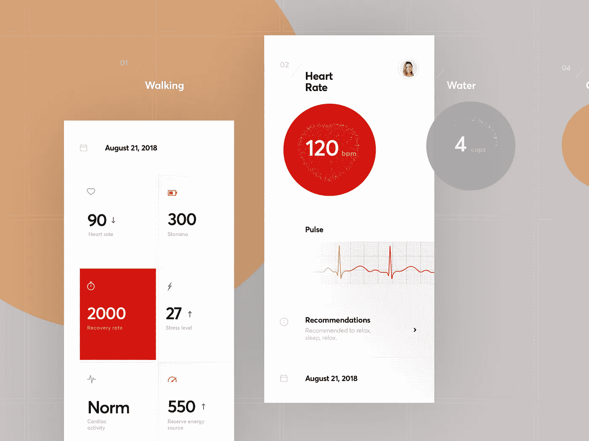

[https://dribbble.com/shots/5318560-Fitness-Activity-Tracker-Dashboard-4](https://dribbble.com/shots/5318560-Fitness-Activity-Tracker-Dashboard-4)

# 智能血糖仪

问问任何一个糖尿病患者，他们是否喜欢每天刺破手指来测量血糖水平。我们只是猜测，没有那么多。几年来，一直在开发旨在测量血糖水平的非侵入性方法。方法就在那里。唯一的障碍是它们的可靠性。然而，我们手环的一个传感器可以让用户通过光学手段测量葡萄糖。

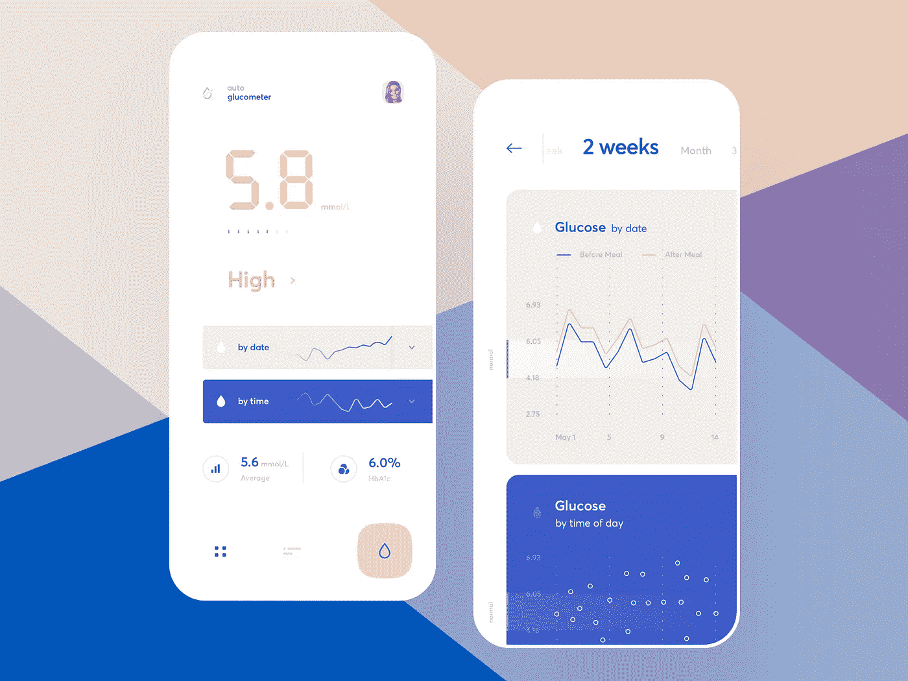

[https://dribbble.com/shots/5344703-Smart-Blood-Glucose-Meter](https://dribbble.com/shots/5344703-Smart-Blood-Glucose-Meter)

# 智能警报紫外线

研究表明，紫外线对健康构成严重威胁。我们伟大的想法？当紫外线最危险时，全天发出警报，以便用户可以采取简单的措施远离阳光。内置在手镯中的可拉伸皮肤传感器可以监测紫外线对皮肤的影响。

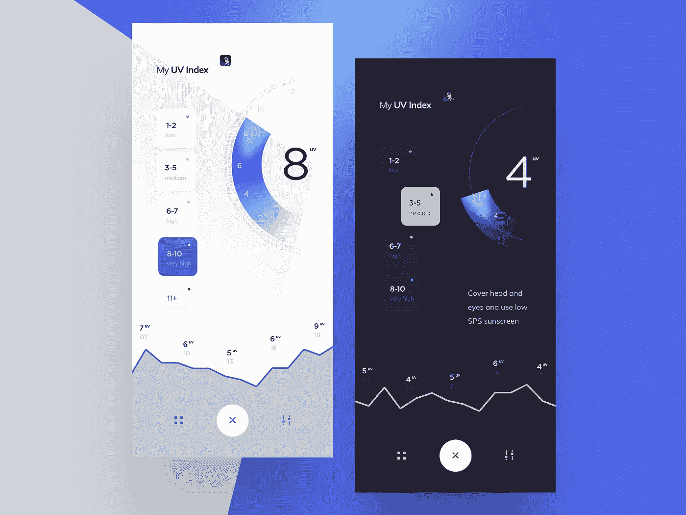

[https://dribbble.com/shots/5363739-Smart-Alert-UV-rays](https://dribbble.com/shots/5363739-Smart-Alert-UV-rays)

# 总结一下

我们生活在一个激动人心的时代，技术不断发展，不断突破界限。今天的新闻就是明天的过时。一方面，变化是由客户的需求驱动的。另一方面，令人大开眼界的创新导致了以前认为不可能的发明。

如果你想收集关于自己身体的重要信息，有一款应用程序可以满足你。健康追踪器是幸福的未来。

[*库贝托*](http://cuberto.com/) 引领创意网站和移动应用的潮流。数字和移动专业知识推动了我们屡获殊荣的设计和创新的高端产品*。*[**info@cuberto.com**](mailto:info@cuberto.com)

关注我们的**和 [**Instagram**](https://www.instagram.com/cubertodesign/)**

****

## **这篇文章发表在 [The Startup](https://medium.com/swlh) 上，这是 Medium 最大的创业刊物，拥有+424，678 名读者。**

## **在这里订阅接收[我们的头条新闻](https://growthsupply.com/the-startup-newsletter/)。**

****