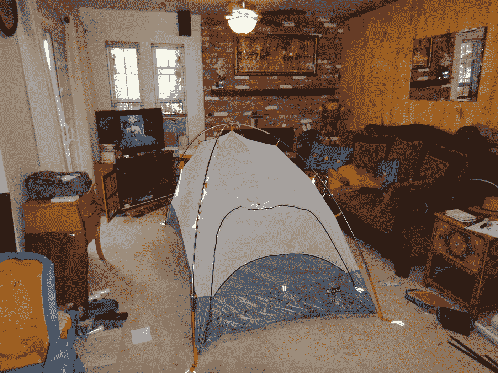

# 设计团队在不参与多样化输入时做出的愚蠢假设。或者说，为什么没有什么对不知情的人来说是显而易见的。

> 原文：<https://medium.com/swlh/the-dumb-assumptions-design-teams-make-when-they-dont-engage-diverse-input-24facdca9a3b>

Photo credit Julia Hubbel

以上是我准备大旅行时，我家客厅的样子。

是的，*魔戒*在玩。背景音乐。

这是一个全新的，非常非常非常昂贵的 Nemo Kunai 双人探险帐篷。七张钞票。