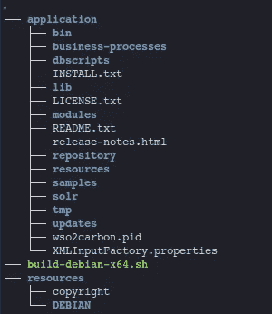
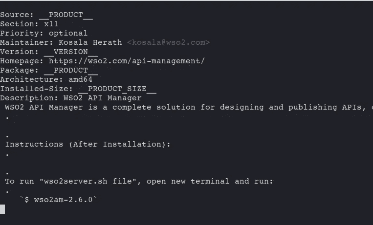
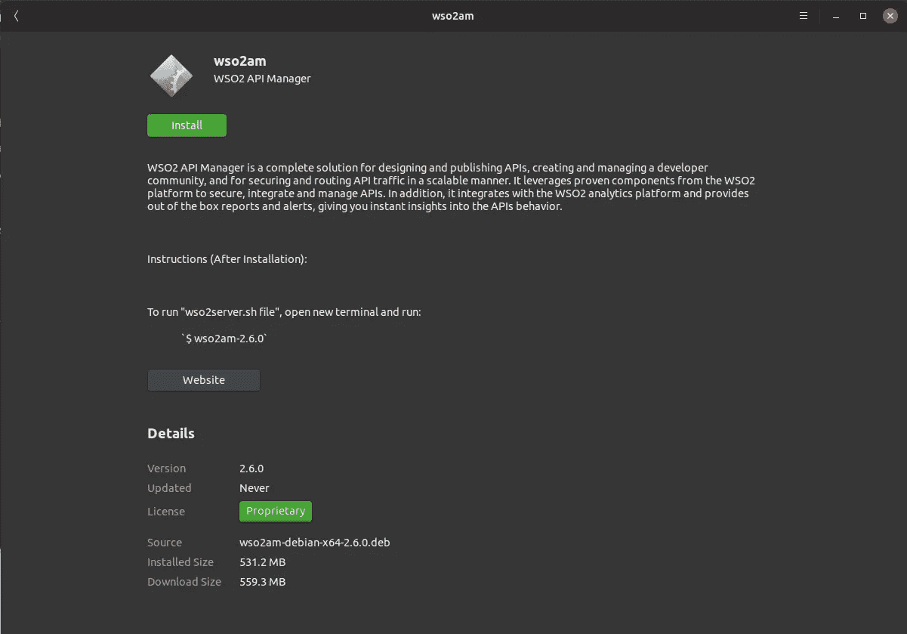
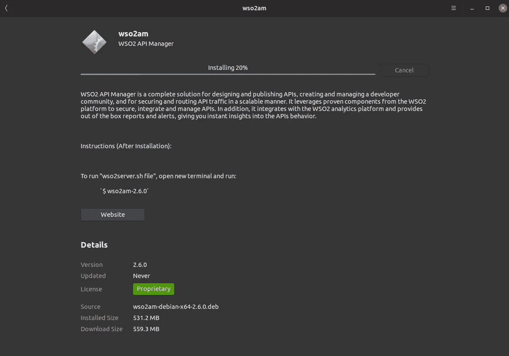
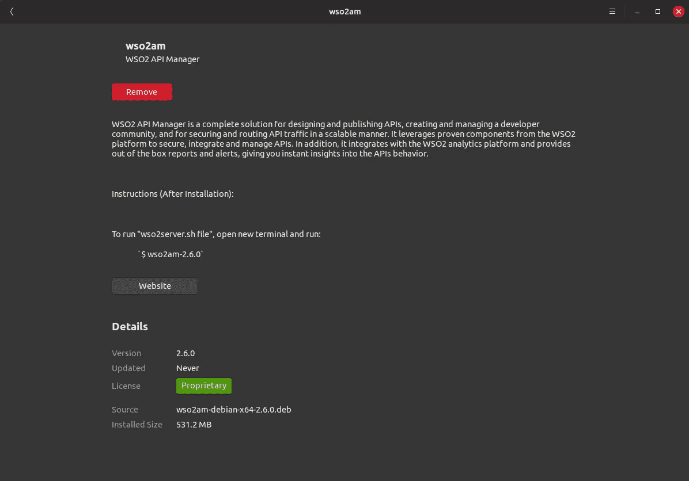
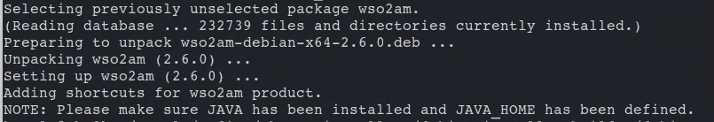
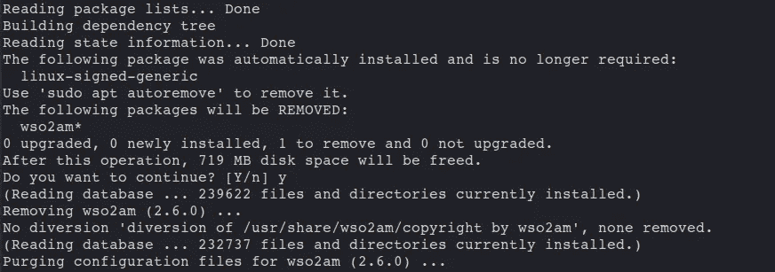

# 为您的应用程序构建 Debian 安装程序的最简单方法

> 原文：<https://medium.com/swlh/the-easiest-way-to-build-debian-installer-for-your-application-d1468179a7c0>

## Debian | Ubuntu |开源| WSO2 |安装程序

## 用一个简单的命令构建你的 debian 安装程序。


Debian 项目是一个由个人组成的联盟，他们有一个共同的目标，那就是创建一个[免费的](https://www.debian.org/intro/free)操作系统。我们创造的这个操作系统叫做 **Debian** 。

如果我们需要在 Debian 系统上安装程序或应用程序，我们可以使用一个叫做 **Debian Package** 的 **Debian 安装程序**。不管有多少方法可用，使用 Debian 软件包是最简单的方法。😇

# 🤔什么是“Debian 包”？

Debian 包是文件的集合，允许应用程序或库通过 Debian 包管理系统进行分发。打包的目的是允许以一致的方式自动安装、升级、配置、删除 Debian 的计算机程序。(来源: [Debian Wiki](https://wiki.debian.org/Packaging) )

Debian 包由一个源代码包组件和一个或多个二进制包组件组成。Debian 政策要求这些包文件以特定的结构和格式构建，但是有许多方法可以获得这些文件。

源码包不仅包含 Debian 包构建系统的上游源码分发和选项，还包含**运行时依赖**和**冲突包**的列表，版权和许可信息的**机器可读描述**，**初始配置**等。

# 🔧 **dpkg-deb**

虽然打包的目标是生成应用程序发行版的文件，但是它也将完成初始配置过程。二进制包(。deb)将由 **dpkg-deb** 等工具为你构建。dpkg-deb 打包、解包并提供关于 Debian 档案的信息。Debian 系统中已经有这个工具了。

要构建 debian 包，只需使用下面的命令。

```
**dpkg-deb --build** *binary-directory* [*archive*|*directory*]
```

这将从存储在二进制目录中的文件系统树创建一个 debian 包。二进制目录必须有一个 **DEBIAN** 子目录，其中包含控制信息文件，比如控制文件本身。这个目录不会出现在二进制包的文件系统归档中，但是其中的文件会放在二进制包的控制信息区域中。它将检查文件的语法错误和其他问题，并显示正在构建的二进制包的名称。 **dpkg-deb** 还会检查 **maintainer 脚本**和 **DEBIAN** 控制信息目录中的其他文件的权限。

如果没有指定包，那么 **dpkg-deb** 将把包写入文件 **binary-directory.deb** 。如果要创建的归档文件已经存在，它将被覆盖。如果第二个参数是一个目录，那么 **dpkg-deb** 将写入文件**directory/package _ version _ arch . deb**。

如上所述，当您构建 DEBIAN 包时， **DEBIAN** 子目录应该在包目录中，并且 **DEBIAN** 子目录可能包含以下文件。

1.  **控制文件**
2.  **维护者脚本**

下一节将讨论**控件**文件的用法和配置，您可以从[Debian Maintainer 脚本流程图介绍](/@kosalasananthana/introduction-to-debian-maintainer-script-flow-charts-6f76423b80d9)文章中了解 **maintainer 脚本**及其用法的基本概念。如果还没有阅读，请在开始下一部分之前阅读。它将涵盖 debian 软件包的所有过程和配置。

在这篇文章中，我希望使用我的自动化构建脚本为 [WSO2 API 管理器](https://wso2.com/api-management/)构建一个 debian 安装程序。WSO2 API Manager 处理完整的 API 生命周期管理、货币化和策略执行。它支持可扩展性和定制性，并确保免于锁定，并且在 2018 年第四季度报告 Forrester Wave:API 管理解决方案中被评为领导者。

# 📦让我们来构建我们的 Debian 安装程序

首先，您需要将 debian installer builder 库克隆到您的 debian 机器上，然后向其中添加所需的配置(将在下一节中描述)。之后，您只需要运行命令来构建应用程序的安装程序。让我们开始我们的旅程。

**1。将 [debian-installer-builder](https://github.com/KosalaHerath/debian-installer-builder) 库克隆到你的本地机器上。您可以通过以下命令克隆存储库。让我们将存储库的主目录定义为< REPO_HOME >。**

```
git clone [https://github.com/KosalaHerath/debian-installer-builder.git](https://github.com/KosalaHerath/debian-installer-builder.git)
```

**2。**将应用程序的分发文件(安装后需要复制)复制到应用程序目录，该目录位于:

```
<REPO_HOME>/debian-x64/application
```

作为一个例子，我下载了 [WSO2 API 二进制发行版](https://bintray.com/wso2/binary/download_file?file_path=wso2am-2.6.0.zip)并解压。然后将所有文件复制到'**应用程序的**目录下。



WSO2 API Manager’s distribution copied to the application directory

**3。**用您的应用程序信息修改以下文件。您可以在以下位置找到这些资源文件。

```
<REPO_HOME>/debian-x64/resources/DEBIAN
```

**控制:**

*该文件包含各种值，其中****dpkg****，****dselect****，****apt-get****，****apt-cache****，****aptitude****等*



control file that contains the package details

*你可以根据需要修改上面给定的参数来改变 debian 软件包的细节。如果你想添加更多的参数或者改变文件，你可以参考* [*这个 debian 文档*](https://www.debian.org/doc/manuals/maint-guide/dreq.en.html#control) *来获得控制文件的参数。*

*在这个例子中，我已经参数化了产品名称和版本。但是，您可以在此文件中随意更改详细信息。这些详细信息将显示在应用程序的安装页面中。*

**维护者脚本:**

这些文件是可执行脚本，在安装或删除软件包之前或之后自动运行。maintainer 脚本流程图解释了这个自动运行的流程。这些 maintainer 脚本流程图是 debian 软件包流程的蓝图。如果你需要为你的 Linux 应用程序或产品构建你自己的 debian 包，你应该对这些流程图有更好的理解。你可以从我之前的文章[*Debian Maintainer 脚本流程图*](/@kosalasananthana/introduction-to-debian-maintainer-script-flow-charts-6f76423b80d9) *中了解到所有这些脚本和流程图的基本概念。*

*你可以修改这些脚本来完成你的安装、更新和卸载过程的自动流程。在示例存储库中，我已经添加了一些支持安装、更新和卸载过程的脚本。您可以根据您的应用更改它们。*

**4。**根据您的产品更改版权文件。

*您需要更改位于*的版权文件

```
<REPO_HOME>/debian-x64/resources/copyright
```

*关于版权文件和参数的更多细节可以参考* [*关于版权文件*](https://www.debian.org/doc/manuals/maint-guide/dreq.en.html#copyright) *的 debian 文档。在示例文件中，我添加了 WSO2 API 管理器所需的版权。*

**5。运行下面的命令来构建你的 debian 安装程序。**

```
bash <REPO_HOME>/debian-x64/build-debian-x64.sh [APPLICATION_NAME] [APPLICATION_VERSION]
```

注意:您应该提供应用程序名称和应用程序版本。此外，应用程序版本应为**【0–9】。[0–9].[0–9]**模式。(例如:2.6.0)

这将启动安装程序生成过程，在完成安装程序的构建过程后，debian 包(**wso2am-debian-x64–2 . 6 . 0 . deb**)将保存到以下位置。

```
<REPO_HOME>/debian-x64/target/wso2am-debian-x64-2.6.0
```

太棒了。！💪就是这样。现在您可以通过双击**开始安装过程。deb** 文件。

# ⚙安装过程

## 📦通过用户界面安装

安装过程步骤如下所示:



Installation page of the package (Details we added on control file are shown here)

然后点击屏幕上的安装按钮，这将开始安装过程。



Installing the debian package on the system

安装完成后，如果需要，您可以通过单击“删除”按钮来删除软件包。



After successful installation

## 📦通过终端安装

转到生成 debian 包的位置，运行下面的命令开始安装。

```
$ sudo dkpg -i <REPO_HOME>/debian-x64/target/<DEBIAN_PACK_NAME>
```



Installation of the debian package using terminal

如果要从系统中清除已安装的软件包，可以在终端上运行以下命令。

```
$ sudo apt purge <APPLICATION_NAME>
```



Purging process using terminal command

因此，您可以使用这个自动化的 debian 安装程序生成器来轻松地为您的任何可以在 debian 系统上运行的应用程序生成安装程序。请在此 处建议任何**修改**，将 debian installer builder 改进为 [**。**](https://github.com/KosalaHerath/debian-installer-builder/issues)

干杯！！🍺🍺

关于 debian 软件包和软件包管理的更多细节:

[](/@kosalasananthana/introduction-to-debian-maintainer-script-flow-charts-6f76423b80d9) [## Debian Maintainer 脚本流程图简介

### debian 软件包安装基础

medium.com](/@kosalasananthana/introduction-to-debian-maintainer-script-flow-charts-6f76423b80d9) [](https://www.debian.org/doc/manuals/maint-guide/index.en.html) [## Debian 新维护者指南

### 制作 Debian 软件包(又名 Debmake 手册)，版权 1997 Jaldhar Vyas。

www.debian.org](https://www.debian.org/doc/manuals/maint-guide/index.en.html) [](https://wiki.debian.org/Apt?action=show&redirect=Package) [## Apt - Debian Wiki

### Debian 是一个强大的 Linux 发行版的大部分原因来自于 Debian 的核心，即它的包管理…

wiki.debian.org](https://wiki.debian.org/Apt?action=show&redirect=Package)