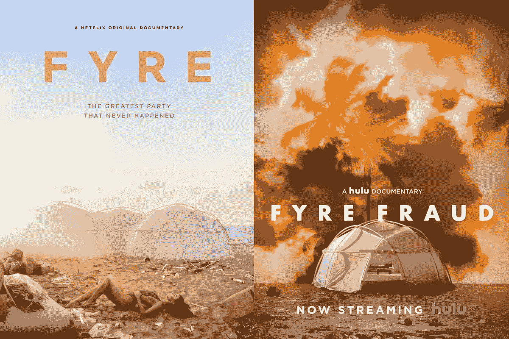
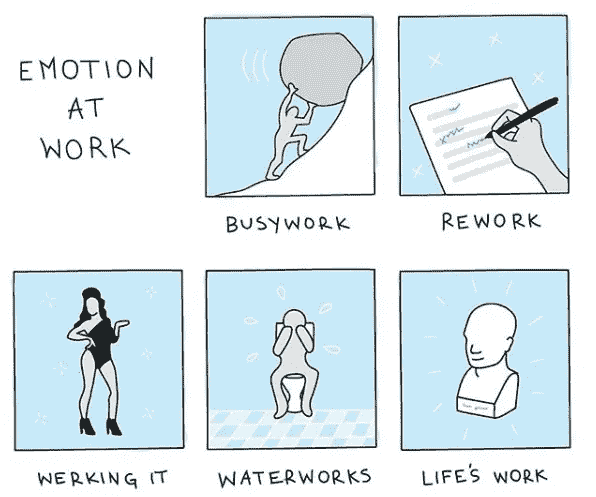
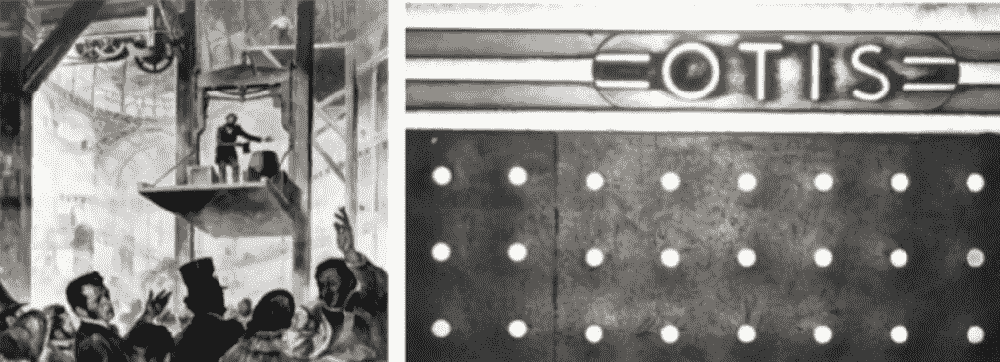

# 情感革命

> 原文：<https://medium.com/swlh/the-emotional-revolution-3cae0fca7814>

## 我们如何生活在一种无法停止感受的状态中。

> “哇！你能想象其中的可能性吗？”一位不知名的中年发明家对那些看不到他设计中的逻辑的人感到沮丧，他把所有的赌注都押在了一个古怪的想法上。以利沙站在高高悬挂在人群上方的木平台上，砍断了绳子。在 1853 年的世界博览会上，当他看起来像是从高处坠落而死时，人们倒吸一口冷气。

以利沙花了两年时间为他的安全杆的多种用途招揽潜在买家。新泽西办公室的门一个接一个地被砰地关上。人们被他的发明惊呆了[。不过这一次会有所不同。](https://www.inc.com/jonas-altman/innovate-faster-by-asking-this-one-simple-question.html)

他的杠杆是用一个用过的马车弹簧制成的，在紧要关头站稳了脚跟。下降的平台突然停住了。以利沙扫视了他的新信徒的场景，很快世界闻名的*奥的斯电梯公司*诞生了。

# 春节与情感导向的思考

我们常常很难看到别人想法的真正潜力。直到它把我们打得头破血流。作为非理性的存在，逻辑只能到此为止。关闭网飞的自动播放功能是有意义的，这样我们就不会陷入当前修复的另一个插曲，但我们就是不想被打扰。那一个人的性格呢？嗯，我们也经常弄错。一些实习生的洞察力不亚于(如果不是更多的话)高管。

然而，情感是一个完全不同的袋子。如果我们真的想抓住问题的核心并阐明观点，没有比让你周围的人感受到更好的方法了。今天，没有比社交媒体更好的表达情感的工具了。

脸书没有把世界联系起来，而是让我们变得更加沉闷、担忧、焦虑和逃避。错过一个聚会是一回事，第二天收到多个提醒是另一回事，每个人都错过了你的笑容。或者更糟糕的是，你可能会经历一个糟糕的早发性 FOMO，已经担心你会错过一些事情，即使那些事情从来没有发生过。

没有什么比 Fyre 更能抓住这种情绪了，Fyre 是一个高档的必看节日，但它并没有成为两部纪录片的主题。理性地说，我们知道所有的喧嚣有多愚蠢，我们的注意力如何能更好地转移到其他地方。但是，正如黑幕媒体操纵者所说的那样，很难抗拒全明星阵容中受害者和恶棍的诱惑。

如果你想让人们看到你的想法或故事的天才之处，这种信息可能最好与引发情绪导向思维的触发器联系在一起。这些触发因素可能包括故事、气味、橙色方块或声音。会发生什么？一个节日游客变得如此担心，如果他们不把他们的 Fyre 手镯充值，他们就不会得到米其林星级晚餐，而实际上他们应该担心他们是否会得到任何晚餐。

# 搬家一定很激动人心

我们是有情感的生物。在某些情况下，我们很好地抑制了我们的感情，而在其他情况下，我们很好地拥抱了它们。我们本能地知道什么是对的，但我们得到的信号往往令人困惑。思考是否采用*剂量或*策略会有所帮助。

Via Mollie West Duffy and Liz Fosslien

如果你的目标是打动你的观众，那么*用情感打动他们。如果你不兴奋，人们就不会对一个想法感到兴奋。另一方面，如果你在寻求化解一种局面，那么尝试*缓和*情绪。你总是可以在前进的过程中加入更多的情感，但是如果你大发雷霆，就很难爬回来，看起来很镇静。*

甚至波士顿咨询集团也加入了情感潮流。他们相信，如今成功的业务转型“取决于那些积极参与并努力超越的人。组织可以通过一系列*心脏练习来创造这种条件。*“在微软的过去 5 年里，这正是首席执行官[塞特亚·纳德拉](https://qz.com/work/1539071/how-microsoft-ceo-satya-nadella-rebuilt-the-company-culture/)所做的——注入一些活力！有一个令人信服的愿景，即“让这个星球上的每个人和组织都能够实现更多”。战略思维和敏捷很重要，但真正重要的是全心全意。

# 唯一的出路

什么使*有意义*可能不觉得*有意义*。所以我们编织了一些安慰我们的故事——在这个疯狂的世界里提供了一种理智的表象。我们的态度决定了我们的现实，信仰意味着从*有意义的*转变为*感觉正确的*。

我们调整和编织我们自己创作的故事，这样我们就可以度过新的一天。我们开始练瑜伽、交叉健身、普拉提、尊巴(人们还会这么做吗？)或其他一些地方预留给集体流汗，以逃避我们的感情稍纵即逝的时刻。工作室里到处都是“你已经足够了”的提醒，以防我们忘记善待自己。

所以我们买东西。很多。我们踩在消费者的仓鼠轮子上，因为感觉良好的诀窍是买得更多！然而，一次又一次，购物疗法的光泽消失了，我们感到不完整。

但是工作中的忙碌也许是我们转移情绪的罪魁祸首。“在生活中，没有什么是一成不变的，对失败的恐惧已经成为一种持续存在的感觉。社会学家塞巴斯蒂安·普朗兹写道:“工作是抑制这种恐惧的唯一仪式。”。

情绪革命是几个世纪以来忽视我们内心深处的想法和感受的后果。再喝一口拿铁并不能让内心翻腾的感觉消失。“一切都会好起来的”这一集体口号被置若罔闻。

当我们离开沉思的时代，我们变得迷恋于在世界上行动的需要。我们放弃了存在、思考和感受的美德，而去做。但是，如果我们更好地将我们的意识与行动结合起来，我们可能会发现一个更好的平衡。

以利沙·奥蒂斯的成功不是因为他是谁。他没有因为他的创造性思维而受到表扬。由于他的保险杆的机械结构，没有人向他扔钱。他用情感的力量敲定了电梯的交易。是爱和感觉揭示了上升的道路。

*乔纳斯·奥特曼写工作。点击**[***此处***](https://www.jonasaltman.com/newsletter) 加入千千并领取他的月刊*

*如果您喜欢这个故事，请点击👏按钮&分享帮别人找。*

**

## *这篇文章发表在 [The Startup](https://medium.com/swlh) 上，这是 Medium 最大的创业刊物，拥有+435，678 名读者。*

## *在这里订阅接收[我们的头条新闻](https://growthsupply.com/the-startup-newsletter/)。*

**