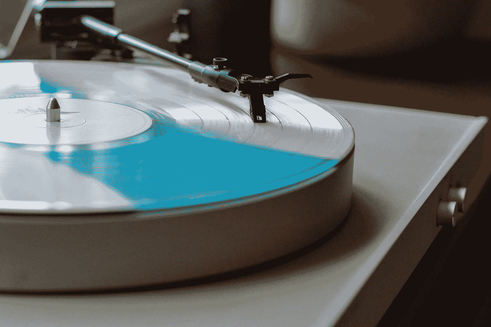

# …现实的终结在重演…

> 原文：<https://medium.com/swlh/the-end-of-reality-is-on-repeat-4969e03ad85>

## 如果死亡的不是资本主义，或者社会秩序，或者真理呢？如果是现实本身呢？

Photo by [Lee Campbell](https://unsplash.com/@leecampbell?utm_source=medium&utm_medium=referral) on [Unsplash](https://unsplash.com?utm_source=medium&utm_medium=referral)

在马克·费舍尔(Mark Fisher)后来的政治著作中，他提到了川普和英国退出欧盟，“在这些早期的反抗中，被拒绝的不是资本主义，而是现实主义。”如果像有证据证明的那样，我们现在正在目睹…