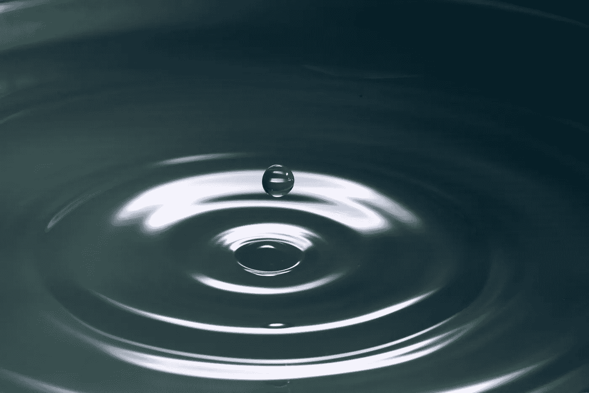

# 正念的本质以及如何达到持久的正念状态

> 原文：<https://medium.com/swlh/the-essence-of-mindfulness-and-how-to-achieve-a-lasting-state-of-mindfulness-abbd4a0680d7>

Photo by [Levi XU](https://unsplash.com/@xusanfeng?utm_source=unsplash&utm_medium=referral&utm_content=creditCopyText) on [Unsplash](https://unsplash.com/search/photos/mindfulness?utm_source=unsplash&utm_medium=referral&utm_content=creditCopyText)

# 什么是正念？

正念是有意识和觉察，而不对头脑、思想和行动做出反应。我们可以主动注意，但不能被动注意。后者是内省，与正念有很大不同。内省是回顾过去，而正念是审视未来…