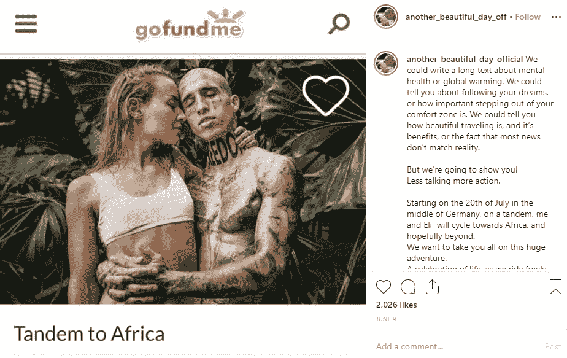

# 众筹的伦理

> 原文：<https://medium.com/swlh/the-ethics-of-crowdfunding-b8a50373c43d>

## 什么时候可以向陌生人要钱？

Photo by [Artem Beliaikin @belart84](https://unsplash.com/@belart84?utm_source=medium&utm_medium=referral) on [Unsplash](https://unsplash.com?utm_source=medium&utm_medium=referral)

本周，GoFundMe 关闭了澳大利亚足球运动员 Israel Folau 的账户。他正在筹集资金，以支付非法终止案件的法律费用，此前拉格比澳大利亚公司因社交媒体上的恐同帖子而终止了他的合同。佛劳是一个千万富翁——他的上诉包括一项声明，他没有义务“以任何特定的方式运用资金。”

在同一周，[几个来自德国的有影响力的人要求他们的 47，000 名 Instagram 粉丝为他们自己的 GoFundMe 活动捐款](https://www.instagram.com/p/ByfINE3l3AI/)。他们的目的是为€筹集 10，000 英镑(超过 16，000 澳元)，资助他们骑自行车去非洲，以“庆祝”向世界展示地球的真正美丽。

**因为没有什么比两个享有特权的白人游客骑着别人的钱穿越非洲更能展现真实的非洲了。**

尽管他们提到了心理健康和全球变暖，但没有试图描述他们的假期将如何支持这些事业。尽管公众强烈反对，[这一页仍在继续，并提高了€800](https://www.gofundme.com/f/ts7s93-another-beautiful-day) 。这对夫妇表示，他们计划继续旅行，男方的母亲正在打两份工来资助他们的梦想。而不是，你知道，只是自己找份工作，像其他人一样存钱。

关于向他人要钱是否道德的争论几乎和众筹平台本身一样古老。2013 年， *Scrubs* 演员扎克·布拉夫因要求他的粉丝资助他的独立电影*Wish You are Here*所以他可以在工作室控制之外追求自己的创作愿景*而受到严厉批评。他仍然设法筹集了 300 万美元，并制作了一部没有制片厂同意资助的糟糕电影。*

毫无疑问，受到 Braff 的启发，其他演员跳到 Kickstarter 上[支持他们的激情项目](https://www.theguardian.com/commentisfree/2013/jun/01/zosia-mamet-crowd-funding-kickstarter)或[重振他们岌岌可危的事业](https://www.dailydot.com/business/melissa-joan-hart-darci-kickstarter-failed/)以减少成功和公众的愤怒。那么什么时候可以向别人要钱呢？如果你足够有钱自己支付的话，似乎就不会了。

如果你不是呢？对于急需资金支付救命手术的人来说，众筹已经成为一种流行而有价值的工具。这说明了医疗服务的系统性失败，尤其是在美国，但在其他国家也是如此。在这些情况下，众筹平台提供了一种方便易用的方法，从想要帮助的朋友和家人那里筹集资金。

在澳大利亚，政府对艺术的支持越来越少，我的许多电影制作人朋友依赖众筹作为他们项目的资金来源之一。我很不情愿地把捐款用在了自己的[独立故事片](https://www.clairejharris.com/writing/film/)上，但是直接向人要钱我觉得不太舒服。

**当世界上有如此多更有价值的事业时，我如何证明乞求一个我选择承担的项目是正当的呢？**

也就是说，我向艺术家和电影制作人发起的许多其他众筹活动捐过款。大多数人在接受经济支持时都非常亲切。然而，我注意到一些“众筹者”中有一种潜在的权利感。

一位我一生中只和他说过几次话的电影制作人反复给我发信息，告诉我如果我不为她的活动捐款，那么我就是“一个坏朋友”。她对我的经济状况一无所知，表现得好像我欠她钱似的。因为我们实际上不是朋友，她可能没有意识到我在全职工作为我的学习存钱，我没有要求她为我的学习捐款。她得到了丈夫的支持。

据我所知，她从未拍过这部电影，尽管她达到了目标。捐款的朋友没有收到他们的奖励。当涉及到众筹时，绝对没有责任——如果你不坚持到底，也不会向支持者强制退款。她并不是我所知道的唯一一个没有用筹集到的资金实际拍电影的电影制作人。

**佛劳不需要在他的 GoFundMe 页面上添加免责声明，因为没有人对他们如何使用资金负责。**

随着众筹如今被正常化为“帮助我们实现目标”，这种权利感正变得越来越普遍。不仅仅是 Instagram 有影响力的人在讨钱，社交媒体上的每个作家似乎都有一个 [Patreon 页面](https://www.patreon.com/)，捐赠者承诺每月向创作者捐款，就像你向慈善机构捐款一样。

作为一名作家，我显然赞成为艺术家的作品付费，并支持我喜欢其内容的作家。我还认为，艺术没有得到足够的资助，一些知名作家勉强维持生计，这是错误的。但是对于其中的许多页面，不清楚“创造者”实际上产生了什么(如果有的话)——好像他们觉得在 Patreon 上就足够了。

我记得几年前，一个朋友给我看了她 16 岁继女的 Kickstarter 页面。这个女孩正在寻求捐款来帮助她实现去巴黎旅行一周的梦想。她说学校已经告诉他们这是一种可以接受的借钱方式。也许这是她的家人和朋友给她钱的一个简单平台——但我想知道这教会了她什么是努力实现自己的梦想。

在我那个时代，如果我们想要陌生人的钱，我们会举办蛋糕摊和洗车活动。

喜欢我的写作吗？在这里注册我的简讯[，查看](https://clairejharris.us18.list-manage.com/subscribe?u=77065344b7808dbc4d5c11773&id=5ee9813168)[我的网站](https://www.clairejharris.com/)或者在[脸书](https://www.facebook.com/clairejharriswriter) / [推特](https://twitter.com/Claire_J_Harris) / [Instagram](https://www.instagram.com/clairejharris_writer/) 上关注我。