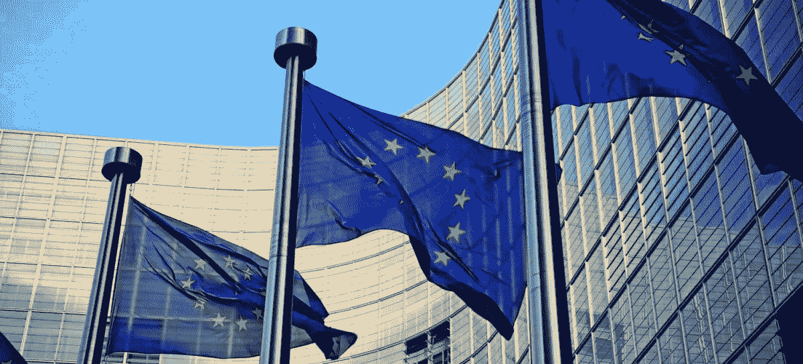

# 欧洲对人工智能的看法

> 原文：<https://medium.com/swlh/the-european-take-on-ai-4706e134b251>

Photo by [Franki Chamaki](https://unsplash.com/@franki?utm_source=medium&utm_medium=referral) on [Unsplash](https://unsplash.com?utm_source=medium&utm_medium=referral)

## 欧盟生态系统还能出类拔萃，给 AI 表带来价值吗？

今天，由 CEPS 智库组织的 IdeasLab 大会上，出现了一个非常有趣的关于人工智能的专题讨论。目的是让公共政治专家、政治机构的代表和私营部门的领导人参加。

初创公司、企业和研究将需要在未来几年应对这种愿景和生态系统，无论是在实施人工智能解决方案时，还是在应用或使用它时。这就是为什么重要的是要拓宽视野，从人工智能的单纯技术或经济开发，到人工智能在日常业务中实施的政治和社会影响的更广泛的感知。

## 欧盟委员会**总司联系图**

*   重要的是支持欧洲产业采用人工智能作为实际竞争力的必要资产
*   这将在未来几年内跨越整个工业领域，我们需要为此做好准备
*   已经设计了适当的专家小组来构建对这一未来的展望

## 欧洲议会对人工智能的看法

*   伦理原则:我们怎样才能在伦理层面或者至少在算法内容上增加一些平衡
*   你必须应对不同的价值观和对隐私行为和规则的看法(在欧盟比在世界其他地方更强烈)
*   对公民的额外保护是欧盟和其他国家的典型资产。这可能会减缓进化，但会带来更多的安全
*   要求在欧盟层面上建立一个特别的人工智能研究机构，以避免科学家迁移到(非欧盟)公司
*   确保这些规则也适用于对现实感知的暂时扭曲。

Photo by [Samuel Zeller](https://unsplash.com/@samuelzeller?utm_source=medium&utm_medium=referral) on [Unsplash](https://unsplash.com?utm_source=medium&utm_medium=referral)

## 对谷歌的看法

*   私营部门也接受和欢迎可能的规则和原则
*   去年 6 月，他们公开发布了谷歌人工智能原则和谷歌不会跨越的四个红灯(例如，不为武器开发人工智能)，以及谷歌负责任的人工智能实践(也是公开的)，每季度更新一次。
*   基于这一点和可能的威胁，谷歌将不会为通用人工智能驱动的任务(如人脸识别)提供公共 API。相反，它将提供垂直的、定制的解决方案，有利于特定的案例或社会挑战

## 摩根士丹利的情况

*   对于如何存储、使用和访问数据，以及如何实现算法，有一套清晰客观的规则非常重要
*   一个共享的研究开放沙箱应该对社区开放以进行协作研究
*   一旦人工智能发挥作用，政策和规则演变的整个问题就变得至关重要，因为如果你想一想，当政策发生变化时会发生什么？这是否意味着重新设置机器迄今为止执行的学习过程？！
*   欧洲有一些复杂性，可能会阻碍人工智能的采用，但一些复杂性也可能是一种非常有价值的资源(例如，多种语言但融合了文化)。

## 埃森哲的经历

*   企业非常清楚，欧盟公民对数字领域的企业行为非常谨慎
*   数字素养仍然是一个大问题:数据科学是最需要的技能之一，但许多人仍然需要数字教育。

## 面板和扬声器

作为补充说明:小组成员还回答了观众提出的大量相关问题，包括培训、授予中小企业和研究机构访问数据的权限(我称之为**数据鸿沟**)、打破人工智能垄断等问题。该小组由 [*安德里亚·仁达*](https://www.ceps.eu/content/andrea-renda) *(一位研究总监在***)*领导，参与该小组的人员有:*

*   **DG Connect 人工智能和数字产业总监 Lucilla SiO Li**
*   **欧盟议会议员伊娃·凯丽**
*   **谷歌新兴技术全球政策主管 Charina Chou**
*   *咨询、销售和分销技术全球主管 Andrew Sargison。，摩根士丹利*
*   **鲁曼·乔杜里，埃森哲**

**

*Photo by [Simon Zhu](https://unsplash.com/@smnzhu?utm_source=medium&utm_medium=referral) on [Unsplash](https://unsplash.com?utm_source=medium&utm_medium=referral)*

## *正在总结…*

*所有这些为这个问题定义了一个非常清晰的背景，但也为创造我们自己的未来留下了足够的空间。*

*作为个人、公民、企业家和公司，我们有责任将这个未来塑造成一个有远见的、有益于社会的模式，或者是人类的反面乌托邦式的未来。*

**

## *这篇文章发表在 [The Startup](https://medium.com/swlh) 上，这是 Medium 最大的创业刊物，拥有+427，678 名读者。*

## *在这里订阅接收[我们的头条新闻](https://growthsupply.com/the-startup-newsletter/)。*

**