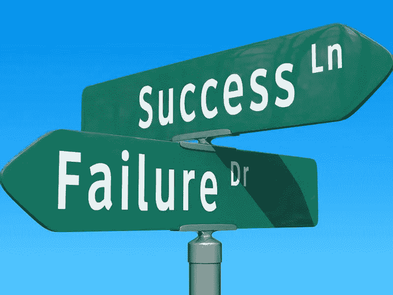

# 成功文化的失败

> 原文：<https://medium.com/swlh/the-failure-of-success-culture-70ae9558bc1e>

几个月前，我在《华盛顿邮报》上读到了一篇让我困扰的文章(我刚刚花了一个小时挖掘出来)[霍华德·舒尔茨的“噩梦”:他在星巴克之外的第一次大赌博如何以失败告终](https://www.washingtonpost.com/business/economy/howard-schultzs-first-big-gamble-outside-starbucks-ended-in-defeat/2019/03/08/3ccff7aa-3fb8-11e9-9361-301ffb5bd5e6_story.html)描述了这位星巴克创始人和可能的 2020 年总统候选人未能扭转西雅图超音速队的局面(完全披露:我不会投票支持霍华德·舒尔茨竞选总统)。文章开头写道“舒尔茨是…