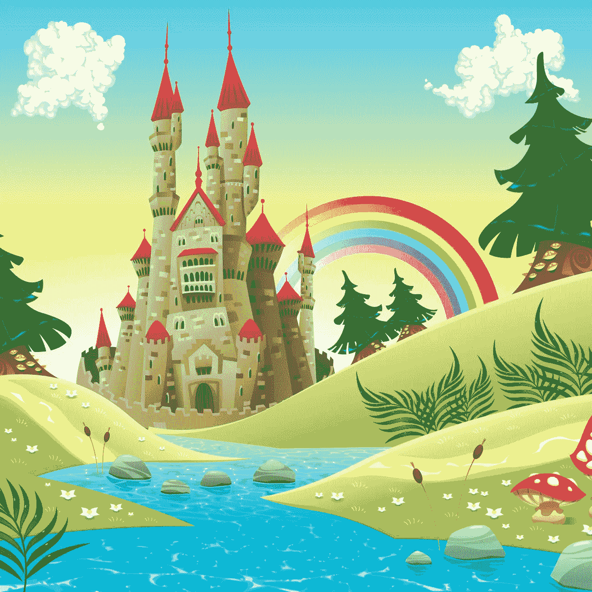

# 童话般的品牌——为什么认为品牌是一夜之间建立起来的是童话而不是现实。

> 原文：<https://medium.com/swlh/the-fairytale-brand-why-thinking-that-brands-are-built-overnight-is-more-fairytale-than-reality-b52485a73fb3>

“从前”这个短语是一些历史上最伟大的童话故事的开场白，也是一个适合介绍那些相信自己的品牌可以在一夜之间建立起来的商业领袖的故事的短语。这种心态生活在一厢情愿的想法中，更像是童话而不是现实…