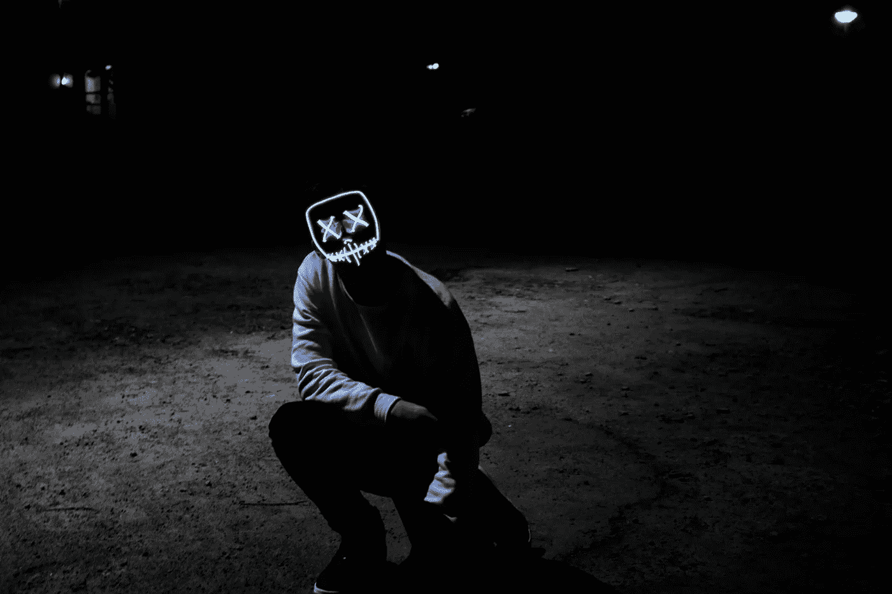

# 如何应对恐惧？

> 原文：<https://medium.com/swlh/the-fear-of-being-disliked-2345f22d9207>

Run from fear. Credit unspash.com

我总是试着写一些我想看的建议。年轻 10 岁的我想听的东西。因为在很多方面我都感觉一团糟。就像真的。搞砸了。我需要写这些东西来应对每天的压力，这并不是说我一直感觉很糟糕，是一个有躁郁症想法的自杀狂。不，我不难过，我只是意识到真正感觉良好的潜力。

不管怎样，不管你是伊拉克小城市的居民还是亿万富翁的儿子，都没关系。我确实认为，我们都有同感。经历相同的骗局，只是程度不同。

大脑以同样的方式运行，我们都是由平等的系统构建的。我们只是看起来不同，做不同的事情，但我们仍然是一样的。

**让我们来谈谈恐惧。**

爱是我们身体中最强烈的感觉。恐惧是其次的。

恐惧是我越来越熟悉的东西。我从来不认为我害怕什么，我是说，有什么值得害怕的呢？

可能发生的最坏情况是什么？

我们每个人都有恐惧。不管我们是否意识到这一点。我们可能害怕被评判，害怕失败、高度、动物或死亡。不管是什么，恐惧是自然的。

恐惧根植于我们的意识中，我们需要恐惧来驾驭这个世界。理解恐惧在我们的生存中扮演着至关重要的角色，并且很可能是你没有做太多蠢事的原因，这是健康的。

## 对我来说:害怕别人的看法。

害怕别人的评判。有时它如此困扰着我，以至于让我去做或不去做一些我原本会做的事情。只是为了取悦别人。

仍然在我的脑海里说:谁在乎别人对你的看法？

我知道不可能成为每个人的甜心。

人们总是会对你有看法。我们有多完美并不重要。即使我们什么都做对了，人们还是会找借口说你的坏话。所以不要再做完美先生，做你自己**。**

即使那包括变得古怪。

见鬼…我喜欢奇怪的人。事实上，在瑞典我们有一个关于怪人的说法。*“家具房里不能有你的人”*

这基本上意味着当一个人被介绍给一个权威或上流社会表现良好的人时，他的行为不会有所不同。仍然做他们自己。

我想这是我的一个弱点。在那种情况下，我是一名职业演员。我会适应我面对的任何人或情况。塑造我的行为以适应我与之交谈的人。我想我可以在二手车场做推销员。尽最大努力让每个人都喜欢我。仍然有人在背后议论我。

> “战胜你的恐惧，你将永远处于战斗中。直面你的恐惧，你将永远自由。”——卢卡斯·容克曼

我想我想说的是，我们有时会成为自己最大的敌人。我们害怕对自己诚实，因为这意味着我们实际上必须照照镜子，而不是指指点点。

恐惧是最大的杀手。你想要的一切都在恐惧的另一边。挑战在于放下它。我们害怕孤独，也害怕坠入爱河。我们害怕变化，却不喜欢现状。我们害怕失败，但我们想要成功。

**我的情况:害怕被人嫌弃，害怕做自己。**

面对你的恐惧…那是不是意味着我要面对别人在背后说我什么，并且释怀，甚至接受？

我可能很奇怪，但肯定比“正常”强

*老实说，退缩并没有什么启发性，这样别人在你身边就不会感到不安全。我们注定要发光，就像孩子一样。*

*它不仅仅存在于我们中的一些人身上，它存在于每个人身上，只要我们让自己的光芒闪耀。我们无意识地允许其他人也这样做。当我们从自己的恐惧中解放出来时，我们的存在自动解放了他人。*

非常感谢您的阅读。

我希望你觉得这篇文章很有见地，甚至可能有所帮助。我是一个新的作家，如果你能给我一两个掌声或者更好，给我写一个评论，我会很感激你的任何支持，我很乐意阅读你的想法。

**更多我最好的作品。目前为止。**

*   [自知之明指南](/swlh/the-guide-to-self-knowledge-656ad7e23a3d)
*   [你需要问自己的 5 个重要问题](/swlh/5-question-to-ask-yourself-everyday-e8cd8a9f5d68)
*   [提高生产力的万无一失的循序渐进指南](/swlh/the-foolproof-step-by-step-guide-to-productivity-a19c44308254)
*   关于孤独和如何治疗孤独的基本建议。
*   让自己在余生保持动力的三种方法

## 这篇文章发表在 [The Startup](https://medium.com/swlh) 上，这是 Medium 最大的创业刊物，拥有+428，678 名读者。

## 在这里订阅接收[我们的头条新闻](https://growthsupply.com/the-startup-newsletter/)。

