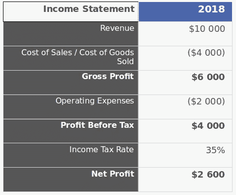
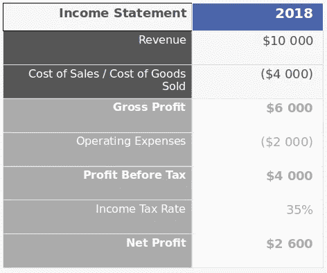
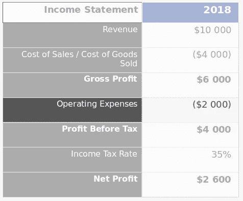

# 你需要理解的财务数字(它们与估值无关)

> 原文：<https://medium.com/swlh/the-finance-numbers-you-need-to-understand-and-they-have-nothing-to-do-with-valuation-f74d220af7ec>

Photo by [Nick Hillier](https://unsplash.com/photos/yD5rv8_WzxA?utm_source=unsplash&utm_medium=referral&utm_content=creditCopyText) on [Unsplash](https://unsplash.com/search/photos/numbers?utm_source=unsplash&utm_medium=referral&utm_content=creditCopyText)

我现在花很多时间和早期创业公司打交道。此外，我试图分享一些我在为世界上最大的银行之一工作的十年中积累的金融智慧。

我发现大多数创业公司在财务方面采取两种策略之一:

*   有些人试图完全避免，除了在报税时与他们的会计师做最起码的沟通
*   而另一些人则完全沉迷于大量建立在未经检验的假设之上的金融模型、预测和估值

我很少发现有人介于两者之间，专注于对他们的创业真正有影响的几个财务指标。

这就是我介入并试图引导他们回到真正重要的事情上来的原因。只需几个简单的概念和模型，你就可以消除所有看似复杂和令人生畏的金融噪音，但除了大公司，这对任何人来说都只是一种干扰。

# 真正重要的是

对我来说，这是早期创业最重要的两个指标:

*   毛利
*   营业费用

对于那些还记得他们的账目的人来说，你会发现这两个数字都出现在损益表上。**我总是告诉我建议的初创公司，从这里开始。如果你只理解损益表上的内容，那在很长一段时间内是完全没问题的。**

这样做的原因是损益表告诉你是否在赚钱。它显示的是你从销售中赚到的钱减去你经营业务的花费。

真的是这样。

对于一家规模更大、更成熟的企业来说，情况就不那么明朗了，它面临着资产剥离、大量非现金支出和其他复杂的会计问题。**但这些对一家初创公司来说并不重要，所以你在损益表上看到的确实是你的业务运营情况的准确写照。**

这是一个非常基本的损益表的例子:

简单吧？收入是你销售产品的收入，然后从中减去所有不同类别的费用，直到你得到最终净利润。

当然还有更多，其他财务报表的出现是有原因的，但**现金流量表和资产负债表主要用于捕捉与早期创业无关的活动。在许多情况下，直到一家公司变得非常成熟和老练，它们才变得相关。**

**对于一家初创公司来说，对损益表了如指掌意味着你了解了自己业务的核心。**

在损益表中，你需要关注两个主要部分。这里:

还有这里:

让我们更详细地看一下这些部分。

# 毛利

我非常喜欢看像美国的《鲨鱼池》或英国的《龙穴》这样的节目，在那里你可以看到真正的企业家向潜在的投资者推销。

一次又一次，你会从投资者那里听到同样的问题:

> 你做这个要花多少钱，卖多少钱？

这个问题完全是关于毛利润的，如果你不知道其他事情，这是你应该知道的第一件事。**我总是对这些节目感到惊讶，有多少企业家不知道他们的毛利润。**

如果我合作的初创公司还没有这个数字，这是我们将共同努力的第一件事。**因为如果你不知道你卖出的每件产品能赚多少钱，你就不知道你的定价是否正确，你的成本是否太高，或者你是否能赚到钱。**

没有这一点，你基本上是盲目飞行，并希望最好的。所以如果你还没有这个，你怎么去计算它呢？

正如我之前提到的，想想你每卖出一件产品能赚多少钱。首先看看你的收入或者你卖产品赚了多少:

> 收入=售出单位*价格

**你的产品卖多少钱，你卖了多少或者预计卖多少？**

而另一方面，销售成本就像它听起来的那样，**每次你向客户运送一件产品所花费的成本。**

> 销售成本=销售单位*单位成本

毛利润只是这两者的简单组合:

> 毛利=价格-单位成本

所以如果我们回到损益表，你可以用两种方法计算出你的毛利:

*   从总收入中减去总销售成本
*   或者将你的毛利润乘以你售出的数量

无论哪种方式，本质上都是一样的。

有了这些信息，你至少知道每卖出一个单位你赚了多少。这是你最需要的最基本的基础。

它告诉你你应该以绝对最低的价格出售你的产品(除非你不介意花掉数百万风投资金，同时希望以后提高价格)，它让你知道你需要出售多少单位才能覆盖你的其他成本并最终盈利。

但是关于那些其他的成本，你该怎么处理呢？

# 营业费用

请记住，销售成本是与你所销售的产品直接相关的一切。换句话说，每卖出一件产品，你的销售成本就会增加一些。

但是有很多费用与销售量没有直接联系。以下是其中的一些例子:

*   设计
*   品牌宣传
*   营销/广告
*   租金
*   薪水

所有这些费用都属于损益表中的“营业费用”一栏。

理解这些费用的关键是要知道是什么事件真正驱动了它们。或者换句话说，是什么使得这些费用上升或下降。

通过了解这些变化，你就能预测未来你需要在这些物品上花多少钱。

让我们以一些与设计有关的费用为例。也许在前一年，你正致力于发布你的产品，为了让你的产品准备好发布，你不得不花 5000 美元在自由设计工作上。但是明年，你计划只卖这一种产品，不需要新的设计。

**驱动设计费用的事件是你必须推出的产品数量。**因为你明年不会推出任何产品，你可以预期你的设计成本为 0。但是，如果说下一年你计划推出两个以上的产品，你可以期待大约 10，000 美元的设计成本。(2 *每次产品发布的设计成本为 5000 美元)

**在会计和预算中，这被称为“分配成本”，你分配成本的事件被称为“成本动因”。**

底线是，你能确定的成本驱动因素越多，你就能更好地预测你的运营费用。

让我们回到上面的列表，看看哪些成本驱动因素对每个成本驱动因素有意义:

*   设计——新产品发布的数量
*   品牌——新产品发布的数量，或新营销活动的数量
*   营销/广告—新营销活动的数量，新客户的数量
*   租金——办公室面积的数量。连续镜头
*   工资——员工人数

一旦你列出了所有的运营费用，一个很好的练习就是像我上面做的那样仔细检查并头脑风暴出每一项的不同成本驱动因素。

**有了这些信息，就很容易预测未来几年的情况，并根据发展业务所需的活动来估算这些成本。**

# 然后呢？

希望你很清楚所有这些信息对早期创业有多重要，对你可能想做的任何其他财务规划有多基础。

**有了上面的信息，你可以合理地预测未来几年的收入和利润，为营销和设计等事情设定预算，甚至设定价格和销售预测，就像我在以前的一篇关于** [**反向损益表的帖子中展示的那样。**](/swlh/the-little-known-tool-that-inspired-the-lean-startup-and-how-you-should-be-using-it-ab45f3f4af96)

这些概念可能很简单，但它们非常强大，会给你提供比基于未经测试的假设做出不成熟的评估更有价值的决策信息。

或者，如果你是那些试图完全避开财务的人之一，这是一个开始利用你的财务状况做出更好决策的好方法。

# 你能帮我一个忙吗？

我正在考虑为创业公司创建一系列关于最重要的金融主题的在线课程。

这与我在 Medium 上分享的想法类似，但有一步一步的视频、模板和更深入的内容。

如果您对此感兴趣:

[**请点击这里让我知道**](https://mailchi.mp/e312b87d2341/financeforstartups)

或者如果你有什么特别想看的，请在下面的评论中告诉我。

感谢阅读！

## 这篇文章发表在[《创业](https://medium.com/swlh)》上，这是 Medium 最大的创业刊物，有+418，678 人关注。

## 在这里订阅接收[我们的头条新闻](http://growthsupply.com/the-startup-newsletter/)。

