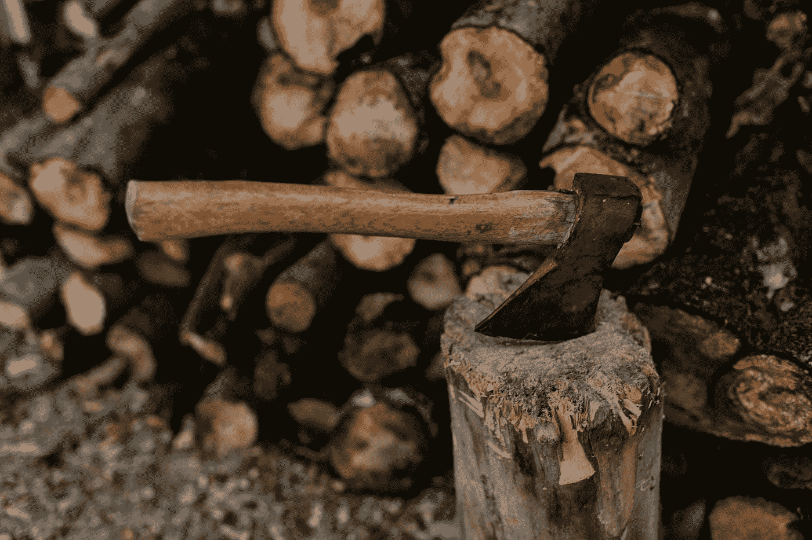

# 给出指示和做出修正的艺术……(愚蠢)

> 原文：<https://medium.com/swlh/the-fine-art-of-giving-instructions-and-making-corrections-stupid-6a9a95a9c53b>

Photo by [Alexei Scutari](https://unsplash.com/@scutal?utm_source=medium&utm_medium=referral) on [Unsplash](https://unsplash.com?utm_source=medium&utm_medium=referral)

“等等！*不要*……”

砰的一声，斧头锋利的刀刃穿过木柴，埋进了地里。

做完这件事后，我意识到自己犯了重罪。我们所在的地方——在加拿大不列颠哥伦比亚省北部的荒野深处——斧头不是你想弄钝的东西。