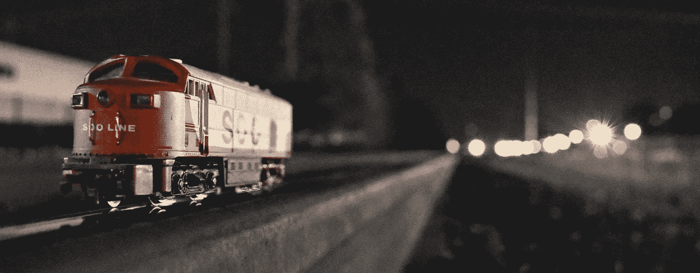

# 前 5%和后 5%

> 原文：<https://medium.com/swlh/the-first-5-and-the-last-5-648006db1dbe>

## 年轻和变老教会我们什么是最重要的

*Photo by* [*David Solce*](https://unsplash.com/@dlsolce?utm_source=unsplash&utm_medium=referral&utm_content=creditCopyText) *on* [*Unsplash*](https://unsplash.com/search/photos/trains?utm_source=unsplash&utm_medium=referral&utm_content=creditCopyText)

几个月前，我听到作家兼采集者 Priya Parker 在第一届年度 [*奥斯汀主持人峰会*](https://landing.voltagecontrol.co/control-the-room-2019/) 上发言。

Priya 谈到了她书中的几个主题，[《聚会的艺术:我们如何相遇以及为什么它很重要》;我特别喜欢她在前百分之五和后百分之五的坚持](https://www.amazon.com/Art-Gathering-How-Meet-Matters/dp/1594634920)