# 翻转行动法

> 原文：<https://medium.com/swlh/the-flip-to-action-method-ee02b8ff7c47>

**将问题转化为机会空间的草图工具**

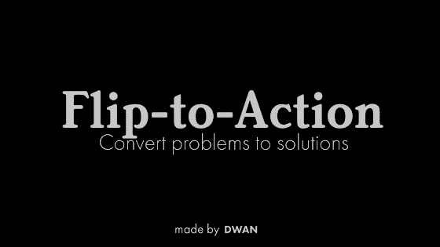

> ***在这里下载翻转行动模板*** *:* [转到 Gumroad - >](https://jespergbhenriksen.gumroad.com/l/flip-to-action)

在设计和产品开发领域，我和我的同事从仔细观察我们试图帮助的人和情况开始。通常，关注的焦点是机遇和新蓝海。只关注现有的问题有时是有问题的，因为范围是在已知的摩擦、痛苦和问题上。奶酪上的洞并不能说明未来会有什么新的有趣的味觉感受。它给了我们一个应该迭代和改变的边界。
问题焦点有时只是离心已知的知识，而不是将我们抛入未知的空白，在那里我们可以以更深刻的方式帮助人们。

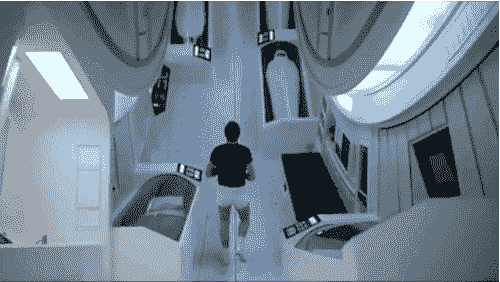

Problem focus is sometimes just centrifuging known knowns and not catapulting us into the unknown void where we might help people in more profound ways.

布乌乌..也就是说，大多数时候我们做的是更多的面包和黄油，基于现有的场景和问题的简陋和小规模的设计。专注于缓解问题会带来很多好处。消除摩擦一直是一项很有意义的创新活动。

# 来自问题的想法

我们如何从一个问题到一个概念想法？

Questions x 100.000 = not enough questions

有时候你不需要任何工具和帮助就可以开始创造想法。太好了。其他时间？没有那么多。想出答案的最好方法显然是问好问题。设计中的问题应该是丰富的，而答案的数量应该是稀缺的。有利于问题的 1:1.000.000 的比例应该足够了。

分解和重新组合与某个领域相关的问题是提出问题的有效方法。

Disassembling and reassembling problems is a good way to find good questions to ask (photo by dwan.dk)

我们可能会做案头研究、采访、观察、在数据集上运行统计、[做工作故事采访](https://jtbd.info/what-does-hiring-a-product-for-a-job-to-be-done-mean-and-why-say-that-49b0d20b19ef)，对着月亮吠叫或者可能会创建一个客户旅程地图。旅行地图善于发现机会和问题。

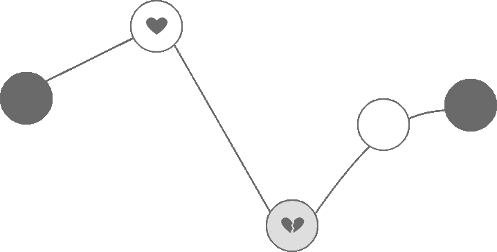

Customer journey maps identify pains but are in danger of turning into unused artifact in design processes due to a lack of tangible calls to action. Flip-to-Action helps this process along.

客户旅程图很棒，但公司有一种趋势，就是创建了它们，然后就不用了。它们经常被放在抽屉里，甚至更糟，挂在公司的墙上，没有任何歌剧的目的。那么，我们如何使这些可操作性和可测试性？我已经把模板和我从其他人那里得到的想法结合起来，并把它结合到翻转行动法中，试图在遇到困难时帮助这个过程。
由问题重构练习(翻转法)和解决方案草图练习(动作画布)组成。

The Flip-to-Action Method is a work in progress (photo by dwan.dk)

翻转到行动将任意的问题和痛苦以结构化的形式转化为有形的可测试的想法。我试图让这个方法尽可能简单，并且足够通用，以便在许多场景和实践中使用。这是一项正在进行的工作，非常欢迎反馈。

在这里或者在 [dwan.dk](https://dwan.dk/) 给我写信。

# 如何使用翻转行动法

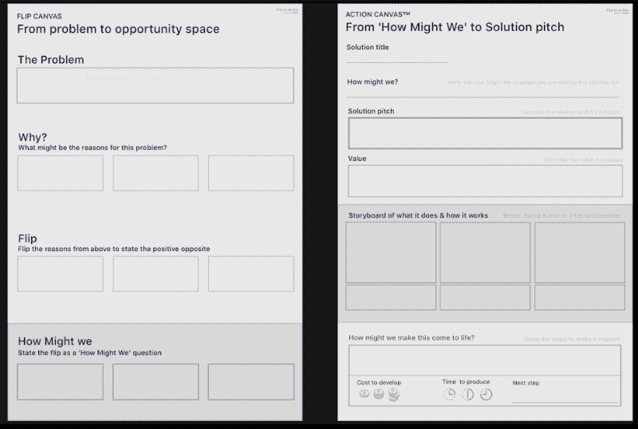

## 第一步:挑一个问题，疼痛或摩擦

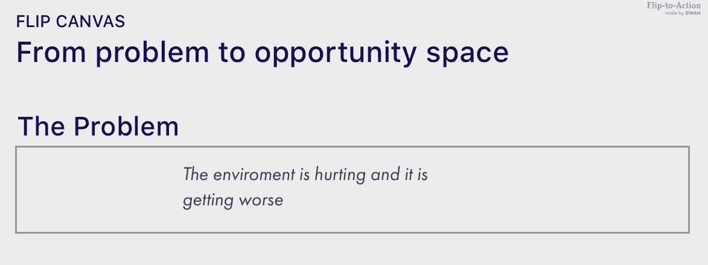

Describe the problem you would like to come up with solutions for

从本文顶部的链接中获取翻转画布。填写第一个字段。描述一个问题。应该是具体问题。尽量让它看得见摸得着。

## 步骤 2:确定问题的原因

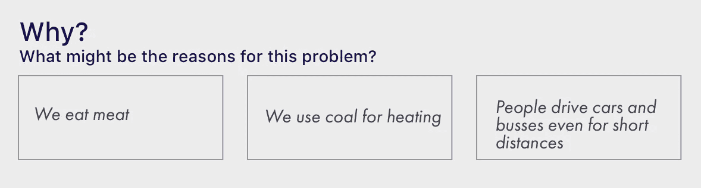

Write the reasons you think have created the problem

带着问题，问这样一个问题:

“W帽子可能有助于构成这个成问题吗？这个事件有什么原因？”。

写出问题的原因。你可能有数据点来帮助你，也可能没有。数据点更好，但在这一步开始比由于缺乏确定性而停滞更好。一个问题的后果可能很难猜测，但是写出你的假设来解释为什么一个特定的问题会出现。

它应该非常具体，并基于围绕该问题的情况。越具体越好。

试着写至少 3 个理由。

## 第三步:翻转！

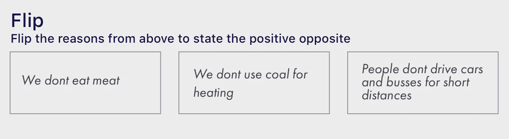

把这些描述翻过来变成正面的反面。翻转它们，这样听起来这个问题就不再存在了。

“我不能”变成了“我能”，“人不知如何..”变成了“人们知道如何..”等等。

你甚至可以写出理想状态，而不是正好相反。

例如*“人们不知道如何使用我们的 app”*

成为

*“人们从第一次打开我们的应用的那一刻起，就充分地使用了它”。*

## 第四步:把翻转变成我们如何提问

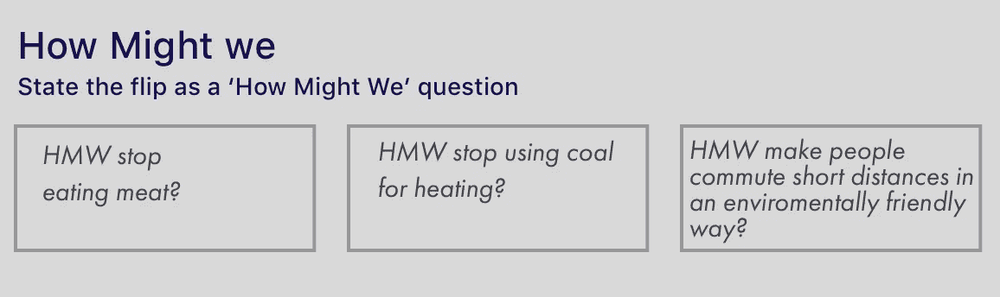

Take the flip from step 3 and write How might we in front of it. Sometimes you might need to rephrase it a bit.

当这样做了，你可以很容易地将这些问题转化为好奇的问题。我建议使用“我们如何能够(HMW)”的措辞。拿起翻过来的版本，把它们写成独立的 HMW 问题:

“我们怎样才能让人们以环保的方式进行短途通勤？”

# 如何使用动作画布

## 第五步:从翻转画布中选择一个 HMW，写在新的动作画布上

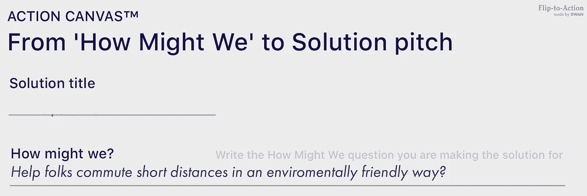

Write the How Might We that you would like to work on. Write the solution title later when you have created a sketch for the idea

在本文顶部的链接中找到 Action Canvas。在行动画布中，你选择一个“我们可以如何”并描述解决方案。从画布上你想要的任何地方开始。从故事板部分开始可能是最容易的。

## 第 6 步:撰写解决方案推介

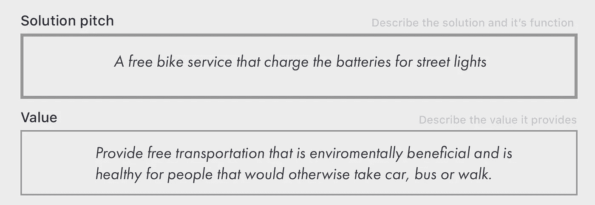

Write the solution pitch and the value of your idea at the top of the Action Canvas

在模板的顶部，您可以写一个简短的解决方案推介。它应该以简短的形式描述你的解决方案。它应该帮助你对这个概念有一个感觉，它帮助谁，它做什么和它为什么做。你的推销不应该以任何方式简化或降低你的想法，而只是像人们推销电影或书籍一样向自己和他人推销。电影《异形》(1979)被投资者宣传为“太空大白鲨”。

## 步骤 7:描述这为谁提供价值以及如何提供价值

在推销之下，你描述它提供的价值以及提供给谁。这个在我看来应该是有重点的，狭隘的。写“给每个人快乐”不是一个好主意。写“给丹佛那些想要学习如何用 Python 语言编程的无家可归的年轻人每周一次免费课程，这样他们就可以在科技行业找工作”要好得多。它是可测试和可管理的。在我看来，规模排在价值之后。

## 步骤 8:画出并描述解决方案做了什么以及如何做

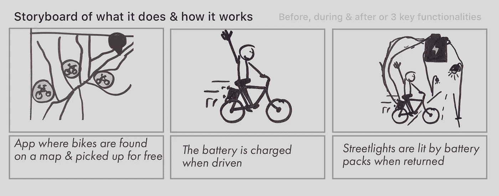

Create a storyboard describing your idea. Write the Before, during & the after people use the idea you are describing. You might describe functionalities instead of flow if this is more suited to your idea.

在这里，您将创建一个小的故事板，其中包含使用该解决方案之前、期间和之后的插图。在某些情况下，描述 3 个关键特征可能比描述一个故事更有意义。它应该清楚地传达这个想法。它是什么，有什么作用。

## 第九步:这将如何实现？

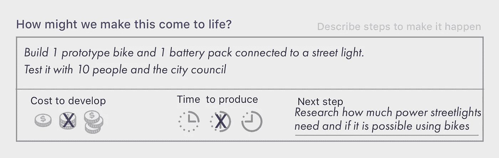

模板的底部描述了如何让它变成现实。描述一种把它从想法变成更具体和可测试的东西的方法。

## 第十步:成本和时间

然后试着用 1-3 来评估成本。无论是时间还是金钱。这主要是让你思考如何让它发生。它并不意味着精确和基于长时间的分析。一切都在后面。我们主要关注价值以及如何测试这种感知价值。

## 第十一步:下一步

在右上角写下你认为下一步可以做的事情。这应该是做完练习后的第一步。这应该尽可能的压缩。不要写“让它发生——[嘣！](https://media.giphy.com/media/laUY2MuoktHPy/giphy.gif)”。写一些你可以马上做的事情。“研究技术并与专家会面”或“打电话给 Jim 寻求帮助”。

最后一点是在模板顶部给这个解决方案草图一个配件名称。

# **解决主义不是解决办法**

没有一个问题是容易解决的，解决方案也不仅仅是一个孤立在孤岛上的中立实体。服务和产品影响世界。你可能认为你只是解决了一个问题，但却制造了 5 个问题，对人们来说比你试图解决的问题糟糕 400%。我认为解决方案的含义应该始终存在于设计过程中。

Solutions are not just a neutral entity isolated by itself on an island. They impact their environment and vice versa (photo by dwan.dk)

“快速行动”只涉及概念的第一部分&构思过程。在构思&预定型后的测试过程中，应该进行隐含假设和研究。

让我知道你对翻转行动的看法。

**📎在这里下载行动模板:** [去 Gumroad - >](https://jespergbhenriksen.gumroad.com/l/flip-to-action)