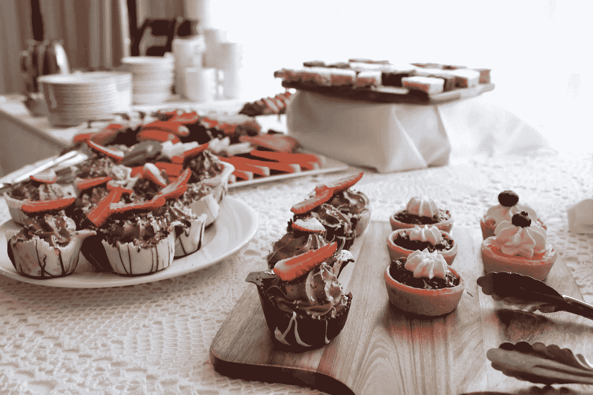
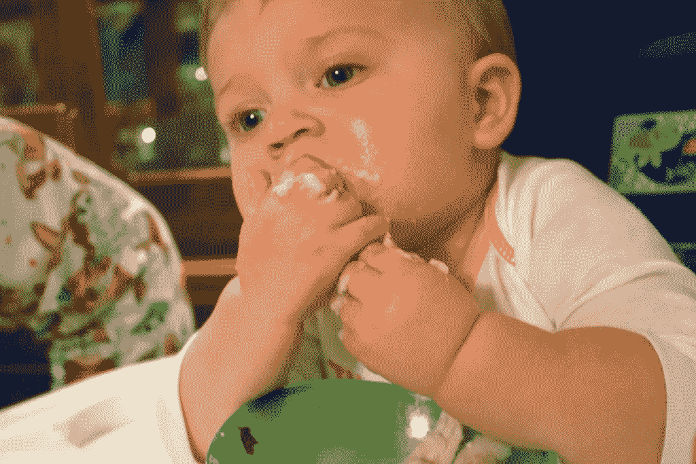
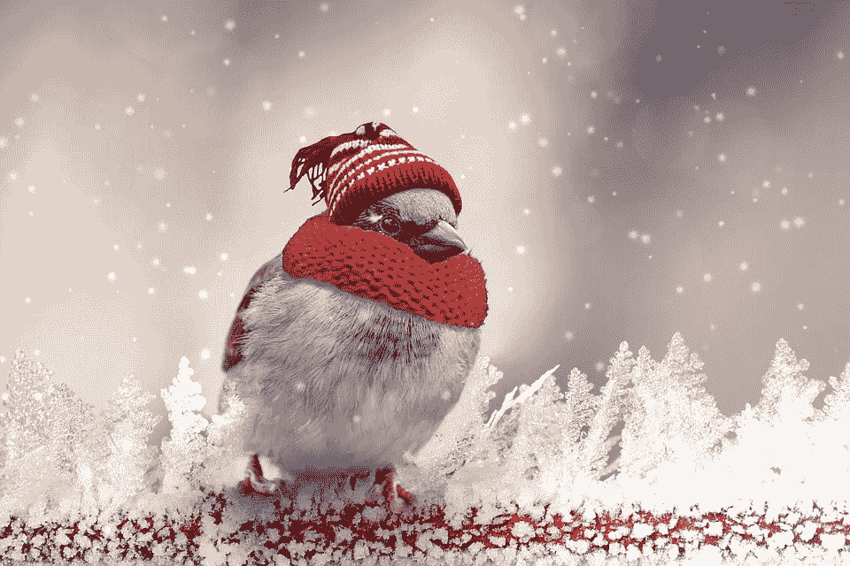
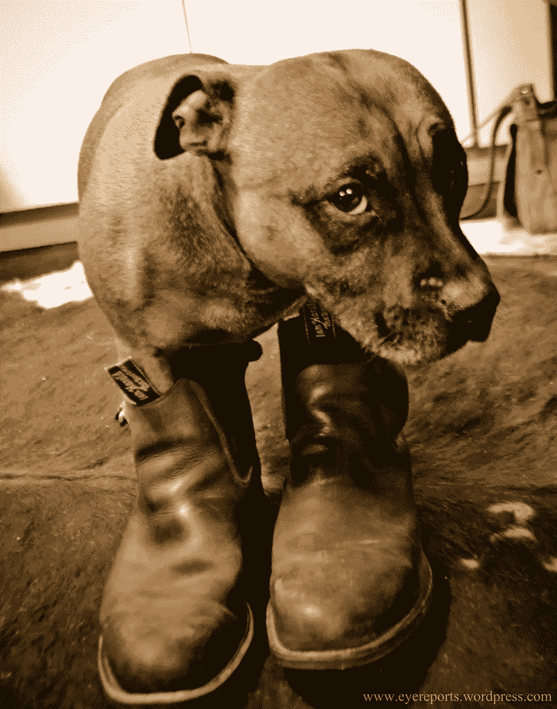

# 食物谬论:极端饮食

> 原文：<https://medium.com/swlh/the-food-fallacy-extreme-eating-5e3b8475a2e9>

我是一个极端主义者。

这很艰难。

社会顽固地颂扬中庸的美德，贬低它不太受欢迎的表亲——贫困。我的一生都被鼓励“只吃一点点”，因为“少量不会有坏处”和“你不想错过”。

但是问题来了。并非所有人都喜欢这种明智的方法。

当然— **你**可能完全有能力随便啃一三片薯片，并承认一个适当的“足够”点。但是对我来说，当第一个美味的薯片从我的嘴里出来的时候，整个袋子就要被扔掉了。

Omg nom nom nom nom… oh sorry, did you want some of that?

这并不是说我完全没有纪律性。相反，我实际上能够完全避免嚼薯片。如果我不打开一包或接受提供的口味，我可以很高兴地去没有。见鬼，一个袋子可以在我的储藏室里放几个月都没打开过(如果我的伴侣没有发现的话)。

但是就像一个正在康复的酒鬼，对我来说关键是绝对戒酒。

我不认为这种极端版本的纪律与更温和的人的纪律有什么不同。差异纯粹在于我们每个人容易停下来的时间和阶段。

对我来说，只是碰巧在我开始之前。

不幸的是，对我和其他极端主义者来说，社会似乎很难理解和接受我们的饮食方式。

我们被建议不要绝对避免特定的食物，因为害怕我们会因为渴望而变得暴躁，在压力下崩溃，在街上横冲直撞，从小孩子的手中抢走青蛙。

但是，即使我们和我们的饮食方法被人瞧不起，它真的不全是坏事。作为一个极端的进食者有一些独特的优势。

**优势 1:戒毒**

有些“食物”不仅对健康有害，而且对我们身体系统的影响非常类似毒品。

糖就是这样一种药物。

就像它的亲戚——海洛因和快克可卡因——它引发了多巴胺的瞬间爆发，让我们跑回去寻求更多，每次都需要越来越大的爆发来刺激同样令人满意的尖峰。

鉴于我的极端倾向，我知道唯一能让自己远离卑鄙的东西的方法就是彻底戒掉糖。因此，我没有像一个温和的人那样减少吸烟量，而是突然戒烟。

Ok, so all I could find was a cold sparrow. But you get the idea.

将它从我的饮食中剔除两周后，我开始意识到胡萝卜、腰果甚至牛奶的甜美。蛋糕、饼干和巧克力的味道变得令人作呕，几乎令人无法忍受。

更好的是，我以前贪得无厌的甜蜜渴望消失在虚无中。就像一个康复的性上瘾者，我可以冷静地坐在先前诱惑的对象旁边，没有任何将它放入我体内的冲动。

他们说，分离使心变得更亲密。但显然，当涉及到有问题的饮食关系时，它也能很好地让心脏不那么喜欢。

**优势 2:消除选择的挑战**

前段时间，我写了一篇关于选择相关问题的[帖子](https://flitmusings.wordpress.com/2015/12/01/are-you-happy-with-your-choice/)，其中包括不断做出决策所带来的精神和情感上的混乱。

我的健康意识适中的伴侣必须不断选择是否沉迷于顽皮的小吃。在一个充斥着无穷无尽的办公室巧克力、不断有蛋糕点缀的生日和超市收银台货架上排列的廉价零食的世界里，这种基于食物的决策点多如牛毛。

吃还是不吃？吃大的还是小的？回去几秒钟？三分之一？五分之一？

作为一个曾经伪装成温和派的饮食极端主义者，我知道不得不不断权衡这些选择是令人疲惫的，特别是考虑到我们许多人在一个错误选择的决定后所经历的内疚。

然而，自从接受了我的极端方式，我发现自己能够愉快地避免这种斗争，因为我知道选择已经做出了。这永远是一个简单的拒绝。(除非有奶酪蛋糕在生产线上。在这种情况下，答案总是肯定的。看到了吗？我不是一个完全的殉道者！)

现在请不要误解；我做**不做**，无论如何，提倡极限饮食。适合我和我的咀嚼方式不一定适合你和你的。事实上，我有一些温和的朋友，他们声称戒瘾会导致如此严重的渴望，以至于一场史诗般的、诱发疾病的狂欢是这种剥夺的唯一自然后遗症。

但是如果你像我一样是天生的极端主义者，不要陷入中庸的谬误。了解你自己，你的倾向，你的极限，以及你最有能力说不的时间点。

如果你自称是温和派呢？请不要试图说服我尝一块你可爱的生日蛋糕。

如果我不这样做，它会持续更长时间。