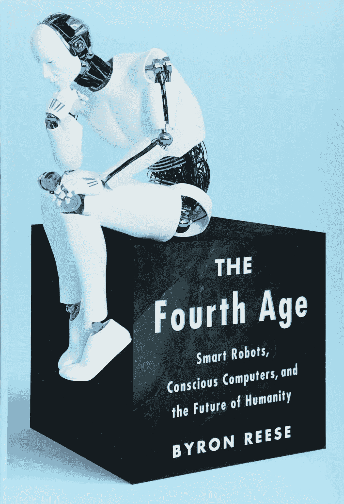

# 第四时代:智能机器人、有意识的计算机和人类的未来

> 原文：<https://medium.com/swlh/the-fourth-age-smart-robots-conscious-computers-and-the-future-of-humanity-13fd28b2fbd9>

```
Is technology the answer to life, the universe and everything?
```

人类历史简述。技术和经济。人脑、信仰系统和形而上学。还有很多人工智能。这是拜伦·里斯的书《第四时代》中包含的内容，该书在 2019 年 CES 上展出。不缺乏谈判各种议题的雄心或能力。尽管这本书在这一点上取得了成功，并展示了系统的方法和理性的诚实，但它乐观的镜头阻碍了它的分析，并接近于[的解决方案。](https://www.macmillandictionary.com/buzzword/entries/solutionism.html)

“在第四时代，拜伦·里斯为读者提供了比思考人工智能和机器人更有价值的东西——他专注于如何思考这些技术，以及它们将永远改变世界的方式”。

“虽然我们可能会同意人工智能的确切未来有许多未知因素，因此有潜在的危险，但这并不能改变这样一个事实，即我们可以选择通过乐观的镜头来看待各种可能性，就像里斯在这里所做的那样”。

这些只是人们写的关于第四时代的一些[评论。前者属于全食超市的联合创始人兼首席执行官约翰·麦基。后者给了一个匿名的评论者。他们都是有效的，以他们自己的方式。起初这看起来有些矛盾，因此需要一个解释。](https://www.amazon.com/Fourth-Age-Conscious-Computers-Humanity/dp/1501158562/)



# 假设，以及一切的简史

拜伦·里斯(Byron Reese)是科技研究公司 Gigaom 的首席执行官兼发行人，也是多家高科技公司的创始人。里斯对人工智能有着浓厚的兴趣，并主持人工智能播客中的[声音。里斯可以定期与人工智能的一些顶尖人物和企业家交流，他可能已经融入了科技和创业文化。这是这本书最大的资产，同时也是最可怕的负债。](https://voicesinai.com/)

里斯在介绍一切事物的简史方面做得很好:从史前时代到今天的人类历程，以及技术如何演变和影响人类。这很好地搭建了舞台，里斯也开始了更雄心勃勃的事业，就经济和劳动力、人类大脑、自由意志和意识等话题进行谈判。

这似乎过于雄心勃勃，但事实是，在处理人工智能和未来时，处理人类智能和历史是一个必要的基础。里斯处理这类话题的好地方在于，他简明扼要地概述了可供选择的理论或信仰，展示了每种假设如何可能导致不同的结论。

说得好的一点是，最终，有些事情与技术本身关系不大，更多的是与我们对世界的基本假设有关。例如，如果你相信人类灵魂的神圣本质，很难看出你如何也能相信用意识创造人工智能的可能性。里斯指出，他没有努力隐瞒自己的假设，这是真的。

# 意识形态和认知偏见

里斯确实提到意识形态是某种认知偏见，例如声称马克思认为机器与工人不一致。马克思当然不是勒德分子；他的作品表现出对技术进步的钦佩，但对生产手段的控制和这一进步成果的分配提出了质疑。但曲解并不是这里真正的问题——我们可以把这归因于对马克思著作的偶然了解。

问题是里斯自己也表现出了这种意识形态偏见，尽管是从不同的角度。例如，虽然他对资本积累如何与技术互动以扩大收入不平等进行了有根据的分析，但他基于这一分析得出的结论只能通过意识形态和过度乐观的视角来证明。

里斯还讨论了普遍基本收入作为劳动力和收入不平等中技术破坏的一种解释手段，引用了统计数据，引用了沃伦·巴菲特的话，甚至引用了公地来建立一个案例。虽然这似乎是一种开明的方法，但当里斯提出自己对未来的愿景时，他对这个主题的看法令人震惊。

里斯的观点似乎是，从长远来看，收入不平等并不重要，因为每个人都会有富足。这就是众所周知的“水涨船高”的论点，将其运用到逻辑的极端。不幸的是，这个问题同样极端。


Does technology equal infinite growth? There’s something missing from this picture. Photo by [**Simon Marsault**](https://unsplash.com/photos/YHvHjItP1Fc?utm_source=unsplash&utm_medium=referral&utm_content=creditCopyText)on [**Unsplash**](https://unsplash.com/search/photos/infinity?utm_source=unsplash&utm_medium=referral&utm_content=creditCopyText)

# 无限增长和气候变化

这基本上是说自然资源是没有限制的。这意味着要么在有限的星球上无限增长，要么星际旅行和技术突破提供几乎无限的资源。那个世界可能是一个非常有趣的地方，正如伊恩·m·班克的《文化》系列所展示的那样。但这远不是我们的世界，将此视为终结不仅是错误的，而且最终是危险的。

此时，作为一个物种，我们最大的挑战不是星际旅行或有意识的人工智能，而是生存。我们目前的轨迹是走向不可逆转的气候变化、资源枯竭、环境毁灭，以及随之而来的一切。里斯站在那些认为指数级技术进步能够并将解决一切问题的人一边。即使它可以，这是一个很大的假设，也是一种打破僵局的便捷方式，这是一种短视的观点。

根据联合国的说法，在地球上的损害和气候不可逆转之前，人类有 10 年的时间采取行动。人们会认为这可能是一本关于未来的书的关注点。毕竟，我们不是在谈论一些模糊或遥远的可能性，而是人类为了拥有未来而需要应对的最关键的挑战。

里斯在整本书中一次提到了气候变化，而他用了几章来讨论诸如植入物之类的东西。对于一本关于人类未来的书来说，这似乎是一个明显的遗漏——也许这还不够超前，不足以受欢迎。从他认为一切都是技术问题的信念来看，也许里斯也相信像地球工程这样的东西可以在 10 年内解决问题。

# 决策和玛奇纳之外

这就引出了另一个问题。应对气候变化需要全球范围内的
决策、协调和行动。里斯认为，下层阶级在民主国家的决策中有发言权。“不平等无关紧要”观点的另一个疏忽是，金钱不仅仅代表购买力，它还代表决策权。当收入不平等不受抑制时，决策权随之而来。

购买一台更大的电视并不等同于决定世界需要更多的电视。里斯声称，我们集体选择了“更好的生活水平”。或许更准确的说法是，我们被集体灌输了消费。

里斯确实提到，如果有机会，人们有能力站出来。因此，非常有趣的是，在应用于技术时受到称赞的创新，在应用于决策和教育时却如此谨慎。民主，通常被称为对抗决策不平等的手段，在今天与古希腊并没有太大的不同:它保证了一个封闭的特权群体之间的平等。

里斯的观点在这里也是乐观的:贵族们不会冒社会动荡的风险，因此会给予平民一些东西。也许是这样。但如果历史可以借鉴的话，贵族们可能需要一点推动。与此同时，时间不多了。因此，走向自动化光明未来的最大障碍可能是，社会进步跟不上技术进步。事实上，很可能人工智能偏爱暴政。

就我们的社会结构和认知偏见的演变而言，我们集体无法跟上技术的发展。即使技术进步和支配无限增长的经济体系现在完全停止，我们仍然需要时间来平整竞技场。

提供更多的技术来解决一切问题，就像给一个疯狂的枪手一把威力无穷的枪，希望他会比现在用得更好。把我们的希望寄托在能解决一切问题的人工智能上，就像是在等待一场玛奇纳双人舞。

是的，技术为更好的社会提供了潜力。但只有在明智和公平地使用的情况下，这才是我们所缺少的、需要关注的部分。
我们需要改造疯狂的枪手，没有人工智能会为我们做这些。

**披露**:第四时代是通过 Gigaom 免费提供给我审查的。在拜伦·里斯(Byron Reese)成为 Gigaom 首席执行官之前，我曾与 Gigaom 有过业务往来。在 Gigaom 被其前管理层关闭后，我和许多与 Gigaom 有未清发票的人都赔了钱。据我所知，Gigaom 的新管理层没有偿还任何债务。

*原载于 2019 年 1 月 11 日*[*blog.p2pfoundation.net*](https://blog.p2pfoundation.net/book-of-the-day-the-fourth-age-smart-robots-conscious-computers-and-the-future-of-humanity/2019/01/11)*。*

[](https://medium.com/swlh)

## 这篇文章发表在 [The Startup](https://medium.com/swlh) 上，这是 Medium 最大的创业刊物，拥有+409，714 名读者。

## 在这里订阅接收[我们的头条新闻](http://growthsupply.com/the-startup-newsletter/)。

[](https://medium.com/swlh)